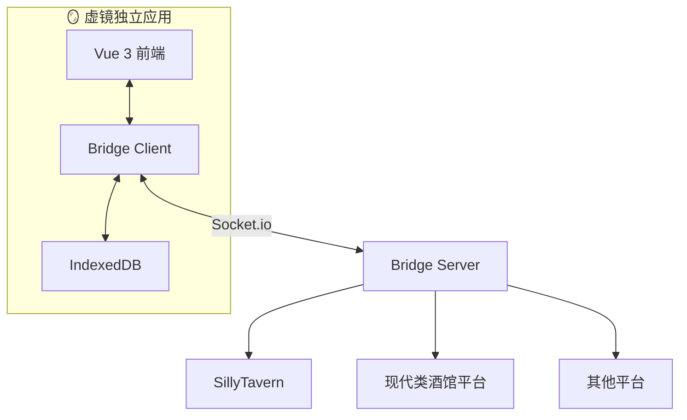

# 🪞 虚镜 (VirtuMirror)

> **构建 LLM 驱动的虚拟社交世界** —— 一个平台化的手机模拟器框架，让开发者轻松打造沉浸式的社交内容平台与即时通讯应用。

   

---

## 🎯 愿景

**虚镜**的目标是成为 LLM 驱动的虚拟社交世界的**基础设施**。

我们提供一套完整的**平台化架构**和**基础服务**，让开发者能够：

- 🚀 **快速构建** — 用最少的代码开发微博、微信、B站、知乎等社交平台的模拟应用
- 🤖 **深度集成 LLM** — AI 角色不仅能被动回复，更能主动发起社交、发布动态、参与互动
- 🎭 **沉浸式体验** — 为用户提供超越同类产品的角色扮演沉浸感

---

## 💡 为什么选择虚镜？

### 现状的痛点

在当前的酒馆（SillyTavern）生态中，小手机类插件能够**极大增强角色扮演沉浸感**。

为什么？因为手机这个界面能够**多方面呈现角色扮演中正在发生和同时发生的事情**——热搜榜上的新闻、朋友圈的动态、微信群里的讨论、NPC 主动发来的私信……宛如一个真实的世界在运转，而不仅仅是一对一的对话。

然而，现有方案存在明显的局限：

| 痛点 | 描述 |
|------|------|
| 🔧 **开发门槛高** | 需要熟悉 jQuery、原生 JS、插件规范，难以 DIY |
| 🏗️ **架构老旧** | 单体设计，难以维护和扩展 |
| 🔒 **平台锁定** | 仅支持 SillyTavern，无法迁移到新兴平台 |
| 📦 **功能孤岛** | 各 App 各自为战，无法共享数据和能力 |

### 虚镜的解决方案

**虚镜**采用**平台化架构**，从根本上解决这些问题：

```text
┌─────────────────────────────────────────────────────────────────────┐
│                        应用层 (App Skins)                            │
│   ┌────────┐  ┌────────┐  ┌────────┐  ┌────────┐  ┌────────┐        │
│   │  微博  │  │  微信  │  │  B站   │  │  知乎  │  │  ...   │        │
│   └────┬───┘  └────┬───┘  └────┬───┘  └────┬───┘  └────┬───┘        │
└────────┼───────────┼───────────┼───────────┼───────────┼────────────┘
         │           │           │           │           │
         └───────────┴─────┬─────┴───────────┴───────────┘
                           ▼
┌─────────────────────────────────────────────────────────────────────┐
│                      领域服务层 (Domain Services)                     │
│  ┌─────────────┐  ┌─────────────┐  ┌─────────────┐  ┌─────────────┐ │
│  │ 社交媒体引擎 │  │  IM 通讯引擎 │  │  账号服务   │  │  内容工厂   │ │
│  │ (热搜/流量)  │  │ (私域导演)   │  │ (多重身份)  │  │ (LLM生成)  │ │
│  └─────────────┘  └─────────────┘  └─────────────┘  └─────────────┘ │
└─────────────────────────────────────────────────────────────────────┘
                           │
                           ▼
┌─────────────────────────────────────────────────────────────────────┐
│                      能力服务层 (Capability Services)                 │
│  ┌────────┐ ┌────────┐ ┌────────┐ ┌────────┐ ┌────────┐ ┌────────┐  │
│  │ LLM任务│ │提示词链│ │ 通知   │ │ 时间   │ │ 媒体   │ │ 调度器 │  │
│  └────────┘ └────────┘ └────────┘ └────────┘ └────────┘ └────────┘  │
└─────────────────────────────────────────────────────────────────────┘
                           │
                           ▼
┌─────────────────────────────────────────────────────────────────────┐
│                      基础设施层 (Infrastructure)                      │
│  ┌──────────┐  ┌──────────┐  ┌──────────┐  ┌──────────────────────┐ │
│  │ IndexedDB│  │ EventBus │  │ 会话上下文│  │ Bridge (跨平台桥接)  │ │
│  └──────────┘  └──────────┘  └──────────┘  └──────────────────────┘ │
└─────────────────────────────────────────────────────────────────────┘
```

---

## ✨ 核心特性

### 🏗️ Core & Skin 架构

**"一次开发，多端复用"**

- **App 只是皮肤** — 专注于 UI 渲染，业务逻辑交给核心引擎
- **统一数据模型** — `UniversalPost`、`IMMessage` 等跨平台共享结构
- **可插拔扩展** — 通过注册机制支持平台特定功能（如 B站一键三连）

```typescript
// 开发一个新的社交平台 App，只需关注 UI
const BilibiliApp = defineApp({
  id: 'bilibili',
  // 复用社交媒体引擎的全部能力
  engine: useSocialMediaEngine({ platform: 'bilibili' }),
  // 只需定义差异化配置
  config: {
    trending: { maxItems: 10, categories: ['动画', '游戏', '鬼畜'] },
    interaction: { enableTripleAction: true }  // B站特有：一键三连
  }
});
```

### 🤖 LLM 深度集成

**让 AI 角色"活"起来**

| 能力 | 描述 |
|------|------|
| **Private Director（私域导演）** | AI 角色会主动给你发私信：早安问候、分享趣事、事件触发 |
| **拟人化行为** | 模拟真人的"正在输入"、阅读延迟、回复延迟 |
| **内容工厂** | 自动生成博文、评论、热搜，构建活跃的虚拟社区 |
| **人设面具** | 同一角色在微信和微博表现不同的人设 |
| **惰性内容填充** | 用户点击时才生成内容，节省 LLM 调用 |

---

## 🌟 三大核心亮点

### 📋 LLM 任务服务

**统一的 LLM 任务管理中心，App 接入仅需 < 200 行代码**

```text
┌─────────────────────────────────────────────────────────────────┐
│                        LLM 任务服务                              │
│                                                                  │
│  ┌──────────────┐    ┌──────────────┐    ┌──────────────┐       │
│  │  任务定义     │───▶│  任务执行     │───▶│  输出处理     │       │
│  │  (声明式)     │    │  (调度执行)   │    │  (可扩展)     │       │
│  └──────────────┘    └──────────────┘    └──────────────┘       │
│         ▲                   ▲                   ▲                │
│         │                   │                   │                │
│  ┌──────┴──────┐     ┌──────┴──────┐     ┌──────┴──────┐        │
│  │ 上下文提供器 │     │ 变量替换引擎 │     │ 自动执行调度 │        │
│  └─────────────┘     └─────────────┘     └─────────────┘        │
└─────────────────────────────────────────────────────────────────┘
```

| 能力 | 说明 |
|------|------|
| **任务定义与注册** | App 声明式定义任务，服务统一管理 |
| **多种执行模式** | 手动提示词、注册提示词、提示词链 |
| **自动执行调度** | 支持定时循环执行，无需手动触发 |
| **变量替换引擎** | 动态注入上下文变量 `{{variable}}` |
| **可扩展输出处理** | 插件机制支持不同 App 的特定需求 |

### 🔗 提示词服务与提示词链

**完整的提示词生命周期管理 + 多步骤链式编排**

```text
┌─────────────────────────────────────────────────────────────────────────┐
│                           提示词服务层                                    │
│                                                                          │
│  ┌──────────────────┐  ┌──────────────────┐  ┌──────────────────┐       │
│  │  PromptService   │  │SystemPromptService│  │PromptChainService│       │
│  │  (模板管理)       │  │  (系统提示词)      │  │  (链管理)         │       │
│  │                  │  │                   │  │                  │       │
│  │  • 模板 CRUD     │  │  • 全局约束注入   │  │  • 多步骤编排    │       │
│  │  • 变量定义      │  │  • App 级约束    │  │  • 变量传递      │       │
│  │  • 渲染引擎      │  │  • 作用域继承    │  │  • 循环执行      │       │
│  └────────┬─────────┘  └────────┬─────────┘  └────────┬─────────┘       │
│           │                     │                     │                  │
│           └─────────────────────┼─────────────────────┘                  │
│                                 ▼                                        │
│                    ┌──────────────────────┐                              │
│                    │PromptChainExecutor   │                              │
│                    │  (链执行引擎)          │                              │
│                    └──────────────────────┘                              │
└─────────────────────────────────────────────────────────────────────────┘
```

| 原则 | 说明 |
|------|------|
| **模板与数据分离** | 提示词模板定义结构，运行时通过变量注入数据 |
| **来源隔离** | 区分内置、用户自定义、App 注册三种来源 |
| **层级继承** | 系统提示词支持 全局 → App → 场景 三级作用域 |
| **可观测性** | 链执行提供完整的事件流和历史记录 |

### 👤 账号系统服务

**"一个人在整个虚拟世界中是同一个人"**

账号系统服务是系统级的身份与社交关系管理中心，实现跨平台的统一身份体验。

```text
┌─────────────────────────────────────────────────────────────┐
│ CharacterEntity (角色实体)                                   │
│ └── 系统中的"人"，是所有平台账号的源头                        │
│                                                              │
│     ┌─────────────────────────────────────────────────────┐  │
│     │ PlatformAccount (平台账号)                           │  │
│     │ └── 某个实体在某个具体平台上的身份                    │  │
│     │     一个 Entity 可以有多个 Platform Account          │  │
│     │                                                      │  │
│     │     ┌─────────────────────────────────────────────┐  │  │
│     │     │ SocialRelation (社交关系)                    │  │  │
│     │     │ └── 两个平台账号之间的关系                   │  │  │
│     │     │     关注、好友、拉黑等                       │  │  │
│     │     └─────────────────────────────────────────────┘  │  │
│     └─────────────────────────────────────────────────────┘  │
└─────────────────────────────────────────────────────────────┘
```

| 能力 | 说明 |
|------|------|
| **统一身份管理** | 聊天好友"小明"和微博用户"小明"是同一个人 |
| **关系复用** | 聊天好友自动成为朋友圈可见者 |
| **玩家多重身份** | 同一玩家在不同世界可有不同的"马甲"账号 |
| **数据一致** | 修改头像一处生效，全平台同步 |
| **UserPool** | 丰富的随机用户档案生成器 |

**双层作用域模型**：

| 作用域 | 标识 | 说明 | 适用场景 |
|--------|------|------|----------|
| **会话级** | `session` | 仅在创建它的会话中可见 | 普通 NPC、路人账号 |
| **角色卡级** | `character` | 相同角色卡的会话共享 | 玩家世界专属身份 |
| **全局级** | `global` | 所有会话共享 | 玩家实体、系统角色 |

```typescript
// 确保玩家有微博账号
const result = await accountStore.ensurePlayerAccount('weibo');

// 获取当前会话可见的所有微博账号
const accounts = await accountService.getVisibleAccounts('weibo');

// 关注某人
await accountService.followAccount(myAccountId, targetAccountId);

// 生成随机用户档案
const profile = userPool.generateRichProfile({ topic: 'tech' });
```

---

### 🔐 应用沙箱与数据隔离

**安全、独立、可控**

每个 App 都运行在独立的沙箱环境中：

```text
┌─────────────────────────────────────────────────────────────────┐
│                          App 层                                 │
│  ┌─────────────┐    ┌─────────────┐    ┌─────────────┐         │
│  │   App A     │    │   App B     │    │   App C     │         │
│  └──────┬──────┘    └──────┬──────┘    └──────┬──────┘         │
│         │                  │                  │                 │
│         ▼                  ▼                  ▼                 │
│  ┌─────────────────────────────────────────────────────────┐   │
│  │                   AppRuntime 层                          │   │
│  │  ┌───────────────┐  ┌───────────────┐  ┌─────────────┐  │   │
│  │  │   Identity    │  │ ScopedStorage │  │  SystemAPI  │  │   │
│  │  │   (身份信息)   │  │  (隔离存储)    │  │ (系统功能)   │  │   │
│  │  └───────────────┘  └───────────────┘  └─────────────┘  │   │
│  └─────────────────────────────────────────────────────────┘   │
└─────────────────────────────────────────────────────────────────┘
```

**命名空间隔离策略**：

| 来源 | 命名空间格式 | 示例 |
|------|-------------|------|
| 内置应用 | `builtin/{appId}` | `builtin/calculator` |
| 商店应用 | `repo/{repoId}/{developerId}/{appId}` | `repo/official/dev1/notes` |
| URL 导入 | `url/{domain}/{hash}` | `url/example.com/a1b2c3d4` |
| 本地导入 | `local/{installationId}` | `local/inst_xyz12345` |

### 📂 会话上下文服务

**不同角色卡的数据自动分离**

```text
┌─────────────────────────────────────────────────────────────┐
│ Session (会话)                                               │
│ └── 由 sessionId 标识，对应一个聊天文件                       │
│                                                              │
│     ┌─────────────────────────────────────────────────────┐  │
│     │ Message (楼层)                                       │  │
│     │ └── 由 messageId 标识，对应一条用户/AI 消息           │  │
│     │                                                      │  │
│     │     ┌─────────────────────────────────────────────┐  │  │
│     │     │ Swipe (消息页)                               │  │  │
│     │     │ └── 由 swipeId 标识，同一楼层的不同版本       │  │  │
│     │     └─────────────────────────────────────────────┘  │  │
│     └─────────────────────────────────────────────────────┘  │
└─────────────────────────────────────────────────────────────┘
```

| 过滤模式 | 说明 | 适用场景 |
|---------|------|----------|
| `all` | 显示所有数据 | 跨会话查看 |
| `session` | 按会话过滤 | **默认推荐** |
| `message` | 按楼层过滤 | 精确到楼层 |
| `swipe` | 按消息页过滤 | 最后楼层的分支数据 |

### 🌉 跨平台桥接

**一个项目，多个平台**



- **独立运行** — 作为独立 Web 应用，通过桥接脚本连接各大平台
- **数据自主** — 数据存储在本地 IndexedDB，不依赖宿主环境
- **未来兼容** — 新平台问世时，只需开发桥接脚本即可接入

### 📱 沉浸式 UI

- **全真模拟** — 复刻 iOS/Android 界面风格，支持动态岛、刘海屏
- **多主题系统** — iOS、Material You、深色模式、赛博朋克
- **流畅动画** — 原生级的页面切换与 App 启动动画
- **响应式布局** — 手机、平板、桌面三种设备模式

---

## 🧩 服务模块

### 社交媒体引擎 (Social Media Engine)

核心的内容生成与分发引擎：

| 服务 | 职责 | 亮点 |
|------|------|------|
| **TrendService** | 热搜话题管理 | 惰性内容填充 - 用户点击时才生成 |
| **TrafficEngine** | 热度计算、互动概率 | 真实的热度衰减算法 |
| **ContentFactory** | LLM 内容生成 | JSON 解析修复、容错处理 |
| **DirectorService** | 世界事件导演 | 自动生成热搜 - 让世界"活"起来 |
| **PlatformRegistry** | 平台配置管理 | 支持多平台差异化 |

### IM 通讯引擎 (IM Service)

即时通讯与私域社交引擎：

| 模块 | 职责 |
|------|------|
| **Session Manager** | 会话列表、置顶、免打扰、未读数 |
| **Message Dispatcher** | 消息路由、存储、状态更新 |
| **Private Director** | 驱动 NPC 主动发起私信 |
| **Behavior Engine** | 打字时长、阅读间隙、在线状态模拟 |

**Private Director 触发机制**：

- ⏰ **时间信号** — 早安问候、饭点提醒、长草期唤醒
- 📢 **事件信号** — 全服大事件、用户行为触发
- 📍 **空间信号** — 位置重合触发

---

## 🎮 内置应用生态

| 类型 | 应用 | 核心能力 |
|------|------|----------|
| **社交内容平台** | 微博 | 热搜、博文、评论、转发、涨粉系统 |
| | 朋友圈 | 动态发布、点赞、评论互动 |
| | 论坛 | 社区讨论、楼层回复 |
| **即时通讯** | 微信 | 私聊、群聊、红包、转账、语音 |
| | 短信 | 系统短信模拟 |
| **工具应用** | 浏览器 | AI 生成搜索结果和网页内容 |
| | 邮件 | 完整的邮件收发体验 |
| | 直播 | 直播间模拟、弹幕互动 |
| **系统功能** | | 通知中心、控制中心、多任务切换、设置 |

---

## 🛠️ 快速开始

### 开发模式

```bash
# 安装依赖
npm install

# 启动开发服务器（带 Mock 数据）
npm run dev

# 在浏览器中访问 http://localhost:5173
```

### 连接 SillyTavern

1. **启动 Bridge Server**：

   ```bash
   cd server
   npm install
   npm run dev
   ```

2. **配置桥接脚本**：将 `scripts/phone-bridge.js` 添加到酒馆的脚本系统

3. **启动虚镜前端**（桥接模式）

详见 [Bridge 设计文档](./docs/dev/socket-bridge-design.md)

---

## 📚 文档索引

### 架构设计

| 文档 | 描述 |
|------|------|
| [社交内容平台架构](./docs/systems/architecture/Service-for-social-media-platform.md) | Core & Skin 平台化设计 |
| [IM 通讯引擎](./docs/systems/im-service.md) | 即时通讯与私域导演系统 |
| [Socket Bridge](./docs/dev/socket-bridge-design.md) | 跨平台桥接方案 |
| [应用沙箱设计](./docs/dev/app-sandbox-design.md) | 数据隔离与安全机制 |

### 核心服务

| 服务 | 文档 | 状态 |
|------|------|------|
| LLM 任务服务 | [llm-task-service](./docs/systems/llm-task-service/) | ✅ 已实现 |
| 提示词服务 | [prompt-service](./docs/systems/prompt-service/) | ✅ 已实现 |
| 账号系统服务 | [account-service](./docs/systems/account-service/) | ✅ 已实现 |
| 社交媒体引擎 | [social-media-engine](./docs/systems/social-media-engine/) | ✅ 已实现 |
| 通知系统 | [notification-service](./docs/systems/notification-service/) | ✅ 已实现 |
| 时间服务 | [time-service](./docs/systems/time-service/) | ✅ 已实现 |
| AppRuntime | [appRuntime](./docs/systems/appRuntime/) | ✅ 已实现 |
| 会话上下文 | [session-context](./docs/systems/session-context/) | 📋 设计完成 |
| 调度器服务 | [scheduler-service](./docs/systems/scheduler-service/) | 📋 设计中 |
| 互动服务 | [interaction-service](./docs/systems/interaction-service/) | 📋 设计中 |
| 粉丝服务 | [fans-service](./docs/systems/fans-service/) | 📋 设计中 |
| 档案服务 | [archive-service](./docs/systems/archive-service/) | 📋 设计中 |

### 开发指南

- [开发指南](./docs/开发指南.md) — 环境配置与开发流程
- [状态管理](./docs/状态管理.md) — Pinia Stores 设计
- [组件文档](./docs/组件文档.md) — 通用组件使用手册
- [服务开发指南](./docs/systems/service-development-guide.md) — 如何开发新的系统服务

---

## 🗺️ 路线图

### 已完成 ✅

- [x] Vue 3 + TypeScript 重构
- [x] IndexedDB 本地存储
- [x] Socket Bridge 跨平台桥接
- [x] LLM 任务服务（任务定义、执行、调度）
- [x] 提示词服务（模板管理、提示词链、执行引擎）
- [x] 账号系统服务（双层作用域、多重身份、UserPool）
- [x] 社交媒体引擎（热搜、流量、内容生成）
- [x] AppRuntime 应用沙箱

### 进行中 🚧

- [ ] IM 通讯引擎（私域导演、拟人化行为）
- [ ] 会话上下文服务（数据隔离）
- [ ] 互动服务抽取（点赞/收藏/评论通用化）

### 规划中 📋

- [ ] 第二个社交平台 App（B站/知乎）— 验证平台化架构
- [ ] 涨粉算法引擎
- [ ] 档案/知识库服务
- [ ] 媒体服务（统一媒体库）
- [ ] Electron/Tauri 桌面打包
- [ ] 应用商店 UI 完善

---

## 🤝 贡献指南

欢迎参与虚镜的开发！

1. Fork 本仓库
2. 创建特性分支 (`git checkout -b feature/AmazingFeature`)
3. 提交更改 (`git commit -m 'feat: Add some AmazingFeature'`)
4. 推送到分支 (`git push origin feature/AmazingFeature`)
5. 提交 Pull Request

请确保代码通过类型检查：`npm run type-check`

---

## 📄 License

MIT License

---

<p align="center">
  <b>🪞 虚镜 —— 映射虚拟，连接灵魂</b>
</p>
