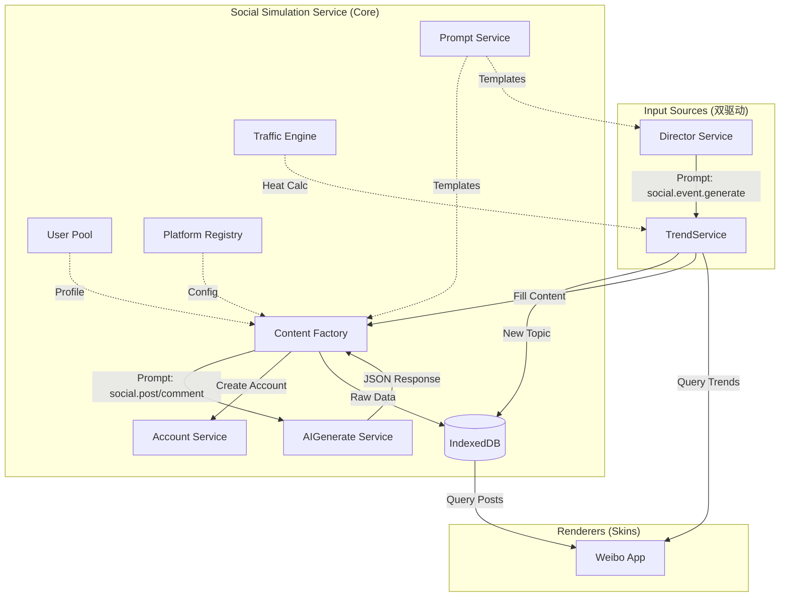
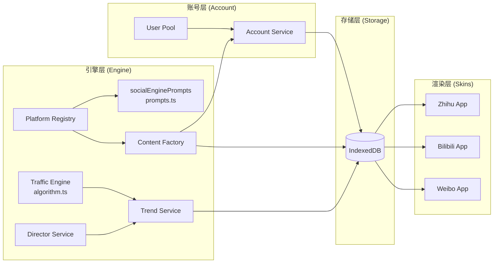
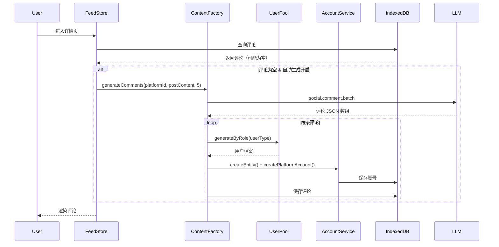
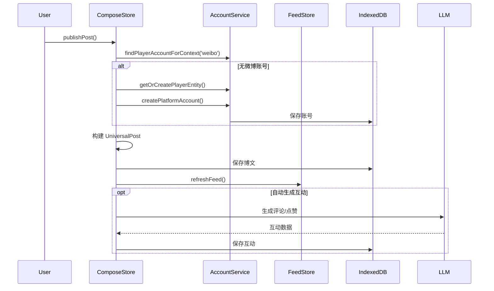

# 架构设计

## 1. 整体架构图



## 2. 核心组件关系



## 3. 数据流向

### 3.1 世界事件驱动流程

```mermaid
sequenceDiagram
    participant TS as TimeService
    participant DS as DirectorService
    participant PS as PromptService
    participant AI as AIService
    participant Trend as TrendService
    participant DB as IndexedDB
    participant UI as App UI
    
    TS->>DS: onTick(worldTime)
    DS->>DS: 检查间隔 & 随机跳过
    
    alt 应该生成事件
        DS->>PS: getPrompt('social.event.generate')
        PS-->>DS: 提示词模板
        DS->>AI: generate(prompt)
        AI-->>DS: 事件 JSON
        DS->>Trend: createTopicFromEvent(event)
        Trend->>DB: 为每个平台保存 Trendingn    end
    
    UI->>Trend: getTrendingList('weibo')
    Trend->>DB: 查询话题（内存过滤）
    Trend->>Trend: TrafficEngine.calculateTopicHeat()
    Trend-->>UI: 返回排序后的热搜榜
    
    UI->>Trend: ensureTopicContent(topicId)
    Trend->>DB: 检查现有博文
    
    alt 无内容
        loop 3-5 次
            Trend->>Factory: generatePost()
            Factory->>AI: 调用 LLM
            AI-->>Factory: 博文 JSON
            Factory->>DB: 保存 UniversalPost
        end
    end
```

### 3.2 评论惰性生成流程



### 3.3 玩家发布流程



## 4. 服务依赖关系

| 服务 | 文件 | 依赖 | 说明 |
| ---- | ---- | ---- | ---- |
| `TrendService` | `trendService.ts` | `TrafficEngine`, `ContentFactory`, `AccountService`, `UserPool`, `DB` | 热搜管理核心 |
| `DirectorService` | `directorService.ts` | `TrendService`, `PromptService`, `AIService`, `TimeService` | 世界事件生成 |
| `ContentFactory` | `contentFactory.ts` | `PromptService`, `AIService`, `AccountService`, `UserPool`, `PlatformRegistry` | 内容生成工厂 |
| `TrafficEngine` | `algorithm.ts` | 无 | 纯静态算法类 |
| `PlatformRegistry` | `registry.ts` | `PromptService` | 平台配置管理 |
| `UserPool` | `account/userPool.ts` | 无 | 纯生成器 |
| `AccountService` | `account/accountService.ts` | `DB` | 账号 CRUD |

## 5. 存储架构

### 5.1 IndexedDB 表设计

| 表名 | 说明 | 主要索引 |
| ---- | ---- | -------- |
| `socialPosts` | 博文/动态 | `id`, `platformId`, `authorId`, `topicTags`, `[platformId+timestamp]` |
| `socialComments` | 评论/回复 | `id`, `postId`, `[postId+timestamp]`, `platformId` |
| `socialTopics` | 热搜话题 | `id`, `platformId`, `createdAt` |
| `characterEntities` | 角色实体 | `id`, `type`, `scope`, `linkedCharacterCardId` |
| `platformAccounts` | 平台账号 | `id`, `entityId`, `platformId`, `[platformId+handle]`, `[entityId+platformId]` |
| `socialRelations` | 社交关系 | `id`, `[fromAccountId+type]`, `[toAccountId+type]` |

### 5.2 数据生命周期

```text
┌─────────────────────────────────────────────────────────────┐
│                      数据生命周期                            │
├─────────────────────────────────────────────────────────────┤
│                                                             │
│  LLM 输出 ──────────────────────────────────────────┐       │
│       │                                              │       │
│       ▼                                              │       │
│  ┌──────────┐    ┌──────────┐    ┌──────────┐       │       │
│  │  JSON5   │───▶│parseAnd  │───▶│   DB     │       │       │
│  │  Parse   │    │RepairJSON│    │(持久化)  │       │       │
│  └──────────┘    └──────────┘    └──────────┘       │       │
│                                        │             │       │
│                                        ▼             │       │
│                                  ┌──────────┐       │       │
│                                  │DisplayPost│◀──────┘       │
│                                  │(展示层)   │               │
│                                  └──────────┘               │
│                                        │                     │
│                                        ▼                     │
│                                  ┌──────────┐               │
│                                  │    UI    │               │
│                                  │ (渲染)   │               │
│                                  └──────────┘               │
└─────────────────────────────────────────────────────────────┘
```

## 6. 引擎与皮肤分离

### 6.1 设计原则

* **引擎层**：负责内容生成、热度计算、账号管理，与 UI 无关
* **皮肤层**：负责渲染、交互，只调用引擎 API

### 6.2 接口抽象

```typescript
// 引擎对外接口（概念性，实际通过各服务单例访问）
interface SocialEngine {
  // 热搜管理
  getTrendingList(platformId: string): Promise<TrendingTopic[]>;
  createTopicFromEvent(event: WorldEvent): Promise<TrendingTopic[]>;
  ensureTopicContent(topicId: string): Promise<void>;
  
  // 内容生成
  generatePost(platformId: string, topic: TrendingTopic): Promise<any>;
  generateComments(platformId: string, content: string, count: number): Promise<any[]>;
  
  // 热度计算（静态方法）
  calculateTopicHeat(topic: TrendingTopic, time: number): number;
  formatHeat(heat: number): string;
  getHeatDisplay(heat: number, rank: number, createdAt: number): HeatDisplay;
}

// 皮肤需使用的配置（通过 PlatformRegistry）
interface PlatformConfig {
  id: string;
  name: string;
  content: {
    hasTitle: boolean;
    mediaType: string;
    maxLength: number;
  };
  aiSetting: {
    tone: string;
    roles: string[];
    slang: string[];
    promptTemplate: string;
  };
  interaction: {
    actions: string[];
    commentStructure: 'flat' | 'nested' | 'bullet';
  };
  dmStrategy: {
    allowStranger: boolean;
    foldUnknown: boolean;
  };
}
```

### 6.3 新平台接入

添加新平台（如 B站）只需：

1. 在 `PlatformRegistry` 注册配置（已有预置）
2. 定义平台专用提示词（可选，会回退到通用提示词）
3. 实现 UI 组件（皮肤）

```typescript
// 1. 平台配置已预置在 registry.ts
// 如需自定义，可以覆盖
PlatformRegistry.getInstance().registerPlatform({
  id: 'bilibili',
  name: 'B站',
  content: {
    hasTitle: true,
    mediaType: 'video',
    maxLength: 1000,
  },
  aiSetting: {
    tone: 'Meme-heavy, Otaku culture',
    roles: ['Otaku', 'TechGeek', 'Gamer'],
    slang: ['下次一定', '三连', '好耶'],
    promptTemplate: 'social.post.generate.bilibili',
  },
  // ...
});

// 2. 定义平台专用提示词（可选）
const bilibiliPrompts: AppPromptDefinition[] = [
  {
    scene: 'social.post.generate.bilibili',
    name: 'B站动态生成',
    // ...
  }
];

// 3. 创建 App 组件
// BilibiliApp.vue, BilibiliHome.vue, ...
```

## 7. 账号系统集成

社交引擎在 Phase 2 迁移到了新的账号系统：

### 7.1 账号层级

```text
┌─────────────────────────────────────────┐
│           CharacterEntity               │
│   (角色实体 - 背后的"人")                │
│   - displayName,, bio            │
│   - scope: session | character | global │
├─────────────────────────────────────────┤
│           PlatformAccount               │
│   (平台账号 - App 里的号)                │
│   - handle, nickname, platformData      │
│   - 可覆盖 Entity 的头像/简介           │
│   - scope: 独立于 Entity                │
└─────────────────────────────────────────┘
```

### 7.2 典型场景

| 场景 | Entity 类型 | Entity 作用域 | Account 作用域 |
| ---- | ----------- | ------------- | -------------- |
| 玩家在不同世界有不同微博号 | player | global | character |
| NPC 路人评论者 | npc | session | session |
| 角色卡关联的 NPC | npc | character | character |
| 全局名人（如雷军） | npc | global | global |

## 8. Phase 演进历史

| Phase | 内容 | 状态 |
| ----- | ---- | ---- |
| Phase 1 | 统一 payload 结构（PrimaryContentType、ContentFlags、MediaAsset） | ✅ 完成 |
| Phase 2 | 迁移到新账号系统（CharacterEntity + PlatformAccount） | ✅ 完成 |
| Phase 3 | 消除 UI 类型（DisplayPost 统一展示层） | ✅ 完成 |
| Phase 4 | 提示词输出转换层（postTransformer） | ✅ 完成 |
| Phase 5 | 解析器分发架构（ContentDispatcher） | ✅ 完成 |
| Phase 6 | 图片生成对接 | 📋 规划中 |
| Phase 7 | 更多平台皮肤（B站、知乎） | 📋 规划中 |
| Phase 8 | 档案系统深度集成 | 📋 规划中 |
