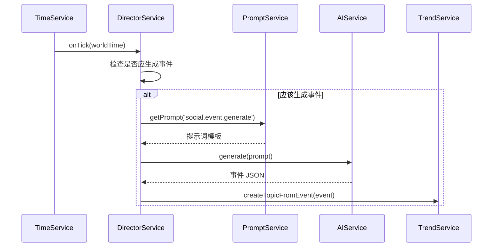

# 核心服务

## 1. 服务概览

| 服务 | 位置 | 职责 | 状态 |
| ---- | ---- | ---- | ---- |
| `TrendService` | `src/services/social/trendService.ts` | 热搜管理、话题生成、惰性内容填充 | ✅ 已实现 |
| `DirectorService` | `src/services/social/directorService.ts` | 后台静默线程，基于 TimeService 生成世界事件 | ✅ 已实现 |
| `ContentFactory` | `src/services/social/contentFactory.ts` | LLM 交互封装、博文/评论生成、JSON 修复 | ✅ 已实现 |
| `TrafficEngine` | `src/services/social/algorithm.ts` | 热度计算、交互概率计算（静态类） | ✅ 已实现 |
| `PlatformRegistry` | `src/services/social/registry.ts` | 平台配置管理、提示词自动注册 | ✅ 已实现 |
| `UserPool` | `src/services/account/userPool.ts` | 用户档案生成、随机路人生成 | ✅ 已实现 |
| `AccountService` | `src/services/account/accountService.ts` | 统一账号管理 | ✅ 已实现 |

---

## 2. TrendService

热搜管理的核心服务，负责话题的创建、查询和内容填充。

### 2.1 主要 API

```typescript
class TrendService {
  static getInstance(): TrendService;
  
  /**
   * 从世界事件创建话题
   * 会根据 event.affectedPlatforms 为每个平台创建一条话题记录
   */
  createTopicFromEvent(event: WorldEvent): Promise<TrendingTopic[]>;
  
  /**
   * 获取平台热搜列表
   * @param platformId 平台 ID
   * @param limit 返回数量，默认 20
   */
  getTrendingList(platformId: string, limit?: number): Promise<TrendingTopic[]>;
  
  /**
   * 确保话题有内容（惰性填充）
   * 当用户点击空话题时调用，自动生成 3-5 条博文
   * @param topicId 话题 ID
   */
  ensureTopicContent(topicId: string): Promise<void>;
}
```

### 2.2 热度计算

热度使用 `TrafficEngine.calculateTopicHeat()` 静态方法计算：

```typescript
// 热度公式
Heat = (BaseScore³ × 0.1) × TimeFactor × Jitter

// BaseScore: 1-100，决定事件量级
// TimeFactor: 时间衰减因子
//   - 上升期：正弦曲线 (0.2 → 1.0)
//   - 衰退期：指数衰减 (最小 0.05)
// Jitter: 随机抖动 (±2%)
```

### 2.3 惰性内容填充

当用户点击一个没有关联博文的话题时，自动生成内容：

```typescript
async ensureTopicContent(topicId: string): Promise<void> {
  const topic = await db.socialTopics.get(topicId);
  if (!topic || !topic.platformId) return;

  // 检查现有博文
  const postCount = await db.socialPosts
    .where('topicTags').equals(topic.keyword)
    .count();
  if (postCount > 0) return;

  // 生成 3-5 条博文
  const generateCount = 3 + Math.floor(Math.random() * 3);
  
  for (let i = 0; i < generateCount; i++) {
    // 获取或创建 NPC 账号
    const account = await this.getOrCreateNpcAccount(topic.platformId);
    
    // 生成博文内容
    const postData = await ContentFactory.getInstance()
      .generatePost(topic.platformId, topic, account);
    
    // 保存到数据库
    await db.socialPosts.add({ ...postData, topicTags: [topic.keyword] });
  }
}
```

---

## 3. DirectorService

世界导演服务，负责在后台自主生成世界事件。

### 3.1 主要 API

```typescript
class DirectorService {
  static getInstance(): DirectorService;
  
  /**
   * 设置配置
   * @param config 配置对象
   */
  setConfig(config: Partial<{
    worldSetting: string;                    // 世界观设定
    frequency: 'low' | 'medium' | 'high';   // 事件频率
    isEnabled: boolean;                      // 是否启用
    costLimit: number;                       // Token 预算
  }>): void;
  
  /**
   * 手动触发事件（用于测试）
   */
  triggerManualEvent(): Promise<void>;
}
```

### 3.2 配置说明

| 配置项 | 类型 | 默认值 | 说明 |
| ------ | ---- | ------ | ---- |
| `isEnabled` | boolean | `false` | 是否启用自动生成 |
| `frequency` | enum | `'medium'` | 事件生成频率 |
| `worldSetting` | string | 现代都市 | 世界观描述 |
| `costLimit` | number | 10000 | Token 预算 |

**频率对应的时间间隔**：

| 频率 | 间隔（世界时间） |
| ---- | ---------------- |
| `low` | 12 小时 |
| `medium` | 6 小时 |
| `high` | 2 小时 |

> ⚠️ **默认关闭**：`isEnabled: false`
> 
> 需要手动调用 `setConfig({ isEnabled: true })` 开启，避免无意中消耗大量 API 调用。

### 3.3 事件生成流程



---

## 4. ContentFactory

内容生成工厂，封装与 LLM 的交互。

### 4.1 主要 API

```typescript
class ContentFactory {
  static getInstance(): ContentFactory;
  
  /**
   * 生成单条博文
   * @param platformId 平台 ID
   * @param topic 话题对象
   * @param account 发帖账号（可选）
   */
  generatePost(
    platformId: string, 
    topic: TrendingTopic, 
    account?: PlatformAccount
  ): Promise<any>;
  
  /**
   * 批量生成评论
   * @param platformId 平台 ID
   * @param postContent 原帖内容
   * @param count 生成数量，默认 5
   */
  generateComments(
    platformId: string, 
    postContent: string, 
    count?: number
  ): Promise<any[]>;
}
```

### 4.2 提示词调用

| 方法 | 调用的 Prompt |
| ---- | ------------- |
| `generatePost()` | `social.post.generate.<platform>` 或 `social.post.generate` |
| `generateComments()` | `social.comment.batch.<platform>` 或 `social.comment.batch` |

### 4.3 JSON 修复

`parseAndRepairJSON` 使用 JSON5 库处理以下问题：

* Markdown 代码块包裹 (\`\`\`json)
* 尾随逗号
* 单引号字符串
* 未闭合的括号
* 控制字符

```typescript
// 示例
const raw = `
\`\`\`json
{
  "text": "博文内容",
  "images": ['图片1', '图片2',],  // 尾随逗号+单引号
}
\`\`\`
`;

const parsed = factory.parseAndRepairJSON(raw);
// { text: "博文内容", images: ["图片1", "图片2"] }
```

### 4.4 评论者账号创建

生成评论时会自动为评论者创建 NPC 账号：

```typescript
private async ensureCommentAuthorAccount(
  platformId: string,
  nickname: string,
  userType: string
): Promise<string> {
  // 查找已存在的账号
  const existing = await accountService.getAccountsByPlatform(platformId);
  const found = existing.find(acc => acc.nickname === nickname);
  if (found) return found.id;

  // 生成随机档案
  const userPool = UserPool.getInstance();
  const profile = userPool.generateByRole(userType, { platform: platformId });

  // 创建 NPC 实体和账号
  const entity = await accountService.createEntity({ ... });
  const account = await accountService.createPlatformAccount(entity.id, platformId, { ... });
  
  return account.id;
}
```

---

## 5. TrafficEngine

流量算法引擎，提供热度计算和格式化。

> **注意**：这是一个静态类，所有方法都是静态方法，不需要实例化。

### 5.1 主要 API

```typescript
class TrafficEngine {
  /**
   * 计算话题热度
   * @param topic 话题对象
   * @param currentTime 当前时间戳
   */
  static calculateTopicHeat(topic: TrendingTopic, currentTime: number): number;
  
  /**
   * 计算简化版热度（用于 LLM 生成的热搜）
   */
  static calculateSimpleHeat(
    baseScore: number,
    createdAt: number,
    currentTime: number,
    peakHours?: number
  ): number;
  
  /**
   * 格式化热度显示
   * @param heat 热度值
   * @returns 格式化字符串（如 "234.5万"）
   */
  static formatHeat(heat: number): string;
  
  /**
   * 判断热度等级
   */
  static getHeatLevel(heat: number, rank: number, ageMinutes: number): HeatLevel;
  
  /**
   * 获取完整的热度显示信息
   */
  static getHeatDisplay(
    heat: number,
    rank: number,
    createdAt: number,
    currentTime?: number
  ): HeatDisplay;
  
  /**
   * 生成合理的初始热度
   */
  static generateInitialHeat(baseScore: number): number;
  
  /**
   * 计算博文的互动数据
   */
  static calculateInteractions(
    authorFollowers: number,
    topicHeat?: number,
    superTopicActiveUsers?: number,
    contentQualityScore?: number
  ): { likes: number; comments: number; reposts: number; views: number };
}
```

### 5.2 热度等级

```typescript
type HeatLevel = 'boil' | 'explode' | 'hot' | 'new' | 'normal';
```

| 等级 | 条件 | 显示 |
| ---- | ---- | ---- |
| `boil` | 排名前 3 且热度 ≥ 100 万 | 红色"沸" |
| `explode` | 热度 ≥ 50 万 | 红色"爆" |
| `hot` | 热度 ≥ 10 万 | 橙色"热" |
| `new` | 创建时间 < 1 小时 | 红色"新" |
| `normal` | 其他 | 无标签 |

### 5.3 热度格式化

```typescript
TrafficEngine.formatHeat(12345678);  // "1234.6万"
TrafficEngine.formatHeat(123456789); // "1.2亿"
TrafficEngine.formatHeat(1234);      // "1234"
```

### 5.4 互动漏斗

`calculateInteractions` 模拟真实的互动转化率：

```typescript
// 曝光计算
impressions = followers × (5%-15%) + sqrt(topicHeat) × 10 + superTopicUsers × 1%
impressions *= qualityMultiplier (0.5-1.5)

// 互动转化
likes    = impressions × (1%-5%)
comments = likes × (10%-30%)
reposts  = likes × (5%-20%)
```

---

## 6. PlatformRegistry

平台配置注册表，管理所有支持的社交平台。

### 6.1 主要 API

```typescript
class PlatformRegistry {
  static getInstance(): PlatformRegistry;
  
  /** 注册新平台 */
  registerPlatform(config: PlatformConfig): void;
  
  /** 获取平台配置 */
  getPlatform(id: string): PlatformConfig | undefined;
  
  /** 获取所有平台 */
  getAllPlatforms(): PlatformConfig[];
}
```

### 6.2 预置r

| ID | 名称 | hasTitle | mediaType | maxLength |
| -- | ---- | -------- | --------- | --------- |
| `weibo` | 微博 | false | text_image | 140 |
| `bilibili` | Bilibili | true | video | 1000 |
| `zhihu` | 知乎 | true | qa | 5000 |
| `redbook` | 小红书 | true | text_image | 1000 |

### 6.3 自动注册提示词

`PlatformRegistry` 初始化时会自动注册社交引擎的通用提示词：

```typescript
// 内部实现
private registerPrompts() {
  PromptService.registerAppPrompts('social-engine', socialEnginePrompts);
}
```

---

## 7. UserPool

用户档案生成器，负责生成虚拟用户身份。

> **位置**: `src/services/account/userPool.ts`  
> **详细文档**: [账号服务文档](../../systems/account-service.md)

### 7.1 主要 API

```typescript
class UserPool {
  static getInstance(): UserPool;
  
  /** 生成随机用户档案 */
  generateRandomProfile(context?: GenerationContext): GeneratedProfile;
  
  /** 生成完整角色画像 */
  generateFullProfile(context?: GenerationContext): CharacterProfile;
  
  /** 生成带完整画像的用户档案 */
  generateRichProfile(context?: GenerationContext): GeneratedProfile;
  
  /** 批量生成用户 */
  generateBatch(count: number, context?: GenerationContext): GeneratedProfile[];
  
  /** 生成特定角色的档案（fan/hater/kol/official） */
  generateByRole(role: string, context?: GenerationContext): GeneratedProfile;
}
```

### 7.2 档案字段

| 分类 | 字段 | 类型 | 说明 |
| ---- | ---- | ---- | ---- |
| 基础 | `displayName` | string | 显示名 |
| 基础 | `nickname` | string | 昵称 |
| 基础 | `avatar` | string | 头像描述 |
| 基础 | `bio` | string | 简介 |
| 基础 | `gender` | enum | 性别 |
| 基础 | `handle` | string | 平台 ID |
| 画像 | `ageRange` | enum | 年龄段 |
| 画像 | `occupation` | string | 职业 |
| 画像 | `location` | string | 所在地 |
| 画像 | `interests` | enum[] | 兴趣领域（最多5个） |
| 画像 | `personality` | enum | 性格类型 |
| 画像 | `activityLevel` | enum | 活跃度 |
| 画像 | `influenceLevel` | enum | 影响力等级 |

### 7.3 使用示例

```typescript
import { UserPool } from '@/services/account/userPool';
import { accountService } from '@/services/account';

const userPool = UserPool.getInstance();

// 生成随机档案
const profile = userPool.generateRandomProfile({ platform: 'weibo' });

// 生成特定角色
const fanProfile = userPool.generateByRole('fan', { platform: 'weibo' });

// 创建账号
const entity = await accountService.createEntity({
  type: 'npc',
  displayName: profile.displayName,
  avatar: profile.avatar,
  bio: profile.bio,
  gender: profile.gender,
  source: 'social',
  scope: 'session',
});

const account = await accountService.createPlatformAccount(
  entity.id,
  'weibo',
  {
    handle: profile.handle,
    nickname: profile.nickname,
    scope: 'session',
  }
);
```

---

## 8. 服务初始化顺序

```typescript
// 推荐的初始化顺序
async function initializeSocialEngine() {
  // 1. 平台注册（会自动注册提示词）
  const registry = PlatformRegistry.getInstance();
  
  // 2. 注册自定义平台（可选）
  registry.registerPlatform({
    id: 'custom',
    name: '自定义平台',
    // ...
  });
  
  // 3. 热搜服务
  const trendService = TrendService.getInstance();
  
  // 4. 导演服务（可选启用）
  const director = DirectorService.getInstance();
  // director.setConfig({ isEnabled: true });  // 手动启用
}
```

---

## 9. 废弃的旧 API

以下 API 位于 `src/services/social/userPool.ts`，已标记为 `@deprecated`：

| 方法 | 替代方案 |
| ---- | -------- |
| `UserPool.getOrCreateIdentity()` | `accountService.createEntity()` |
| `UserPool.getAccount()` | `accountService.getPlatformAccount()` |
| `UserPool.registerAccount()` | `accountService.createPlatformAccount()` |
| `UserPool.captureShadowAccount()` | 使用新账号系统 |
| `UserPool.getRandomShadowAccount()` | `accountService.getRandomAccountForPlatform()` |

> ⚠️ `src/services/social/userPool.ts` 文件仅用于向后兼容，计划在 v2.0 删除。
> 新代码应使用 `src/services/account/userPool.ts`。
