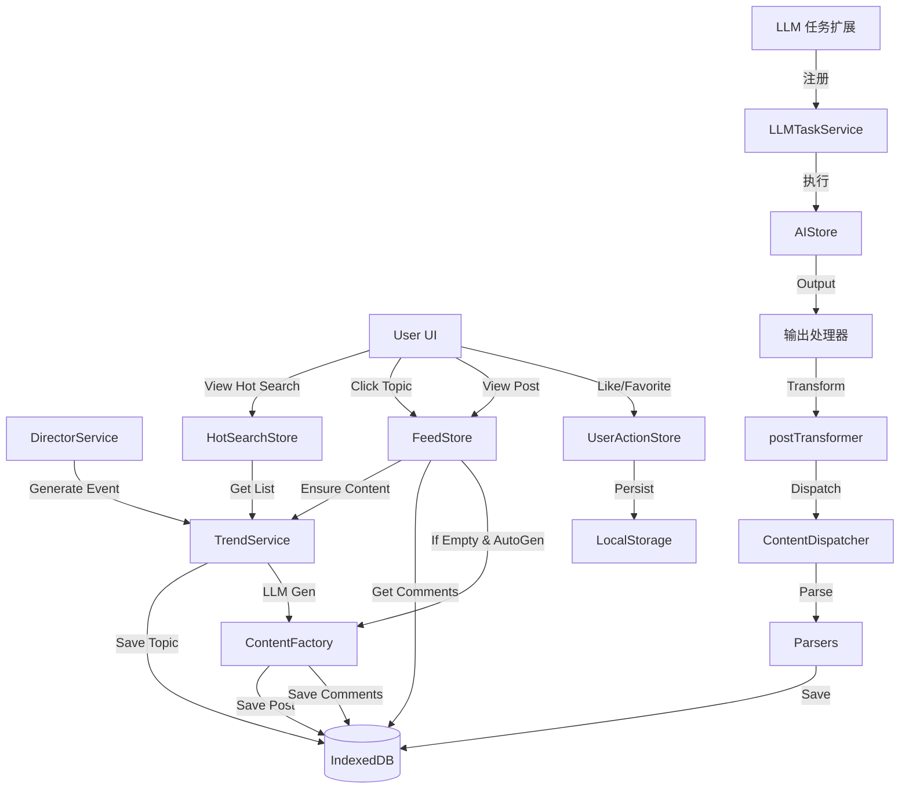
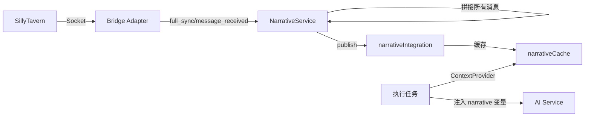
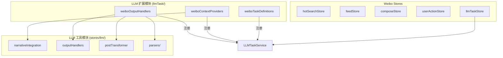
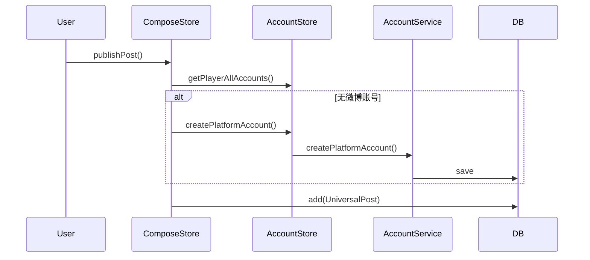

# 架构设计

## 系统集成

微博 App 深度集成了核心引擎的多个服务：

### 1. 数据流向图



### 2. 叙事内容订阅流程



### 3. Store 模块化架构



### 4. 核心服务依赖

* **LLMTaskService**: 全局 LLM 任务管理服务，负责任务定义、执行和状态管理。
* **TrendService**: 负责热搜榜单的生成和维护。
* **TrafficEngine**: 负责热度算法计算（基于时间衰减和基础分数）。
* **ContentFactory**: 负责生成具体的博文和评论内容。
* **DirectorService**: 负责生成后台世界事件。
* **AccountService**: 负责玩家账号和 NPC 账号管理。
* **NarrativeService**: 负责订阅和分发酒馆的叙事内容。
* **AIService**: 提供底层 LLM 生成能力。

## LLM 任务扩展架构

微博 App 使用扩展机制向全局 `LLMTaskService` 注册功能：

### 注册流程

```typescript
// llmTask/index.ts
export function registerWeiboLLMExtensions(): void {
  const service = getLLMTaskService();

  // 1. 注册上下文提供器
  weiboContextProviders.forEach((provider) => {
    service.registerContextProvider(provider);
  });

  // 2. 注册输出处理器
  weiboOutputHandlers.forEach((handler) => {
    service.registerOutputHandler(handler);
  });

  // 3. 注册任务定义
  service.registerTaskDefinitions(weiboTaskDefinitions);

  // 4. 注册任务模板
  service.registerTaskTemplates(weiboTaskTemplates);

  // 5. 初始化叙事订阅
  initializeNarrativeSubscription();

  // 6. 初始化解析器
  initializeParsers();
}
```

### ID 命名规范

| 类型 | 格式 | 示例 |
| ---- | ---- | ---- |
| 任务定义 | `appId:taskId` | `weibo:generate-post` |
| 输出处理器 | `appId:handlerId` | `weibo:post-handler` |
| 上下文提供器 | `appId:providerId` 或 `system:providerId` | `weibo:narrative` |

## 数据持久化

数据存储在 IndexedDB 中，通过 Dexie.js 进行管理。

### 存储表

| 表名 | 说明 | 主要索引 |
| ---- | ---- | -------- |
| `socialPosts` | 微博博文 | `id`, `platformId`, `authorId`, `[platformId+timestamp]` |
| `socialComments` | 评论 | `id`, `postId`, `[postId+timestamp]`, `platformId` |
| `socialTopics` | 热搜话题 | `id`, `platformId`, `[platformId+createdAt]`, `createdAt` |
| `characterEntities` | 角色实体 | `id`, `type`, `scope` |
| `platformAccounts` | 平台账号 | `id`, `entityId`, `platformId`, `handle` |

### 本地存储（localStorage）

| Key | 说明 |
| --- | ---- |
| `weibo_drafts` | 草稿箱数据 |
| `weibo_user_likes` | 点赞记录 |
| `weibo_user_favorites` | 收藏记录 |
| `weibo_view_history` | 浏览历史 |

### 查询优化策略

由于 Dexie 索引查询的兼容性问题，目前采用 **内存过滤** 方式：

```typescript
// ✅ 推荐：使用 toArray() 后内存过滤
const allTopics = await db.socialTopics.toArray();
const weiboTopics = allTopics.filter(t => t.platformId === 'weibo');

// ❌ 不推荐：直接使用索引查询（可能返回空结果）
const topics = await db.socialTopics
  .where('platformId').equals('weibo')
  .toArray();
```

### 数据删除策略

使用 `bulkDelete` 进行批量删除，确保原子性和性能：

```typescript
// 获取所有数据
const allTopics = await db.socialTopics.toArray();

// 过滤出微博平台的 ID
const weiboTopicIds = allTopics
  .filter(t => t.platformId === 'weibo')
  .map(t => t.id);

// 批量删除
if (weiboTopicIds.length > 0) {
  await db.socialTopics.bulkDelete(weiboTopicIds);
}
```

## Phase 3-5 架构演进

### Phase 3: 类型重构

* 引入 `DisplayPost` 类型，继承 `UniversalPost` 并添加 UI 字段
* 使用 `primaryType` 替代 `payload.type/postType`
* 使用 `media[]` 替代 `payload.images`
* 使用 `contentFlags` 标记内容特征
* `usePostDisplay` composable 处理展示逻辑

### Phase 4: LLM 输出转换

* `postTransformer.ts` 负责将 LLM 输出转换为 UniversalPost
* 支持新旧两种 LLM 输出格式
* 自动填充 `contentFlags`、`media` 等字段
* 自动提取话题标签
* 自动生成随机统计数据

### Phase 5: 解析器分发架构

* `ContentDispatcher` 分发复合输出到不同解析器
* `PostParser`: 解析博文，建立 tempId → postId 映射
* `CommentParser`: 解析评论，关联到实际 postId
* `HotSearchParser`: 解析热搜话题
* `RepostParser`: 解析转发内容
* 支持 `composite` 输出处理器

## 账号系统集成

### Phase 2 重构

* 统一使用 `accountService` 管理所有账号
* 移除对旧 `db.socialAccounts` 的依赖
* `getUserInfo()` 从 `accountService` 获取用户信息
* `ensureCommenterAccount()` 使用 `UserPool` 生成随机档案

### 账号创建流程


