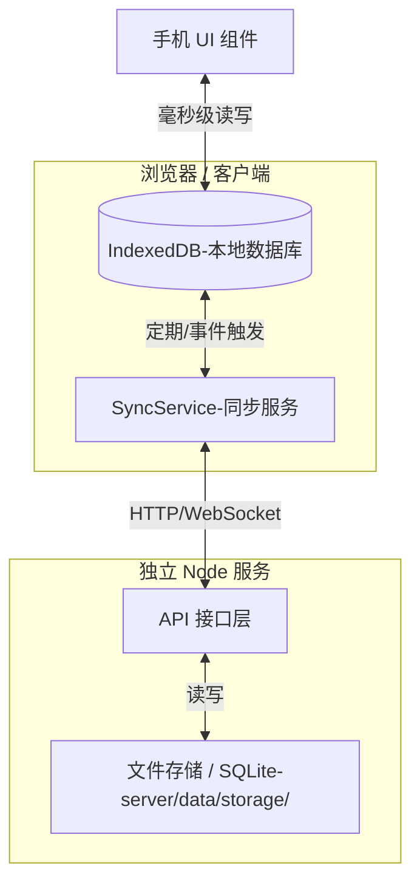

# 数据持久化与多端同步方案

## 1. 核心设计理念：Local-First (本地优先)

为了兼顾“手机插件”的操作流畅性（零延迟）和“跨设备访问”的数据一致性，我们采用 **Local-First** 架构。

*   **单一数据源 (UI)**：前端组件始终直接读取本地 **IndexedDB**。这保证了无论网络状况如何，手机的操作（滑动、点赞、发信）都是瞬时的。
*   **持久化层 (Cloud)**：后端 Server 仅作为数据的**备份仓库**和**同步中枢**。

### 架构图示



---

## 2. 数据流转逻辑

### 2.1 初始化 (Pull)
当用户在一个新设备或新浏览器上首次加载插件时：
1.  检查本地 IndexedDB 是否为空。
2.  如果为空，向 Server 请求该会话 (`sessionId`) 的最新快照。
3.  Server 返回 JSON 数据，前端将其批量导入 IndexedDB。
4.  初始化完成，UI 渲染。

### 2.2 运行时 (Local Write)
1.  用户点赞朋友圈。
2.  IndexedDB 立即更新 `Moments` 表。
3.  UI 响应更新（图标变红）。
4.  **后台静默操作**：将该变更标记为“待同步”或触发防抖定时器。

### 2.3 同步机制 (Sync)

为了降低 MVP 阶段的复杂度，我们第一阶段采用 **“全量快照备份 (Snapshot)”** 策略，后续可升级为 **“增量同步 (Incremental)”**。

#### 阶段一：快照同步 (MVP)
*   **触发时机**：
    *   用户关闭手机面板时。
    *   每隔固定时间（如 1 分钟）且有数据变更时。
    *   用户点击“手动云备份”按钮时。
*   **流程**：
    1.  前端将 IndexedDB 关键表导出为 JSON。
    2.  计算 Hash 值，如果与上次上传的一致则跳过。
    3.  POST 发送到 Server。
    4.  Server 将数据保存为 `storage/{sessionId}.json`。

#### 阶段二：增量同步 (Advanced - 未来规划)
*   记录每个操作的 Action Log (OpLog)。
*   仅上传 `lastSyncTime` 之后的操作记录。
*   Server 负责合并冲突（Last Write Wins）。

---

## 3. 接口设计 (Server 端)

基于 `server/` 目录下的 Express/Node 服务。

### 基础路径: `/api/v1/storage`

| 方法 | 路径 | 描述 | 请求体/参数 | 响应 |
| :--- | :--- | :--- | :--- | :--- |
| **GET** | `/:sessionId` | 获取指定会话的备份数据 | 无 | `{ timestamp: number, data: object }` |
| **POST** | `/:sessionId` | 上传/覆盖备份数据 | `{ data: object, timestamp: number }` | `{ success: true, syncedAt: number }` |
| **GET** | `/:sessionId/meta` | 检查云端版本（用于对比时间戳） | 无 | `{ updatedAt: number, size: number }` |

---

## 4. 存储结构设计 (Server 端)

在 `server/data/` 目录下建立存储结构：

```text
server/
  data/
    storage/
      sillytavern_chat123.json   # 对应 sessionId: sillytavern:chat123
      standalone_user456.json    # 对应 sessionId: standalone:user456
    backup/                      # (可选) 历史版本备份
```

**JSON 文件内容示例：**
```json
{
  "sessionId": "sillytavern:chat123",
  "updatedAt": 1704123456789,
  "version": 1,
  "tables": {
    "contacts": [...],
    "moments": [...],
    "messages": [...]
  }
}
```

---

## 5. 实现步骤

### 第一步：后端基础 (Server)
- [ ] 在 `server/src` 中创建 `storage.ts` 服务。
- [ ] 实现文件读写工具函数（确保目录存在、原子写入）。
- [ ] 在 `server/index.ts` 中注册 `/api/storage` 路由。
- [ ] 添加 API 鉴权（简单的 API Key 或与酒馆的 Token 互通，现在的Server端就有一个API key的机制，应该可以直接用）。

### 第二步：前端服务 (Client)
- [ ] 安装 `dexie-export-import` 库（用于快速导入导出 DB）。
- [ ] 创建 `src/services/cloudSyncService.ts`。
- [ ] 实现 `backupToCloud()` 方法：导出 DB -> POST 请求。
- [ ] 实现 `restoreFromCloud()` 方法：GET 请求 -> 清空 DB -> 导入 DB。

### 第三步：状态管理集成
- [ ] 修改 `src/stores/appStateStore.ts`。
- [ ] 在 `initApp()` 时调用 `restoreFromCloud` (如果本地无数据)。
- [ ] 在 `saveState()` 或页面销毁钩子中调用 `backupToCloud`。

### 第四步：UI 反馈
- [ ] 在设置页添加“云同步状态”指示器（已同步/同步中/同步失败）。
- [ ] 添加“强制上传”和“强制下载”的手动按钮（用于调试和解决冲突）。
