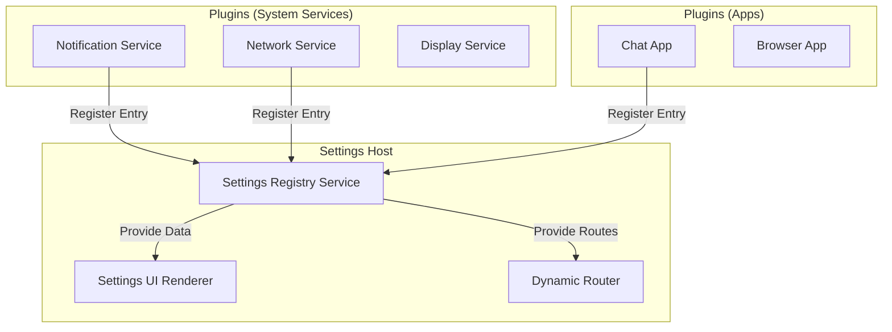

# 设置平台架构设计 (Settings Platform Design)

> 文档状态：设计中
> 负责人：System Team

## 1. 背景与目标

随着系统功能的增加（如通知系统、蓝牙、WiFi、AI 助手等），传统的将所有设置项硬编码在 `SettingsApp.vue` 中的方式面临以下问题：

1.  **耦合度高**：设置应用依赖了系统中所有其他模块。
2.  **维护困难**：每次新增功能都需要修改设置应用的代码。
3.  **缺乏灵活性**：无法支持动态加载的插件或第三方应用的设置。

为了解决这些问题，我们提出**“设置即平台” (Settings as a Platform)** 的架构思路。设置应用 (`Settings App`) 演变为一个宿主容器，负责提供统一的 UI 框架和注册机制；各业务模块（如通知服务）作为“微App”或插件，按需注册自己的设置项。

## 2. 架构概览

采用 **Host-Plugin** 模式：



### 核心组件

1.  **SettingsRegistryService**: 全局单例服务，维护所有注册的设置项。
2.  **SettingsEntry**: 定义单个设置入口的标准接口（图标、标题、跳转目标）。
3.  **Category**: 设置项的分组（如：连接、个性化、系统、隐私）。

## 3. 接口定义

### 3.1 设置入口 (SettingsEntry)

```typescript
export interface SettingsEntry {
  /** 唯一标识符 */
  id: string
  
  /** 显示标题 */
  title: string
  
  /** 副标题/当前状态描述 (可选) */
  subtitle?: string | Ref<string>
  
  /** 图标配置 */
  icon?: {
    type: 'fontawesome' | 'image' | 'text'
    value: string
    color?: string
    backgroundColor?: string
  }
  
  /** 所属分类 */
  category: SettingsCategory
  
  /** 优先级 (数字越小越靠前) */
  priority?: number
  
  /** 交互行为 (二选一) */
  action?: {
    type: 'route' | 'click' | 'toggle'
    value: string | (() => void) | Ref<boolean>
  }
  
  /** 权限控制 (可选) */
  permissions?: string[]
}
```

### 3.2 分类定义 (SettingsCategory)

```typescript
export type SettingsCategory = 
  | 'connectivity'  // 网络与连接 (WiFi, Bluetooth)
  | 'personalization' // 个性化 (Display, Sound, Theme)
  | 'apps'           // 应用管理 (Notification, Permissions)
  | 'system'         // 系统 (Update, About, Language)
  | 'privacy'        // 隐私与安全
  | 'other'          // 其他
```

## 4. 注册流程

### 4.1 服务端注册 (Service Side)

每个系统服务在初始化时，调用注册表进行注册。

**示例：通知系统注册**

```typescript
// src/services/notification/index.ts
import { settingsRegistry } from '@/services/settingsRegistry'

export function initNotificationSettings() {
  settingsRegistry.register({
    id: 'notifications',
    title: '通知与状态栏',
    subtitle: '管理横幅、声音和图标',
    icon: {
      type: 'fontawesome',
      value: 'fa-bell',
      backgroundColor: '#FF3B30', // iOS Red
      color: '#FFFFFF'
    },
    category: 'apps',
    priority: 10,
    action: {
      type: 'route',
      value: '/settings/notifications'
    }
  })
}
```

### 4.2 路由注册

各模块需要自行定义其设置页面的 Vue 组件，并将其添加到路由系统中。建议使用 Vue Router 的动态路由功能，或者在主路由文件中按模块导入。

```typescript
// src/router/modules/notification.ts
export const notificationRoutes = [
  {
    path: '/settings/notifications',
    component: () => import('@/apps/status-bar/settings/NotificationSettings.vue'),
    meta: { title: '通知设置' }
  }
]
```

## 5. UI 实现 (Host Side)

`SettingsApp.vue` 将不再硬编码 `SettingsItem`，而是遍历 Registry 数据。

```vue
<template>
  <div class="settings-list">
    <!-- 按分类渲染分组 -->
    <SettingsGroup 
      v-for="cat in categories" 
      :key="cat.id" 
      :title="cat.title"
    >
      <SettingsItem
        v-for="item in getItemsByCategory(cat.id)"
        :key="item.id"
        :label="item.title"
        :subtitle="unwrap(item.subtitle)"
        :icon="item.icon.value"
        :icon-bg="item.icon.backgroundColor"
        @click="handleAction(item)"
      />
    </SettingsGroup>
  </div>
</template>
```

## 6. 微App/小程序化扩展

对于通过 JSON 配置加载的动态应用（Dynamic Apps），它们可以在其 `manifest.json` 中声明设置页。

```json
{
  "id": "my-game",
  "settings": {
    "enabled": true,
    "entry": {
      "title": "游戏设置",
      "category": "apps"
    },
    "schema": [
      { "type": "toggle", "key": "sound", "label": "音效" },
      { "type": "slider", "key": "volume", "label": "音量" }
    ]
  }
}
```

`AppDataService` 会解析这些 manifest，自动向 `SettingsRegistry` 注册入口，并生成一个通用的 `GenericAppSettings.vue` 页面来渲染这些 Schema。

## 7. 迁移计划

1.  **阶段一**：建立 `SettingsRegistryService`，将现有的硬编码设置项（WiFi, Bluetooth, Display）重构为注册模式。
2.  **阶段二**：实现通知系统的独立设置页，并通过注册接入。
3.  **阶段三**：支持动态 App 的 JSON 设置 schema。
