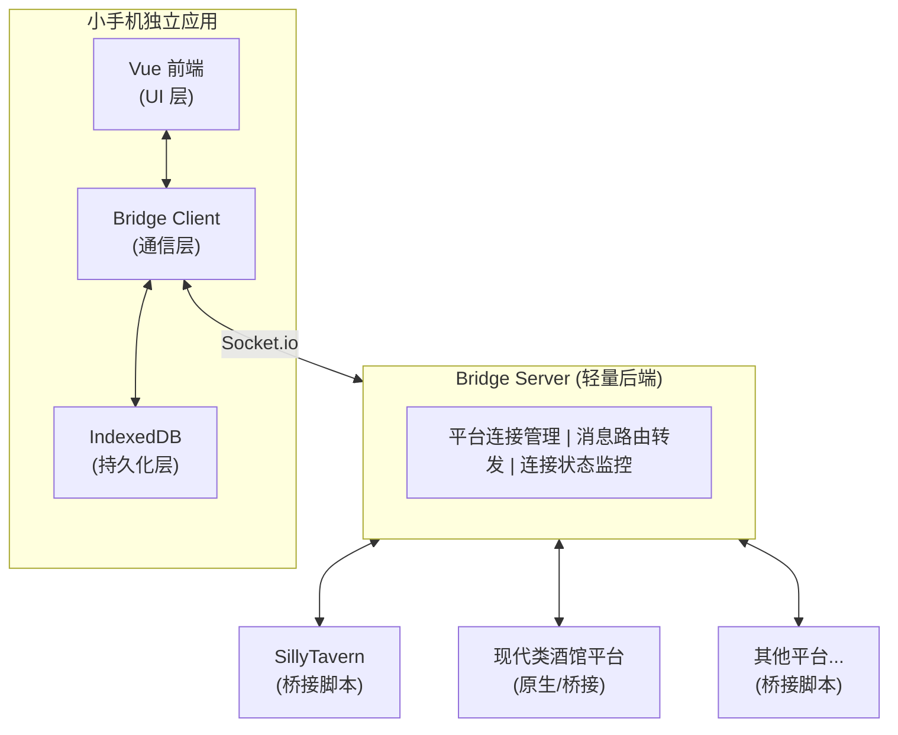
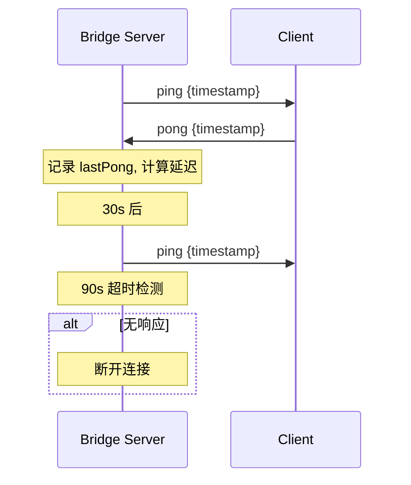
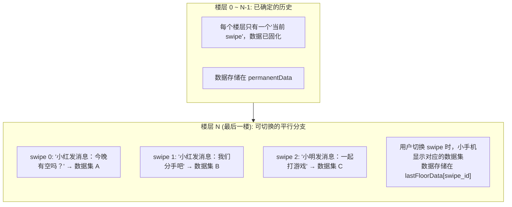

# 小手机独立架构方案

> 通过 Socket 桥接 + IndexedDB 实现跨平台独立运行的小手机应用

## 1. 背景与目标

### 1.1 现状分析

当前小手机设计为嵌入 SillyTavern 的插件，数据存储依赖酒馆的变量系统。这带来以下限制：

- 开发时需要完整的酒馆环境
- 难以适配其他平台（如支持 Vue 运行时的现代类酒馆平台）
- 数据和 UI 耦合在宿主环境中

### 1.2 目标架构



## 2. IndexedDB 数据存储设计

### 2.1 数据库 Schema

使用 [Dexie.js](https://dexie.org/) 作为 IndexedDB 封装库，提供更好的 TypeScript 支持和简洁的 API。

```typescript
// src/services/database/schema.ts
import Dexie, { type Table } from 'dexie'
import type {
  Contact,
  Message,
  Moment,
  CallRecord,
  Email,
  ForumPost,
  ForumBoard,
  LiveStream,
  Bookmark,
  BrowsingHistory,
} from '@/types'

// ============ 数据库实体类型 ============

/** 会话信息 - 用于区分不同的角色/聊天上下文 */
export interface Session {
  id: string                    // 会话ID (平台+chatId 组合)
  platform: string              // 来源平台: 'sillytavern' | 'modern-tavern' | 'standalone'
  chatId: string                // 平台内的聊天标识
  characterName: string         // 角色名
  playerName: string            // 玩家名
  createdAt: number
  lastActiveAt: number
}

/** 存储的联系人 (带会话关联) */
export interface StoredContact extends Contact {
  sessionId: string
}

/** 存储的消息 */
export interface StoredMessage extends Message {
  sessionId: string
}

/** 存储的朋友圈动态 */
export interface StoredMoment extends Moment {
  sessionId: string
}

/** 存储的通话记录 */
export interface StoredCallRecord extends CallRecord {
  sessionId: string
}

/** 存储的邮件 */
export interface StoredEmail extends Email {
  sessionId: string
  folder: 'inbox' | 'sent' | 'drafts' | 'trash'
}

/** 存储的论坛板块 */
export interface StoredForumBoard extends ForumBoard {
  sessionId: string
}

/** 存储的论坛帖子 */
export interface StoredForumPost extends ForumPost {
  sessionId: string
}

/** 存储的直播间 */
export interface StoredLiveStream extends LiveStream {
  sessionId: string
}

/** 存储的书签 */
export interface StoredBookmark extends Bookmark {
  sessionId: string
}

/** 存储的浏览历史 */
export interface StoredBrowsingHistory extends BrowsingHistory {
  sessionId: string
}

/** App 设置 (全局，不分会话) */
export interface AppSettings {
  key: string                   // 设置键名
  value: unknown                // 设置值
  updatedAt: number
}

/** 桌面布局 */
export interface DesktopLayout {
  sessionId: string
  pages: unknown[]              // DesktopPage[]
  dockAppIds: string[]
  updatedAt: number
}

// ============ 数据库定义 ============

export class PhoneDatabase extends Dexie {
  // 核心表
  sessions!: Table<Session>
  
  // 聊天相关
  contacts!: Table<StoredContact>
  messages!: Table<StoredMessage>
  
  // 社交相关
  moments!: Table<StoredMoment>
  calls!: Table<StoredCallRecord>
  
  // 邮件
  emails!: Table<StoredEmail>
  
  // 论坛
  forumBoards!: Table<StoredForumBoard>
  forumPosts!: Table<StoredForumPost>
  
  // 直播
  liveStreams!: Table<StoredLiveStream>
  
  // 浏览器
  bookmarks!: Table<StoredBookmark>
  browsingHistory!: Table<StoredBrowsingHistory>
  
  // 设置
  appSettings!: Table<AppSettings>
  desktopLayouts!: Table<DesktopLayout>

  constructor() {
    super('PhoneSimulator')
    
    this.version(1).stores({
      // 会话管理
      sessions: 'id, platform, chatId, lastActiveAt',
      
      // 联系人: 按会话+ID索引，支持按名称搜索
      contacts: '[sessionId+id], sessionId, name, type',
      
      // 消息: 按会话+联系人+时间索引，支持全文搜索
      messages: '[sessionId+uid], [sessionId+contactId], sessionId, timestamp, type',
      
      // 朋友圈: 按会话+时间索引
      moments: '[sessionId+id], sessionId, authorId, timestamp',
      
      // 通话: 按会话+时间索引
      calls: '[sessionId+id], sessionId, contactId, startTime',
      
      // 邮件: 按会话+文件夹+时间索引
      emails: '[sessionId+id], [sessionId+folder], sessionId, timestamp, read',
      
      // 论坛
      forumBoards: '[sessionId+id], sessionId',
      forumPosts: '[sessionId+id], [sessionId+boardId], sessionId, timestamp',
      
      // 直播
      liveStreams: '[sessionId+id], [sessionId+boardId], sessionId, status',
      
      // 浏览器
      bookmarks: '[sessionId+id], sessionId, createdAt',
      browsingHistory: '[sessionId+url+timestamp], sessionId, timestamp',
      
      // 设置 (全局)
      appSettings: 'key',
      desktopLayouts: 'sessionId',
    })
  }
}

export const db = new PhoneDatabase()
```

### 2.2 数据服务层

```typescript
// src/services/database/index.ts
import { db, type Session, type StoredContact, type StoredMessage } from './schema'
import type { Contact, Message, ContactId } from '@/types'

// ============ 会话管理 ============

export class SessionService {
  private currentSessionId: string | null = null
  
  /** 获取或创建会话 */
  async getOrCreateSession(platform: string, chatId: string, characterName: string, playerName: string): Promise<Session> {
    const id = `${platform}:${chatId}`
    
    let session = await db.sessions.get(id)
    
    if (!session) {
      session = {
        id,
        platform,
        chatId,
        characterName,
        playerName,
        createdAt: Date.now(),
        lastActiveAt: Date.now(),
      }
      await db.sessions.add(session)
    } else {
      // 更新最后活跃时间
      await db.sessions.update(id, { 
        lastActiveAt: Date.now(),
        characterName,
        playerName,
      })
    }
    
    this.currentSessionId = id
    return session
  }
  
  /** 获取当前会话ID */
  getCurrentSessionId(): string {
    if (!this.currentSessionId) {
      throw new Error('No active session')
    }
    return this.currentSessionId
  }
  
  /** 列出所有会话 */
  async listSessions(): Promise<Session[]> {
    return db.sessions.orderBy('lastActiveAt').reverse().toArray()
  }
  
  /** 删除会话及其所有数据 */
  async deleteSession(sessionId: string): Promise<void> {
    await db.transaction('rw', 
      [db.sessions, db.contacts, db.messages, db.moments, db.calls, db.emails, 
       db.forumBoards, db.forumPosts, db.liveStreams, db.bookmarks, db.browsingHistory, db.desktopLayouts],
      async () => {
        await db.contacts.where('sessionId').equals(sessionId).delete()
        await db.messages.where('sessionId').equals(sessionId).delete()
        await db.moments.where('sessionId').equals(sessionId).delete()
        await db.calls.where('sessionId').equals(sessionId).delete()
        await db.emails.where('sessionId').equals(sessionId).delete()
        await db.forumBoards.where('sessionId').equals(sessionId).delete()
        await db.forumPosts.where('sessionId').equals(sessionId).delete()
        await db.liveStreams.where('sessionId').equals(sessionId).delete()
        await db.bookmarks.where('sessionId').equals(sessionId).delete()
        await db.browsingHistory.where('sessionId').equals(sessionId).delete()
        await db.desktopLayouts.where('sessionId').equals(sessionId).delete()
        await db.sessions.delete(sessionId)
      }
    )
  }
}

export const sessionService = new SessionService()

// ============ 联系人服务 ============

export class ContactService {
  private get sessionId() {
    return sessionService.getCurrentSessionId()
  }
  
  async getAll(): Promise<Contact[]> {
    const contacts = await db.contacts.where('sessionId').equals(this.sessionId).toArray()
    return contacts.map(({ sessionId, ...contact }) => contact)
  }
  
  async getById(id: ContactId): Promise<Contact | undefined> {
    const contact = await db.contacts.get([this.sessionId, id])
    if (!contact) return undefined
    const { sessionId, ...rest } = contact
    return rest
  }
  
  async upsert(contact: Contact): Promise<void> {
    await db.contacts.put({ ...contact, sessionId: this.sessionId })
  }
  
  async upsertMany(contacts: Contact[]): Promise<void> {
    const stored = contacts.map(c => ({ ...c, sessionId: this.sessionId }))
    await db.contacts.bulkPut(stored)
  }
  
  async delete(id: ContactId): Promise<void> {
    await db.contacts.delete([this.sessionId, id])
  }
  
  async clear(): Promise<void> {
    await db.contacts.where('sessionId').equals(this.sessionId).delete()
  }
}

export const contactService = new ContactService()

// ============ 消息服务 ============

export class MessageService {
  private get sessionId() {
    return sessionService.getCurrentSessionId()
  }
  
  async getByContact(contactId: ContactId): Promise<Message[]> {
    const messages = await db.messages
      .where('[sessionId+contactId]')
      .equals([this.sessionId, contactId])
      .sortBy('timestamp')
    return messages.map(({ sessionId, ...msg }) => msg)
  }
  
  async add(message: Message): Promise<void> {
    await db.messages.add({ ...message, sessionId: this.sessionId })
  }
  
  async addMany(messages: Message[]): Promise<void> {
    const stored = messages.map(m => ({ ...m, sessionId: this.sessionId }))
    await db.messages.bulkAdd(stored)
  }
  
  async update(uid: string, updates>): Promise<void> {
    await db.messages.update([this.sessionId, uid], updates)
  }
  
  async delete(uid: string): Promise<void> {
    await db.messages.delete([this.sessionId, uid])
  }
  
  async deleteBySourceMessageId(sourceMessageId: number): Promise<number> {
    return db.messages
      .where('sessionId').equals(this.sessionId)
      .filter(m => m.sourceMessageId === sourceMessageId)
      .delete()
  }
  
  async getLastMessage(contactId: ContactId): Promise<Message | undefined> {
    const messages = await db.messages
      .where('[sessionId+contactId]')
      .equals([this.sessionId, contactId])
      .reverse()
      .limit(1)
      .toArray()
    if (messages.length === 0) return undefine { sessionId, ...msg } = messages[0]
    return msg
  }
  
  async search(query: string): Promise<Message[]> {
    const lowerQuery = query.toLowerCase()
    const messages = await db.messages
      .where('sessionId').equals(this.sessionId)
      .filter(m => {
        if (m.type === 'text' && 'content' in m) {
          return (m as any).content.toLowerCase().includes(lowerQuery)
        }
        return false
      })
      .toArray()
    return messages.map(({ sessionId, ...msg }) => msg)
  }
}

export const messageService = new MessageService()

// ============ 导出其他服务（结构类似）============

export * from './emailService'
export * from './momentService'
export * from './callService'
export * from './forumService'
export * from './liveService'
export * from './browserService'
export * from './settingsService'
```

### 2.3 与 Pinia Store 集成

```typescript
// src/stores/contactStore.ts (修改版)
import { defineStore } from 'pinia'
import { ref, computed } from 'vue'
import type { Contact, ContactId } from '@/types'
import { contactService } from '@/services/database'

export const useContactStore = defineStore('contact', () => {
  const contacts = ref<Map<ContactId, Contact>>(new Map())
  const isLoaded = ref(false)
  
  // 从 IndexedDB 加载数据
  async function loadFromDB() {
    const list = await contactService.getAll()
    contacts.value = new Map(list.map(c => [c.id, c]))
    isLoaded.value = true
  }
  
  // 保存到 IndexedDB
  async function upsertContact(contact: Contact) {
    contacts.value.set(contact.id, contact)
    await contactService.upsert(contact)
  }
  
  async function upsertContacts(list: Contact[]) {
    list.forEach(c => contacts.value.set(c.id, c))
    await contactService.upsertMany(list)
  }
  
  async function removeContact(id: ContactId) {
    contacts.value.delete(id)
    await contactService.delete(id)
  }
  
  // ... 其他方法
  
  return {
    contacts,
    isLoaded,
    loadFromDB,
    upsertContact,
    upsertContacts,
    removeContact,
    // ...
  }
})
```

## 3. Bridge Server 设计

### 3.1 服务端实现

见实际代码

### 3.2 package.json

```json
{
  "name": "phone-bridge-server",
  "version": "1.0.0",
  "type": "module",
  "scripts": {
    "dev": "tsx watch server/index.ts",
    "build": "esbuild server/index.ts --bundle --platform=node --outfile=dist/server.js",
    "start": "node dist/server.js",
    "pkg": "pkg dist/server.js -t node18-win-x64,node18-macos-x64,node18-linux-x64 -o dist/phone-bridge"
  },
  "dependencies": {
    "cors": "^2.8.5",
    "express": "^4.18.2",
    "socket.io": "^4.7.2"
  },
  "devDependencies": {
    "@types/cors": "^2.8.15",
    "@types/express": "^4.17.21",
    "esbuild": "^0.19.8",
    "pkg": "^5.8.1",
    "tsx": "^4.6.2",
    "typescript": "^5.3.2"
  }
}
```

## 4. 前端 Bridge Client

### 4.1 Bridge 适配器

见实际代码

## 5. 酒馆桥接脚本

见实际代码。

## 6. 使用流程

### 6.1 开发模式

```bash
# 终端 1: 启动 Bridge Server
cd server
npm run dev

# 终端 2: 启动小手机前端
npm run dev

# 酒馆中: 启用桥接脚本
```

### 6.2 生产部署

```bash
# 打包 Bridge Server 为可执行文件
npm run pkg

# 用户运行
./phone-bridge-server  # Windows: phone-bridge-server.exe
```

## 7. 文件结构

```text
小手机项目/
├── server/                          # Bridge Server
│   ├── index.ts
│   └── package.json
│
├── src/
│   ├── adapters/
│   │   ├── bridgeAdapter.ts         # 新增
│   │   ├── mockAdapter.ts
│   │   ├── sillyTavernAdapter.ts
│   │   └── index.ts                  # 适配器工厂
│   │
│   ├── services/
│   │   ├── database/                 # 新增: IndexedDB 服务
│   │   │   ├── schema.ts
│   │   │   ├── index.ts
│   │   │   ├── contactService.ts
│   │   │   ├── messageService.ts
│   │   │   ├── emailService.ts
│   │   │   ├── momentService.ts
│   │   │   ├── callService.ts
│   │   │   ├── forumService.ts
│   │   │   ├── liveService.ts
│   │   │   ├── browserService.ts
│   │   │   └── settingsService.ts
│   │   └── ...
│   │
│   └── stores/                       # 修改: 集成 IndexedDB
│       ├── chatStore.ts
│       ├── contactStore.ts
│       └── ...
│
└── scripts/
    └── phone-bridge.js              # 酒馆桥接脚本
```

## 8. 心跳机制

### 8.1 设计目标

- 检测连接是否仍然活跃
- 及时清理僵尸连接
- 提供网络延迟监控

### 8.2 工作流程



### 8.3 服务端实现

```typescript
class BridgeServer {
  private heartbeatTimer: NodeJS.Timeout | null = null
  
  private startHeartbeat() {
    this.heartbeatTimer = setInterval(() => {
      this.sendHeartbeat()
      this.checkTimeouts()
    }, this.config.heartbeatInterval)
  }
  
  private sendHeartbeat() {
    const timestamp = Date.now()
    
    // 向所有平台发送心跳
    this.platforms.forEach((client) => {
      client.socket.emit('ping', { timestamp })
    })
    
    // 向所有手机发送心跳
    this.phones.forEach((client) => {
      client.socket.emit('ping', { timestamp })
    })
  }
  
  private checkTimeouts() {
    const now = Date.now()
    const timeout = this.config.heartbeatTimeout
    
    // 检查平台超时
    this.platforms.forEach((client, id) => {
      if (now - client.lastPong > timeout) {
        console.log(`[Bridge] 平台心跳超时: ${id}`)
        client.socket.disconnect(true)
        this.platforms.delete(id)
        this.io.to('phones').emit('platform_disconnected', {
          platform: client.platform,
          chatId: client.chatId,
          reason: 'heartbeat_timeout',
        })
      }
    })
    
    // 检查手机超时
    this.phones.forEach((client, id) => {
      if (now - client.lastPong > timeout) {
        console.log(`[Bridge] 手机心跳超时: ${id}`)
        client.socket.disconnect(true)
        this.phones.delete(id)
      }
    })
  }
}
```

### 8.4 客户端实现

```typescript
// 平台端 (phone-bridge.js)
socket.on('ping', (data) => {
  socket.emit('pong', { timestamp: Date.now() });
});

// 手机端 (BridgeAdapter)
this.socket.on('ping', (data: { timestamp: number }) => {
  this._lastPingTime = data.timestamp;
  this.socket?.emit('pong', { timestamp: Date.now() });
  this._lastPongTime = Date.now();
  this._latency = this._lastPongTime - data.timestamp;
  this.emit('bridge:heartbeat', {
    pingTime: this._lastPingTime,
    pongTime: this._lastPongTime,
    latency: this._latency,
  });
});
```

### 8.5 配置参数

| 参数                 | 默认值 | 说明                 |
| -------------------- | ------ | -------------------- |
| `heartbeatInterval`  | 30000  | 心跳发送间隔（毫秒） |
| `heartbeatTimeout`   | 90000  | 心跳超时时间（毫秒） |

可通过环境变量配置：

```bash
HEARTBEAT_INTERVAL=30000 HEARTBEAT_TIMEOUT=90000 npm run dev
```

### 8.6 状态监控

`/status` API 现在返回心跳状态：

```json
{
  "server": {
    "uptime": 3600,
    "heartbeatInterval": 30000,
    "heartbeatTimeout": 90000
  },
  "platforms": [
    {
      "id": "sillytavern:chat_001",
      "lastPong": 1703500030000,
      "alive": true
    }
  ]
}
```

## 9. 状态管理设计

### 9.1 核心问题

1. 如何分辨获取的聊天信息属于哪个聊天文件？
2. 如何在 LLM 生成过程中避免同步不完整的数据？

### 9.2 解决方案：使用聊天变量存储 Session ID

利用酒馆助手的变量系统（参见 `docs/tavern-helper/variables.d.ts`），在聊天级别变量中存储一个 UUID 作为 Session ID：

```javascript
// 变量路径
const SESSION_ID_PATH = '_phone_bridge.sessionId';

// 获取或创建 Session ID
function getOrCreateSessionId() {
  const chatVars = getVariables({ type: 'chat' });
  
  // 检查是否已有 sessionId
  const existingId = _.get(chatVars, SESSION_ID_PATH);
  if (existingId) {
    return existingId;
  }

  // 生成新的 sessionId (UUID)
  const newId = crypto.randomUUID();
  
  // 保存到聊天变量
  insertOrAssignVariables(
    { _phone_bridge: { sessionId: newId } },
    { type: 'chat' }
  );

  return newId;
}
```

### 9.3 优势

| 特性     | 说明                                       |
| -------- | ------------------------------------------ |
| **持久化** | UUID 存储在聊天变量中，切换聊天再切回来还是同一个 |
| **可靠** | 不依赖可能变化的文件名或其他标识 |
| **简单** | 利用现有的变量系统，无需额外逻辑 |
| **唯一性** | UUID 保证全局唯一 |

### 9.4 消息标识

每条消息使用 `sessionId + message_id` 组合来唯一标识：

```typescript
interface SyncedMessage {
  sessionId: string     // 会话 UUID
  message_id: number    // 酒馆楼层号
  // ... 其他字段
}
```

### 9.5 聊天切换处理

当 `CHAT_CHANGED` 事件触发时：
1. 获取新聊天的 `sessionId`（如果是新聊天会自动创建）
2. 断开当前连接
3. 使用新的 `sessionId` 重新连接

### 9.6 LLM 生成状态追踪

为避免在 LLM 生成过程中同步不完整的数据，脚本会追踪生成状态：

#### 监听的事件

| 事件 | 触发时机 | 处理 |
|------|----------|------|
| `GENERATION_STARTED` | AI 开始生成 | 标记 `isGenerating = true`，暂停数据同步 |
| `GENERATION_ENDED` | AI 生成完成 | 标记 `isGenerating = false`，立即同步最新数据 |
| `GENERATION_STOPPED` | 用户中断生成 | 标记 `isGenerating = false`，同步数据 |

#### 行为说明

```javascript
// 生成中的行为
if {
  // ✗ 跳过数据同步（sendFullSync）
  // ✗ 跳过消息事件同步（MESSAGE_RECEIVED 等）
  // ✓ 继续响应心跳（ping/pong）
  // ✓ 继续接收服务器命令
}
```

#### 心跳携带生成状态

心跳响应中会携带当前的生成状态，便于服务端和前端了解平台状态：

```javascript
socket.emit('pong', {
  timestamp: Date.now(),
  isGenerating: true,           // 是否正在生成
  generationDuration: 5000,     // 已生成时长（毫秒）
});
```

#### 生成状态事件

脚本会主动发送 `generation_status` 事件通知前端：

```javascript
// 生成开始
socket.emit('generation_status', {
  status: 'started',
  timestamp: Date.now(),
  sessionId: 'uuid-xxx',
});

// 生成结束
socket.emit('generation_status', {
  status: 'ended',
messageId: 10,
  duration: 5000,
  sessionId: 'uuid-xxx',
});

// 生成被停止
socket.emit('generation_status', {
  status: 'stopped',
  duration: 3000,
  sessionId: 'uuid-xxx',
});
```

## 10. 鉴权机制

### 10.1 设计目标

- 保护数据安全，防止未授权访问
- 简单易用，适合个人使用场景
- 支持灵活配置（启用/禁用）

### 10.2 API Key 机制

```typescript
// 服务器端 (server/src/auth.ts)
export class AuthManager {
  // 自动生成并保存 API Key
  constructor() {
    const key = loadOrCreateApiKey('./data/api.key')
    // pk_xxxxxxxxxxxxxxxxxxxxxxxxxxxxxxxx
  }
  
  // 验证 Socket 连接
  validateSocket(handshake) {
    const apiKey = handshake.auth?.apiKey || handshake.query.apiKey
    return validateApiKey(apiKey, this.expectedKey)
  }
  
  // 验证 HTTP 请求
  validate(providedKey) {
    return crypto.timingSafeEqual(providedKey, this.expectedKey)
  }
}
```

### 10.3 客户端配置

```javascript
// 酒馆桥接脚本
const CONFIG = {
  serverUrl: 'http://localhost:3001',
  apiKey: 'pk_your_api_key_here',
}

socket = io(CONFIG.serverUrl, {
  query: { type: 'platform', ... },
  auth: { apiKey: CONFIG.apiKey },  // 鉴权信息
})
```

```typescript
// 前端适配器
const adapter = createBridgeAdapter({
  serverUrl: 'http://localhost:3001',
  apiKey: 'pk_your_api_key_here',
})
```

### 10.4 环境变量

| 变量 | 默认值 | 说明 |
|------|--------|------|
| `AUTH_ENABLED` | true | 是否启用鉴权 |
| `API_KEY` | (自动生成) | 指定 API Key |
| `KEY_FILE_PATH` | ./data/api.key | Key 文件路径 |

## 11. 服务器端存储

### 11.1 设计目标

- 缓存同步数据，支持离线查询
- 可选持久化，重启后数据不丢失
- 自动清理过期数据

### 11.2 存储架构

```typescript
// server/src/storage.ts
export class StorageManager {
  // 内存缓存
  private sessions = new Map<string, Session>()
  private syncDataCache = new Map<string, CachedSyncData>()
  
  // 缓存同步数据
  cacheSyncData(data: {
    sessionId: string
    messages: Message[]
    contacts: Contact[]
    // ...
  })
  
  // 获取缓存数据
  getCachedSyncData(sessionId: string): CachedSyncData
  
  // 自动清理
  private cleanup() {
    // 会话：7 天未活跃自动清理
    // 消息：24 小时后自动清理
  }
}
```

### 11.3 API 端点

| 端点 | 说明 |
|------|------|
| `GET /api/sessions` | 获取所有会话 |
| `GET /api/sessions/:id` | 获取会话数据 |
| `DELETE /api/sessions/:id` | 删除会话 |
| `GET /api/sessions/:id/messages` | 获取缓存消息 |

### 11.4 环境变量

| 变量 | 默认值 | 说明 |
|------|--------|------|
| `STORAGE_PERSISTENT` | false | 是否启用持久化 |
| `STORAGE_DATA_FILE` | ./data/cache.json | 持久化文件路径 |

## 12. 优势总结

| 特性 | 说明 |
|------|------|
| **完全独立** | 小手机可作为独立 Web 应用运行 |
| **数据自主** | IndexedDB 存储，不依赖宿主环境 |
| **单平台模式** | 同时只允许一个平台连接，避免冲突 |
| **配置双向同步** | 平台端和手机端配置变更自动同步 |
| **会话追踪** | 使用 UUID 唯一标识每个聊天会话 |
| **开发友好** | 完整的 Vite HMR 支持 |
| **离线可用** | 即使平台断开，历史数据仍可访问 |
| **易于部署** | Server 可打包为单文件可执行 |
| **连接可靠** | 心跳机制确保连接状态可靠 |
| **安全可控** | API Key 鉴权保护数据安全 |
| **服务端缓存** | 支持会话数据缓存和持久化 |

## 13. 消息页（Swipe）切换的状态管理

### 13.1 背景

酒馆支持同一楼层有多个消息页（swipes），用户可以：
- 重新生成最后一楼（产生新的 swipe）
- 切换最后一楼的不同 swipe
- 删除楼层后重新生成

不同的消息页可能包含不同的手机数据（如不同的聊天内容、不同的好感度变化等），需要妥善处理状态切换。

### 13.2 关键限制

- **酒馆限制**：只能切换最后一楼的 swipe，中间楼层的 swipe 无法切换
- **数据量**：单个聊天的数据量通常 < 10MB，性能不是瓶颈
- **主要场景**：用户主要关注最新消息，历史回顾是辅助功能

### 13.3 设计方案：最后一楼特殊处理



### 13.4 数据结构

```typescript
// 数据项增加来源追踪
interface PhoneDataItem {
  id: string
  type: 'message' | 'contact' | 'moment' | 'email' | ...
  
  // 来源追踪
  sourceMessageId: number    // 来自哪个楼层
  sourceSwipeId: number      // 来自哪个消息页
  
  // 数据本身
  data: Message | Contact | Moment | Email | ...
}

// 状态分层存储
interface PhoneState {
  // 已确定的历史数据（非最后楼层）
  permanentData: PhoneDataItem[]
  
  // 最后楼层的分支数据
  lastFloor: {
    messageId: number                       // 最后楼层的楼层号
    currentSwipeId: number                  // 当前显示的 swipe
    swipeData: Map<number, PhoneDataItem[]> // 每个 swipe 对应的数据
  } | null
}

// 获取当前显示的数据
function getVisibleData(state: PhoneState): PhoneDataItem[] {
  const result = [...state.permanentData]
  
  if (state.lastFloor) {
    const currentData = state.lastFloor.swipeData.get(state.lastFloor.currentSwipeId)
    if (currentData) {
      result.push(...currentData)
    }
  }
  
  return result
}
```

### 13.5 事件处理

| 场景 | 处理方式 |
|------|----------|
| AI 生成新消息（新楼层） | 固化之前的最后楼层到 permanentData，解析新消息设为新的 lastFloor |
| 用户切换最后一楼的 swipe | 从 swipeData 读取对应数据，首次切换时按需解析 |
| AI 在当前 swipe 上继续生成 | 更新 lastFloor.swipeData 中对应的数据 |
| 用户删除最后一楼 | 丢弃 lastFloor 所有分支数据 |
| 用户删除多楼后重新生成 | 清理 permanentData 中对应楼层的数据，重置 lastFloor |

### 13.6 同步协议扩展

需要新增 `swipe_changed` 事件类型：

```typescript
interface SyncMessage {
  type: 'full_sync' | 'message_received' | 'message_edited' 
      | 'message_deleted' | 'swipe_changed'  // 新增
  
  payload: {
    // 当前楼层的 swipe 状态
    lastMessageId: number
    lastSwipeId: number
    lastSwipeCount: number  // 总共有几个 swipe
    
    // ...
  }
}
```

### 13.7 存储扩展

IndexedDB 的消息表需要增加 swipe 信息：

```typescript
// 索引
messages: '[sessionId+uid], [sessionId+sourceMessageId+sourceSwipeId], sessionId, timestamp'

// 数据结构
interface StoredMessage extends Message {
  sessionId: string
  sourceMessageId: number   // 来源楼层
  sourceSwipeId: number     // 来源消息页
}
```

### 13.8 Swipe 切换事件

酒馆提供了专门的 swipe 切换事件：

```typescript
// 事件定义 (见 docs/tavern-helper/events.d.ts)
MESSAGE_SWIPED: 'message_swiped';

// 事件签名
[tavern_events.MESSAGE_SWIPED]: (message_id: number) => void;
```

#### 使用方式

```javascript
eventOn(tavern_events.MESSAGE_SWIPED, (messageId) => {
  // messageId 是被切换 swipe 的楼层号
  const msg = getChatMessages(messageId, { include_swipes: true })[0];
  
  sendEvent('swipe_changed', {
    messageId: messageId,
    newSwipeId: msg.swipe_id,
    swipeCount: msg.swipes.length,
    content: msg.swipes[msg.swipe_id]
  });
});
```

#### 验证：仅处理最后一楼的切换

考虑到未来可能有新平台支持在中间楼层切换消息页，但这种场景的状态管理复杂度过高（涉及连锁反应、叙事一致性等问题），我们采取以下策略：

**只处理最后一楼的 swipe 切换，忽略中间楼层的切换。**

```javascript
eventOn(tavern_events.MESSAGE_SWIPED, (messageId) => {
  const lastMessageId = getLastMessageId();
  
  // 验证：只处理最后一楼的切换
  if (messageId !== lastMessageId) {
    log(`忽略非最后楼层的 swipe 切换: 楼层 ${messageId}, 最后楼层 ${lastMessageId}`);
    return;
  }
  
  // 处理最后一楼的切换
  const msg = getChatMessages(messageId, { include_swipes: true })[0];
  sendEvent('swipe_changed', {
    messageId,
    newSwipeId: msg.swipe_id,
    swipeCount: msg.swipes.length,
    content: msg.swipes[msg.swipe_id]
  });
});
```

#### 其他注意事项

- **`MESSAGE_EDITED` 事件不会在 swipe 切换时触发**（已与酒馆开发者确认）
- `MESSAGE_EDITED` 主要由用户手动编辑或脚本/插件修改触发
- 对于编辑场景，通常不需要特殊处理，因为用户更倾向于主动控制

### 13.9 其他状态管理要点

#### 断线重连

断线重连可近似等价于「用户一段时间不使用小手机」：
- 重连后触发 `full_sync` 即可
- 不需要复杂的增量同步机制

#### 楼层删除时的数据处理

楼层删除是重大变化，采用**跟随删除**策略：

```javascript
eventOn(tavern_events.MESSAGE_DELETED, (messageId) => {
  // 通知小手机端，让用户二次确认
  sendEvent('message_deleted', {
    messageId,
    requireConfirmation: true  // 小手机端弹出确认对话框
  });
});
```

小手机端收到后：
1. 弹出确认对话框：「楼层 X 已被删除，是否同时删除相关的手机数据？」
2. 用户确认后，删除所有 `sourceMessageId === messageId` 的数据

#### 数据时序

时序问题在实际场景中影响较小：

| 场景 | 时序情况 | 说明 |
|------|---------|------|
| 触发生成 | `MESSAGE_SWIPED` 先于 `GENERATION_STARTED` | 基本无时序问题 |
| 不触发生成 | 可能存在时序问题 | 但酒馆只提供叙事内容，不提供计算结果 |

即使有计算结果出现在叙事中，通常也是**仅供参考**，不影响核心逻辑。

如需严格保序，可在同步数据中携带 `timestamp`，接收端忽略旧数据。

### 13.10 相关实现

本功能涉及以下模块：

| 模块                                      | 说明                                 |
| ----------------------------------------- | ------------------------------------ |
| `src/types/swipe.ts`                      | `PhoneDataItem` 类型定义，含来源追踪字段；`PhoneState` 分层存储结构 |
| `scripts/phone-bridge.js`                 | 桥接脚本，监听 `MESSAGE_SWIPED` 事件 |
| `server/index.ts`, `server/src/types.ts`  | 服务端 `swipe_changed` 事件类型支持  |
| `src/adapters/bridgeAdapter.ts`           | 前端适配器，处理 swipe 切换          |
| `src/stores/swipeStore.ts`                | Swipe 状态管理 Store                 |
| `src/services/database/schema.ts`         | IndexedDB schema，含 swipe 相关索引  |
| `src/components/common/GlobalDialog.vue`  | 楼层删除确认对话框 UI 组件           |
| `src/stores/dialogStore.ts`               | 对话框状态管理                       |
