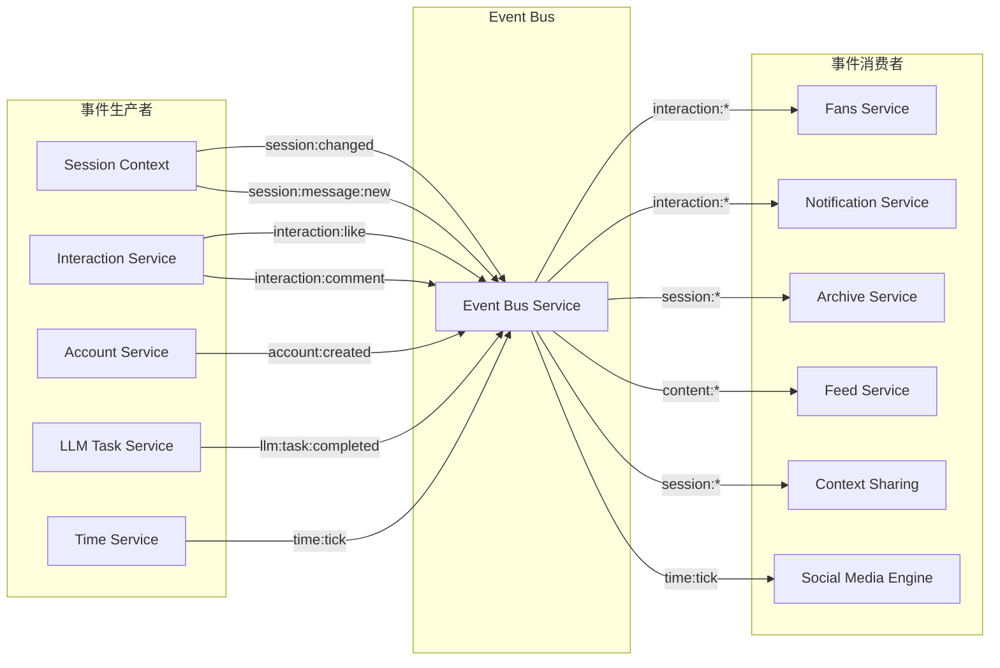

# 系统服务集成指南

> **版本**: 1.0  
> **状态**: 规划中  
> **最后更新**: 2025-01-08  
> **目标**: 定义各系统服务之间的集成关系、依赖规则和通信模式

## 1. 概述

本文档定义了 VirtuMirror 项目中各系统服务之间的集成关系。随着服务数量的增长，清晰的集成规范对于保持架构一致性和避免循环依赖至关重要。

### 1.1 文档目标

1. **明确依赖方向**：定义服务间的依赖层级，避免循环依赖
2. **统一通信模式**：规范服务间的调用方式（直接调用 vs 事件驱动）
3. **定义集成契约**：明确每个服务对外暴露的接口
4. **指导开发实践**：为新服务开发提供集成参考

### 1.2 设计原则

| 原则 | 说明 |
|------|------|
| **单向依赖** | 上层服务可依赖下层，下层不可依赖上层 |
| **接口隔离** | 服务只暴露必要的公共接口 |
| **事件解耦** | 跨层通信优先使用事件总线 |
| **延迟绑定** | 可选依赖通过注册机制延迟绑定 |
| **失败容错** | 依赖服务不可用时应有降级策略 |

---

## 2. 服务分层架构

### 2.1 四层架构模型

```text
┌─────────────────────────────────────────────────────────────────────────────┐
│                              Layer 4: 应用层                                 │
│    微博 App │ B站 App │ 知乎 App │ 图库 App │ 聊天 App │ 设置 App │ ...     │
└─────────────────────────────────────────────────────────────────────────────┘
                                     │ 调用
                                     ▼
┌─────────────────────────────────────────────────────────────────────────────┐
│                           Layer 3: 领域服务层                                │
│  ┌─────────────┐ ┌─────────────┐ ┌─────────────┐ ┌─────────────┐           │
│  │ Social Media│ │ Fans        │ │ Feed        │ │ Archive     │           │
│  │ Engine      │ │ Service     │ │ Service     │ │ Service     │           │
│  └─────────────┘ └─────────────┘ └─────────────┘ └─────────────┘           │
│  ┌─────────────┐ ┌─────────────┐ ┌─────────────┐ ┌─────────────┐           │
│  │ IM Service  │ │ Search      │ │ Trending    │ │ Interaction │           │
│  │             │ │ Service     │ │ Service     │ │ Service     │           │
│  └─────────────┘ └─────────────┘ └─────────────┘ └─────────────┘           │
└─────────────────────────────────────────────────────────────────────────────┘
                                     │ 调用
                                     ▼
┌─────────────────────────────────────────────────────────────────────────────┐
│                           Layer 2: 能力服务层                                │
│  ┌─────────────┐ ┌─────────────┐ ┌─────────────┐ ┌─────────────┐           │
│  │ Account     │ │ LLM Task    │ │ Notification│ │ Session     │           │
│  │ Service     │ │ Service     │ │ Service     │ │ Context     │           │
│  └─────────────┘ └─────────────┘ └─────────────┘ └─────────────┘           │
│  ┌─────────────┐ ┌─────────────┐ ┌─────────────┐ ┌─────────────┐           │
│  │ Media       │ │ Prompt      │ │ Context     │ │ Scheduler   │           │
│  │ Service     │ │ Service     │ │ Sharing     │ │ Service     │           │
│  └─────────────┘ └─────────────┘ └─────────────┘ └─────────────┘           │
│  ┌─────────────┐ ┌─────────────┐ ┌─────────────┐                           │
│  │ Audio       │ │ Icon        │ │ Narrative   │                           │
│  │ Service     │ │ Service     │ │ Service     │                           │
│  └─────────────┘ └─────────────┘ └─────────────┘                           │
└─────────────────────────────────────────────────────────────────────────────┘
                                     │ 调用
                                     ▼
┌─────────────────────────────────────────────────────────────────────────────┐
│                           Layer 1: 基础设施层                                │
│  ┌─────────────┐ ┌─────────────┐ ┌─────────────┐ ┌─────────────┐           │
│  │ Event Bus   │ │ Logger      │ │ Time        │ │ Database    │           │
│  │ Service     │ │ Service     │ │ Service     │ │ Service     │           │
│  └─────────────┘ └─────────────┘ └─────────────┘ └─────────────┘           │
│  ┌─────────────┐ ┌─────────────┐ ┌─────────────┐ ┌─────────────┐           │
│  │ JSON Parser │ │ Lazy Loader │ │ AI Service  │ │ Bridge      │           │
│  │ Service     │ │ Service     │ │             │ │ Adapter     │           │
│  └─────────────┘ └─────────────┘ └─────────────┘ └─────────────┘           │
└─────────────────────────────────────────────────────────────────────────────┘
```

### 2.2 层级依赖规则

| 规则 | 说明 | 示例 |
|------|------|------|
| **L4 → L3** | 应用层可调用领域服务 | 微博 App 调用 Social Media Engine |
| **L4 → L2** | 应用层可调用能力服务 | 设置 App 调用 Account Service |
| **L3 → L2** | 领域服务可调用能力服务 | Fans Service 调用 LLM Task Service |
| **L3 → L3** | 同层服务可相互调用（需注意方向）| Feed Service 调用 Interaction Service |
| **L2 → L1** | 能力服务可调用基础设施 | LLM Task Service 调用 AI Service |
| **L1 → L1** | 基础设施层内部可相互调用 | Logger 使用 Time Service 获取时间戳 |
| **❌ L1 → L2/L3** | 基础设施不可依赖上层 | Event Bus 不可调用 Account Service |
| **❌ L2 → L3** | 能力服务不可依赖领域服务 | Account Service 不可调用 Fans Service |

### 2.3 服务分类清单

#### Layer 1: 基础设施层

| 服务 | 职责 | 状态 | 零依赖 |
|------|------|------|--------|
| **Event Bus Service** | 事件发布/订阅 | ✅ 已实现 | ✅ |
| **Logger Service** | 统一日志 | ✅ 已实现 | ✅ |
| **Time Service** | 时间管理 | ✅ 已实现 | ✅ |
| **Database Service** | IndexedDB 封装 | ✅ 已实现 | ✅ |
| **JSON Parser Service** | JSON 解析修复 | ✅ 已实现 | ✅ |
| **Lazy Loader Service** | 惰性加载框架 | ✅ 已实现 | ✅ |
| **AI Service** | LLM API 调用 | ✅ 已实现 | ✅ |
| **Bridge Adapter** | 酒馆通信适配 | ✅ 已实现 | ✅ |

#### Layer 2: 能力服务层

| 服务 | 职责 | 状态 | 主要依赖 |
|------|------|------|----------|
| **Account Service** | 账号管理 | ✅ 已实现 | Database, EventBus |
| **Session Context Service** | 会话上下文 | ✅ 已实现 | EventBus, Bridge |
| **LLM Task Service** | LLM 任务调度 | ✅ 已实现 | AI, Prompt, Scheduler |
| **Notification Service** | 通知推送 | ✅ 已实现 | EventBus, Time |
| **Prompt Service** | 提示词管理 | ✅ 已实现 | Database |
| **Context Sharing Service** | 上下文共享 | ✅ 已实现 | EventBus |
| **Media Service** | 媒体管理 | 📋 设计完成 | Database, LazyLoader |
| **Scheduler Service** | 定时任务 | 📋 设计完成 | Time, EventBus |
| **Narrative Service** | 酒馆叙事 | ✅ 已实现 | Bridge |
| **Audio Service** | 音频处理 | ✅ 已实现 | Database |
| **Icon Service** | 图标管理 | ✅ 已实现 | Database |

#### Layer 3: 领域服务层

| 服务 | 职责 | 状态 | 主要依赖 |
|------|------|------|----------|
| **Social Media Engine** | 社交媒体核心 | ✅ 已实现 | Account, LLMTask, Time |
| **Interaction Service** | 互动行为 | ✅ 已实现 | Account, EventBus, Notification |
| **Fans Service** | 粉丝管理 | 📋 设计完成 | Account, Interaction, LLMTask |
| **Feed Service** | 信息流 | 📋 设计完成 | Account, Interaction, Time |
| **Search Service** | 搜索 | 📋 设计完成 | Database, LazyLoader |
| **Archive Service** | 档案知识库 | 📋 设计完成 | Account, LLMTask, SessionContext |
| **IM Service** | 即时通讯 | 📋 设计完成 | Account, Notification, LLMTask |
| **Trending Service** | 热搜管理 | 📋 待抽取 | LLMTask, Time, EventBus |

---

## 3. 服务依赖关系图

### 3.1 核心依赖关系

```mermaid
graph TD
    subgraph "Layer 4: 应用层"
        WeiboApp[微博 App]
        BilibiliApp[B站 App]
        GalleryApp[图库 App]
        ChatApp[聊天 App]
    end
    
    subgraph "Layer 3: 领域服务"
        SME[Social Media Engine]
        Fans[Fans Service]
        Feed[Feed Service]
        IM[IM Service]
        Search[Search Service]
        Archive[Archive Service]
        Interaction[Interaction Service]
    end
    
    subgraph "Layer 2: 能力服务"
        Account[Account Service]
        LLMTask[LLM Task Service]
        Notification[Notification Service]
        SessionCtx[Session Context]
        ContextShare[Context Sharing]
        Media[Media Service]
        Prompt[Prompt Service]
        Scheduler[Scheduler Service]
        Narrative[Narrative Service]
    end
    
    subgraph "Layer 1: 基础设施"
        EventBus[Event Bus]
        Logger[Logger Service]
        Time[Time Service]
        Database[Database Service]
        AI[AI Service]
        JSONParser[JSON Parser]
        LazyLoader[Lazy Loader]
        Bridge[Bridge Adapter]
    end
    
    %% Layer 4 → Layer 3
    WeiboApp --> SME
    WeiboApp --> Interaction
    BilibiliApp --> SME
    GalleryApp --> Media
    ChatApp --> IM
    
    %% Layer 3 → Layer 2
    SME --> Account
    SME --> LLMTask
    Fans --> Account
    Fans --> Interaction
    Fans --> LLMTask
    Feed --> Account
    Feed --> Interaction
    IM --> Account
    IM --> Notification
    IM --> LLMTask
    Search --> Database
    Archive --> Account
    Archive --> LLMTask
    Archive --> SessionCtx
    Interaction --> Account
    Interaction --> Notification
    
    %% Layer 2 → Layer 1
    Account --> Database
    Account --> EventBus
    LLMTask --> AI
    LLMTask --> Prompt
    LLMTask --> Scheduler
    Notification --> EventBus
    Notification --> Time
    SessionCtx --> EventBus
    SessionCtx --> Bridge
    ContextShare --> EventBus
    Media --> Database
    Media --> LazyLoader
    Prompt --> Database
    Scheduler --> Time
    Scheduler --> EventBus
    Narrative --> Bridge
    
    %% Layer 1 内部
    AI --> JSONParser
    LazyLoader --> Logger
```



### 3.2 事件驱动关系

除了直接依赖，服务间还通过事件总线进行松耦合通信：



---

## 4. 服务集成模式

### 4.1 直接调用模式

适用于：**同步、强依赖、有返回值** 的场景

```typescript
// ✅ 推荐：领域服务调用能力服务
class FansService {
  constructor(
    private accountService: AccountService,
    private interactionService: InteractionService,
    private llmTaskService: LLMTaskService,
  ) {}
  
  async generateFanProfile(accountId: string): Promise<FanProfile> {
    // 直接调用依赖服务
    const account = await this.accountService.getAccount(accountId);
    const interactions = await this.interactionService.getAccountInteractions(accountId);
    
    // 使用 LLM 生成画像
    return await this.llmTaskService.execute('generate_fan_profile', {
      account,
      interactions,
    });
  }
}
```

### 4.2 事件驱动模式

适用于：**异步、松耦合、无需返回值** 的场景

```typescript
// ✅ 推荐：通过事件解耦
class InteractionService {
  constructor(private eventBus: EventBus) {}
  
  async like(contentId: string, userId: string): Promise<void> {
    // 执行核心逻辑
    await this.db.recordLike(contentId, userId);
    
    // 发布事件，让其他服务响应
    this.eventBus.emit('interaction:like', {
      contentId,
      userId,
      timestamp: Date.now(),
    });
  }
}

// 粉丝服务订阅事件
class FansService {
  constructor(private eventBus: EventBus) {
    // 监听互动事件
    this.eventBus.on('interaction:like', this.handleLike.bind(this));
    this.eventBus.on('interaction:comment', this.handleComment.bind(this));
  }
  
  private handleLike(event: InteractionEvent): void {
    // 更新粉丝互动统计
    this.growthEngine.recordEngagement(event);
  }
}
```

### 4.3 上下文共享模式

适用于：**跨服务共享状态、LLM 上下文聚合** 的场景

```typescript
// ✅ 推荐：通过 Context Sharing Service 共享状态
class WeiboTrendingComponent {
  private contextSharing: ContextSharingService;
  
  mounted() {
    // 发布热搜数据供其他 App 使用
    this.contextSharing.publish({
      id: 'weibo:trending',
      type: 'trending:hot',
      data: this.trendingList,
      visibility: 'public',
    });
  }
}

class BilibiliHomeComponent {
  private contextSharing: ContextSharingService;
  
  async loadRelatedTrending() {
    // 订阅微博热搜
    const weiboTrending = this.contextSharing.getContext('weibo:trending');
    if (weiboTrending) {
      // 展示「微博热搜也在讨论」
    }
  }
}
```

### 4.4 惰性加载模式

适用于：**按需生成、延迟加载** 的场景

```typescript
// ✅ 推荐：使用 Lazy Loader 按需生成内容
class TrendingService {
  private topicPostsLoader: LazyLoader<Post[]>;
  
  constructor(private lazyLoaderService: LazyLoaderService) {
    this.topicPostsLoader = this.lazyLoaderService.create({
      loader: async (topicId) => {
        return await this.contentFactory.generatePostsForTopic(topicId, 5);
      },
      cache: { maxSize: 50, ttl: 30 * 60 * 1000 },
    });
  }
  
  async getTopicPosts(topicId: string): Promise<Post[]> {
    // 首次访问时才生成，之后使用缓存
    return await this.topicPostsLoader.get(topicId);
  }
}
```

### 4.5 定时调度模式

适用于：**周期性任务、批量处理** 的场景

```typescript
// ✅ 推荐：使用 Scheduler 管理定时任务
class FansGrowthEngine {
  constructor(private schedulerService: SchedulerService) {
    // 注册定时任务
    this.schedulerService.register({
      id: 'fans:growth:settle',
      appId: 'fans-service',
      name: '粉丝增长结算',
      schedule: { type: 'interval', ms: 60 * 60 * 1000 }, // 每小时
      handler: this.settleGrowth.bind(this),
    });
  }
  
  private async settleGrowth(): Promise<void> {
    // 执行结算逻辑
  }
}
```

---

## 5. 关键服务集成详解

### 5.1 Social Media Engine 集成关系

社交媒体引擎是最核心的领域服务，集成关系复杂：

```text
┌─────────────────────────────────────────────────────────────────────────────┐
│                         Social Media Engine                                  │
│  ┌─────────────┐ ┌─────────────┐ ┌─────────────┐ ┌─────────────┐           │
│  │ Content     │ │ Traffic     │ │ Trend       │ │ NPC Director│           │
│  │ Factory     │ │ Engine      │ │ Service     │ │             │           │
│  └──────┬──────┘ └──────┬──────┘ └──────┬──────┘ └──────┬──────┘           │
└─────────┼───────────────┼───────────────┼───────────────┼───────────────────┘
          │               │               │               │
          ▼               ▼               ▼               ▼
    ┌───────────────────────────────────────────────────────────────┐
    │                        依赖服务                                │
    │  Account │ LLM Task │ Time │ Prompt │ JSON Parser │ Session  │
    └───────────────────────────────────────────────────────────────┘
```

**集成点**：

| 子模块 | 集成服务 | 集成方式 | 说明 |
|--------|----------|----------|------|
| ContentFactory | LLM Task Service | 直接调用 | 生成博文、评论 |
| ContentFactory | JSON Parser Service | 直接调用 | 解析 LLM 输出 |
| ContentFactory | Account Service | 直接调用 | 获取作者信息 |
| TrafficEngine | Time Service | 直接调用 | 计算热度衰减 |
| TrendService | LLM Task Service | 直接调用 | 生成热搜 |
| TrendService | Lazy Loader | 直接调用 | 按需生成话题内容 |
| NPCDirector | Scheduler Service | 事件驱动 | 触发 NPC 行为 |
| NPCDirector | Session Context | 事件订阅 | 响应叙事变化 |

### 5.2 Fans Service 集成关系

粉丝服务依赖多个服务完成粉丝管理和增长模拟：

```text
┌─────────────────────────────────────────────────────────────────────────────┐
│                            Fans Service                                      │
│  ┌─────────────┐ ┌─────────────┐ ┌─────────────┐ ┌─────────────┐           │
│  │ Follower    │ │ Growth      │ │ Profile     │ │ Stats       │           │
│  │ Manager     │ │ Engine      │ │ Generator   │ │ Tracker     │           │
│  └──────┬──────┘ └──────┬──────┘ └──────┬──────┘ └──────┬──────┘           │
└─────────┼───────────────┼───────────────┼───────────────┼───────────────────┘
          │               │               │               │
          ▼               ▼               ▼               ▼
    ┌───────────────────────────────────────────────────────────────┐
    │                        依赖服务                                │
    │  Account │ Interaction │ LLM Task │ Scheduler │ Event Bus    │
    └───────────────────────────────────────────────────────────────┘
```

**集成点**：

| 子模块 | 集成服务 | 集成方式 | 说明 |
|--------|----------|----------|------|
| FollowerManager | Account Service | 直接调用 | 粉丝账号管理 |
| FollowerManager | Event Bus | 事件发布 | 关注/取关事件 |
| GrowthEngine | Interaction Service | 事件订阅 | 监听互动事件触发涨粉 |
| GrowthEngine | Scheduler Service | 定时任务 | 周期性结算增长 |
| ProfileGenerator | LLM Task Service | 直接调用 | 生成粉丝画像 |
| StatsTracker | Time Service | 直接调用 | 趋势时间戳 |

### 5.3 LLM Task Service 集成关系

LLM 任务服务是 AI 能力的核心调度器：

```text
┌─────────────────────────────────────────────────────────────────────────────┐
│                          LLM Task Service                                    │
│  ┌─────────────┐ ┌─────────────┐ ┌─────────────┐ ┌─────────────┐           │
│  │ Task        │ │ Variable    │ │ Output      │ │ Auto        │           │
│  │ Registry    │ │ Engine      │ │ Handler     │ │ Executor    │           │
│  └──────┬──────┘ └──────┬──────┘ └──────┬──────┘ └──────┬──────┘           │
└─────────┼───────────────┼───────────────┼───────────────┼───────────────────┘
          │               │               │               │
          ▼               ▼               ▼               ▼
    ┌───────────────────────────────────────────────────────────────┐
    │                        依赖服务                                │
    │  AI Service │ Prompt │ Scheduler │ Context Sharing │ Event Bus│
    └───────────────────────────────────────────────────────────────┘
                                     │
                                     ▼
    ┌───────────────────────────────────────────────────────────────┐
    │                      扩展点提供者                              │
    │  Narrative │ Session Context │ Archive │ Social Media Engine │
    └───────────────────────────────────────────────────────────────┘
```

**集成点**：

| 子模块 | 集成服务 | 集成方式 | 说明 |
|--------|----------|----------|------|
| TaskRegistry | Prompt Service | 直接调用 | 获取任务提示词 |
| VariableEngine | Context Sharing | 扩展点 | 获取共享上下文 |
| VariableEngine | Narrative Service | 扩展点 | 获取酒馆叙事 |
| OutputHandler | JSON Parser | 直接调用 | 解析 LLM 输出 |
| OutputHandler | Event Bus | 事件发布 | 任务完成事件 |
| AutoExecutor | Scheduler Service | 直接调用 | 注册自动执行 |
| AutoExecutor | Session Context | 事件订阅 | 响应会话变化 |

### 5.4 Session Context + Context Sharing 集成

这两个服务共同管理跨服务的上下文状态：

```text
┌───────────────────────────────────────┐      ┌───────────────────────────────┐
│        Session Context Service        │      │    Context Sharing Service    │
│  ┌─────────────────────────────────┐  │      │  ┌─────────────────────────┐  │
│  │ 会话状态                         │  │      │  │ 共享上下文               │  │
│  │ - sessionId                     │  │◀────▶│  │ - narrative:content     │  │
│  │ - messageId                     │  │ 同步  │  │ - trending:hot          │  │
│  │ - swipeId                       │  │      │  │ - user:profile          │  │
│  └─────────────────────────────────┘  │      │  └─────────────────────────┘  │
│                 │                     │      │               │               │
│                 ▼                     │      │               ▼               │
│  ┌─────────────────────────────────┐  │      │  ┌─────────────────────────┐  │
│  │ 内容溯源                         │  │      │  │ 订阅者                   │  │
│  │ - ContentSourceTracking         │  │      │  │ - LLM Task Service      │  │
│  │ - 生成来源追踪                   │  │      │  │ - Archive Service       │  │
│  └─────────────────────────────────┘  │      │  │ - 各 App 组件            │  │
└───────────────────────────────────────┘      │  └─────────────────────────┘  │
          │                                    └───────────────────────────────┘
          │ Bridge 事件
          ▼
    ┌───────────────┐
    │ SillyTavern   │
    │ Bridge Adapter│
    └───────────────┘
```

**集成点**：

| 服务 | 集成对象 | 集成方式 | 说明 |
|------|----------|----------|------|
| Session Context | Bridge Adapter | 事件订阅 | 响应酒馆消息 |
| Session Context | Event Bus | 事件发布 | 广播会话变化 |
| Session Context | Context Sharing | 发布/订阅 | 同步会话状态 |
| Context Sharing | Narrative Service | 上下文提供 | 提供叙事内容 |
| Context Sharing | LLM Task Service | 上下文消费 | 聚合 LLM 上下文 |

---

## 6. 事件总线事件规范

### 6.1 事件命名规范

```text
格式：{domain}:{entity}:{action}

示例：
- session:message:new      # 会话域 - 消息实体 - 新增动作
- interaction:like:created # 互动域 - 点赞实体 - 创建动作
- account:profile:updated  # 账号域 - 档案实体 - 更新动作
```

### 6.2 标准事件清单

#### 会话相关事件

| 事件名 | 触发时机 | Payload | 消费者 |
|--------|----------|---------|--------|
| `session:changed` | 会话切换 | `{ sessionId, previousId }` | Archive, ContextSharing |
| `session:message:new` | 新消息 | `{ sessionId, messageId, content }` | Archive, SME |
| `session:swipe:changed` | Swipe 切换 | `{ messageId, swipeId }` | ContextSharing |

#### 互动相关事件

| 事件名 | 触发时机 | Payload | 消费者 |
|--------|----------|---------|--------|
| `interaction:like` | 点赞 | `{ contentId, userId, platformId }` | Fans, Notification |
| `interaction:unlike` | 取消点赞 | `{ contentId, userId }` | Fans |
| `interaction:favorite` | 收藏 | `{ contentId, userId, collection? }` | Notification |
| `interaction:comment` | 评论 | `{ contentId, userId, text }` | Fans, Notification, Archive |
| `interaction:repost` | 转发 | `{ contentId, userId, comment? }` | Fans, Notification |
| `interaction:follow` | 关注 | `{ fromId, toId, platformId }` | Fans, Notification |
| `interaction:unfollow` | 取关 | `{ fromId, toId }` | Fans |

#### 内容相关事件

| 事件名 | 触发时机 | Payload | 消费者 |
|--------|----------|---------|--------|
| `content:post:created` | 新帖子 | `{ postId, authorId, platformId }` | Feed, Search |
| `content:post:deleted` | 删除帖子 | `{ postId }` | Feed, Search |
| `content:trending:updated` | 热搜更新 | `{ platformId, items[] }` | ContextSharing, Feed |

#### 账号相关事件

| 事件名 | 触发时机 | Payload | 消费者 |
|--------|----------|---------|--------|
| `account:created` | 新账号 | `{ accountId, type }` | Search |
| `account:updated` | 账号更新 | `{ accountId, changes }` | ContextSharing |
| `account:profile:updated` | 档案更新 | `{ accountId, profile }` | Search |

#### 系统相关事件

| 事件名 | 触发时机 | Payload | 消费者 |
|--------|----------|---------|--------|
| `time:tick` | 时间流逝 | `{ timestamp, delta }` | SME, Scheduler |
| `time:day:changed` | 跨天 | `{ date, previousDate }` | Scheduler |
| `llm:task:started` | 任务开始 | `{ taskId, taskType }` | Logger |
| `llm:task:completed` | 任务完成 | `{ taskId, result }` | Archive, Notification |
| `llm:task:failed` | 任务失败 | `{ taskId, error }` | Logger, Notification |

### 6.3 事件通道规范

```typescript
// 使用命名通道隔离不同领域的事件
const sessionChannel = eventBus.channel('session');
const interactionChannel = eventBus.channel('interaction');
const contentChannel = eventBus.channel('content');

// 领域服务只订阅相关通道
class FansService {
  constructor(eventBus: EventBus) {
    const interactionChannel = eventBus.channel('interaction');
    interactionChannel.on('like', this.handleLike.bind(this));
    interactionChannel.on('comment', this.handleComment.bind(this));
  }
}
```

---

## 7. 上下文共享规范

### 7.1 共享上下文类型

| 上下文 ID | 类型 | 发布者 | 典型消费者 |
|-----------|------|--------|------------|
| `system:time` | 系统时间 | Time Service | 各服务 |
| `system:session` | 会话信息 | Session Context | LLM Task |
| `narrative:content` | 酒馆叙事 | Narrative Service | LLM Task, Archive |
| `narrative:characters` | 当前角色 | Narrative Service | SME |
| `trending:hot` | 热搜数据 | Trending Service | Feed, LLM Task |
| `archive:core` | 核心档案 | Archive Service | LLM Task |
| `user:profile` | 用户画像 | Account Service | LLM Task, Feed |
| `chat:recent` | 最近聊天 | Chat App | LLM Task |

### 7.2 上下文发布规范

```typescript
// ✅ 推荐：使用类型安全的上下文发布
interface SharedContextTypes {
  'system:time': { timestamp: number; timezone: string };
  'system:session': { sessionId: string; messageId?: string };
  'narrative:content': { content: string; source: string };
  'trending:hot': { platformId: string; items: TrendItem[] };
}

class TrendingService {
  private contextSharing: ContextSharingService;
  
  publishTrending(platformId: string, items: TrendItem[]): void {
    this.contextSharing.publish<SharedContextTypes['trending:hot']>({
      id: `${platformId}:trending`,
      type: 'trending:hot',
      publisherId: `${platformId}-app`,
      data: { platformId, items },
      visibility: 'public',
      ttl: 30 * 60 * 1000, // 30 分钟过期
    });
  }
}
```

### 7.3 LLM 上下文聚合

```typescript
// LLM Task Service 聚合上下文示例
class LLMTaskService {
  async buildContext(taskId: string, scopes: ContextScope[]): Promise<string> {
    const contexts: string[] = [];
    
    for (const scope of scopes) {
      switch (scope) {
        case 'narrative':
          const narrative = this.contextSharing.getContext('narrative:content');
          if (narrative) contexts.push(`【当前剧情】\n${narrative.content}`);
          break;
          
        case 'trending':
          const trending = this.contextSharing.getContext('weibo:trending');
          if (trending) {
            const topItems = trending.items.slice(0, 5).map(t => t.title).join('、');
            contexts.push(`【热门话题】${topItems}`);
          }
          break;
          
        case 'userProfile':
          const profile = this.contextSharing.getContext('user:profile');
          if (profile) contexts.push(`【用户画像】\n${JSON.stringify(profile)}`);
          break;
      }
    }
    
    return contexts.join('\n\n');
  }
}
```

---

## 8. 服务初始化顺序

### 8.1 初始化依赖图

服务初始化必须按依赖顺序进行：

```text
Phase 1: 基础设施层（无依赖）
├── Logger Service
├── Time Service  
├── Event Bus Service
├── Database Service
├── JSON Parser Service
├── Lazy Loader Service
├── AI Service
└── Bridge Adapter

Phase 2: 能力服务层（依赖 Phase 1）
├── Account Service      ← Database, EventBus
├── Prompt Service       ← Database
├── Narrative Service    ← Bridge
├── Session Context      ← EventBus, Bridge
├── Context Sharing      ← EventBus
├── Notification Service ← EventBus, Time
├── Scheduler Service    ← Time, EventBus
├── Media Service        ← Database, LazyLoader
├── Audio Service        ← Database
├── Icon Service         ← Database
└── LLM Task Service     ← AI, Prompt, Scheduler

Phase 3: 领域服务层（依赖 Phase 1 & 2）
├── Interaction Service  ← Account, EventBus, Notification
├── Social Media Engine  ← Account, LLMTask, Time
├── Fans Service         ← Account, Interaction, LLMTask, Scheduler
├── Feed Service         ← Account, Interaction, Time
├── Search Service       ← Database, LazyLoader
├── Archive Service      ← Account, LLMTask, SessionContext
├── IM Service           ← Account, Notification, LLMTask
└── Trending Service     ← LLMTask, Time, EventBus

Phase 4: 应用层
└── 各 App 初始化
```

### 8.2 初始化代码示例

```typescript
// src/services/index.ts

export async function initializeServices(): Promise<ServiceRegistry> {
  const registry = new ServiceRegistry();
  
  // Phase 1: 基础设施
  const logger = new LoggerService();
  const timeService = new TimeService();
  const eventBus = new EventBusService();
  const database = await DatabaseService.initialize();
  const jsonParser = new JsonParserService();
  const lazyLoader = new LazyLoaderService({ logger });
  const aiService = new AIService({ jsonParser });
  const bridge = new BridgeAdapter();
  
  registry.registerAll({
    logger, timeService, eventBus, database,
    jsonParser, lazyLoader, aiService, bridge,
  });
  
  // Phase 2: 能力服务
  const accountService = new AccountService({ database, eventBus });
  const promptService = new PromptService({ database });
  const narrativeService = new NarrativeService({ bridge });
  const sessionContext = new SessionContextService({ eventBus, bridge });
  const contextSharing = new ContextSharingService({ eventBus });
  const notificationService = new NotificationService({ eventBus, timeService });
  const schedulerService = new SchedulerService({ timeService, eventBus });
  const llmTaskService = new LLMTaskService({
    aiService, promptService, schedulerService, contextSharing,
  });
  
  registry.registerAll({
    accountService, promptService, narrativeService, sessionContext,
    contextSharing, notificationService, schedulerService, llmTaskService,
  });
  
  // Phase 3: 领域服务
  const interactionService = new InteractionService({
    accountService, eventBus, notificationService,
  });
  const socialMediaEngine = new SocialMediaEngine({
    accountService, llmTaskService, timeService,
  });
  const fansService = new FansService({
    accountService, interactionService, llmTaskService, schedulerService,
  });
  
  registry.registerAll({
    interactionService, socialMediaEngine, fansService,
  });
  
  return registry;
}
```

---

## 9. 错误处理与降级策略

### 9.1 服务不可用处理

```typescript
// ✅ 推荐：依赖服务不可用时的降级处理
class FansService {
  async generateFanProfile(accountId: string): Promise<FanProfile | null> {
    try {
      // 尝试使用 LLM 生成
      return await this.llmTaskService.execute('generate_fan_profile', { accountId });
    } catch (error) {
      this.logger.warn('LLM 生成失败，使用模板生成', { error });
      
      // 降级：使用模板生成
      return this.generateTemplateProfile(accountId);
    }
  }
  
  private generateTemplateProfile(accountId: string): FanProfile {
    // 使用预设模板生成基础画像
    return {
      id: accountId,
      nickname: `粉丝${accountId.slice(-4)}`,
      tags: ['新粉丝'],
      activity: 'low',
    };
  }
}
```

### 9.2 事件处理失败

```typescript
// ✅ 推荐：事件处理的错误隔离
class FansService {
  constructor(eventBus: EventBus) {
    eventBus.on('interaction:like', (event) => {
      // 包装在 try-catch 中，避免影响其他订阅者
      try {
        this.handleLike(event);
      } catch (error) {
        this.logger.error('处理点赞事件失败', { event, error });
        // 不抛出异常，让事件继续传播
      }
    });
  }
}
```

### 9.3 上下文缺失处理

```typescript
// ✅ 推荐：上下文不存在时的优雅降级
class LLMTaskService {
  async buildContext(scopes: ContextScope[]): Promise<string> {
    const contexts: string[] = [];
    
    for (const scope of scopes) {
      const context = this.contextSharing.getContext(scope);
      if (context) {
        contexts.push(this.formatContext(scope, context));
      } else {
        // 记录日志但不中断执行
        this.logger.debug(`上下文 ${scope} 不存在，跳过`);
      }
    }
    
    // 即使所有上下文都缺失，也返回空字符串而非抛出异常
    return contexts.join('\n\n');
  }
}
```

---

## 10. 最佳实践

### 10.1 服务设计原则

| 原则 | 说明 | 示例 |
|------|------|------|
| **单一职责** | 每个服务只负责一个领域 | Account 只管账号，不管粉丝逻辑 |
| **依赖注入** | 通过构造函数注入依赖 | `new FansService({ accountService })` |
| **接口优先** | 依赖接口而非实现 | `IAccountService` 而非 `AccountService` |
| **事件解耦** | 跨领域通信用事件 | 互动事件 → 粉丝服务 |
| **失败容错** | 依赖不可用时降级 | LLM 失败 → 模板生成 |

### 10.2 代码规范

```typescript
// ✅ 推荐的服务实现模式
class ExampleService {
  // 1. 类型安全的依赖声明
  constructor(
    private readonly accountService: IAccountService,
    private readonly eventBus: IEventBus,
    private readonly logger: ILogger,
  ) {
    // 2. 构造函数中订阅事件
    this.setupEventListeners();
  }
  
  // 3. 私有方法设置事件监听
  private setupEventListeners(): void {
    this.eventBus.on('interaction:like', this.handleLike.bind(this));
  }
  
  // 4. 公共方法清晰的输入输出
  async doSomething(input: SomeInput): Promise<SomeOutput> {
    this.logger.debug('开始执行', { input });
    
    try {
      const result = await this.processInput(input);
      this.logger.info('执行成功', { result });
      return result;
    } catch (error) {
      this.logger.error('执行失败', { error });
      throw error; // 或降级处理
    }
  }
  
  // 5. 私有方法封装实现细节
  private async processInput(input: SomeInput): Promise<SomeOutput> {
    // 实现逻辑
  }
  
  // 6. 事件处理方法
  private handleLike(event: LikeEvent): void {
    // 处理逻辑
  }
}
```

### 10.3 测试策略

```typescript
// ✅ 推荐的服务测试模式
describe('FansService', () => {
  let fansService: FansService;
  let mockAccountService: jest.Mocked<IAccountService>;
  let mockEventBus: jest.Mocked<IEventBus>;
  
  beforeEach(() => {
    // Mock 依赖
    mockAccountService = createMockAccountService();
    mockEventBus = createMockEventBus();
    
    fansService = new FansService({
      accountService: mockAccountService,
      eventBus: mockEventBus,
    });
  });
  
  describe('follow', () => {
    it('should create follower relationship', async () => {
      await fansService.follow('user1', 'user2');
      
      expect(mockAccountService.createRelation).toHaveBeenCalledWith(
        'user1', 'user2', 'follow'
      );
    });
    
    it('should emit follow event', async () => {
      await fansService.follow('user1', 'user2');
      
      expect(mockEventBus.emit).toHaveBeenCalledWith(
        'interaction:follow',
        expect.objectContaining({ fromId: 'user1', toId: 'user2' })
      );
    });
  });
});
```

---

## 11. 附录

### 11.1 服务状态速查表

| 服务 | 层级 | 状态 | 文档位置 |
|------|------|------|----------|
| Event Bus | L1 | ✅ 已实现 | `eventBus-service/` |
| Logger | L1 | ✅ 已实现 | `logger-service/` |
| Time | L1 | ✅ 已实现 | `time-service/` |
| Database | L1 | ✅ 已实现 | - |
| JSON Parser | L1 | ✅ 已实现 | `json-parser-service/` |
| Lazy Loader | L1 | ✅ 已实现 | `lazy-loader-service/` |
| AI Service | L1 | ✅ 已实现 | `ai-service/` |
| Account | L2 | ✅ 已实现 | `account-service/` |
| Session Context | L2 | ✅ 已实现 | `session-context/` |
| Context Sharing | L2 | ✅ 已实现 | `context-sharing-service/` |
| LLM Task | L2 | ✅ 已实现 | `llm-task-service/` |
| Notification | L2 | ✅ 已实现 | `notification-service/` |
| Prompt | L2 | ✅ 已实现 | `prompt-service/` |
| Narrative | L2 | ✅ 已实现 | `narrative-service/` |
| Scheduler | L2 | 📋 设计完成 | `scheduler-service/` |
| Media | L2 | 📋 设计完成 | `media-service/` |
| Audio | L2 | ✅ 已实现 | `audio-service/` |
| Icon | L2 | ✅ 已实现 | `icon-service/` |
| Interaction | L3 | ✅ 已实现 | `interaction-service/` |
| Social Media Engine | L3 | ✅ 已实现 | `social-media-engine/` |
| Fans | L3 | 📋 设计完成 | `fans-service/` |
| Feed | L3 | 📋 设计完成 | `feed-service/` |
| Search | L3 | 📋 设计完成 | `search-service/` |
| Archive | L3 | 📋 设计完成 | `archive-service/` |
| IM | L3 | 📋 设计完成 | `im-service.md` |

### 11.2 相关文档索引

- [社交内容平台系统服务架构](./Service-for-social-media-platform.md)
- [服务开发指南](../service-development-guide.md)
- [LLM Task 上下文共享设计](../llm-task-service/context-sharing.md)

### 11.3 版本历史

| 版本 | 日期 | 变更内容 |
|------|------|----------|
| 1.0 | 2025-01-08 | 初始版本，定义服务分层和集成模式 |
