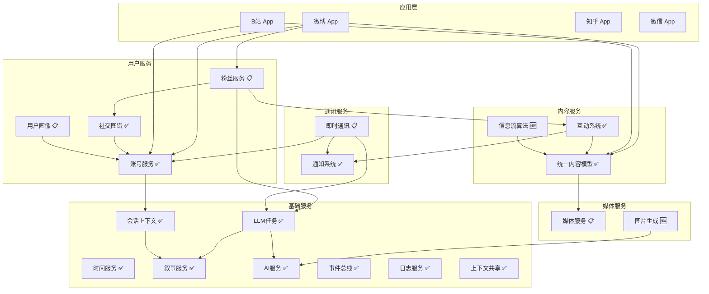

# 社交内容平台系统服务架构

> **版本**: 1.8
> **状态**: 迭代中（核心基础服务、Trending、Social Graph、Feed、Scheduler、Archive MVP 已落地）
> **最后更新**: 2026-02-08
> **目标**: 让小手机模拟器实现平台化和通用化

## 1. 概述

本文档分析社交内容平台（微博、B站、知乎、抖音等）所需的系统服务，目标是通过 **"Core & Skin"** 架构实现平台化：各 App 仅作为渲染层（Skin），共享底层的内容模型、算法、用户系统（Core）。

### 1.1 设计原则

1. **引擎与皮肤分离**：核心逻辑下沉到系统服务，App 只负责 UI 渲染
2. **统一数据模型**：跨平台共享同一套数据结构
3. **可插拔扩展**：通过注册机制支持平台特定功能
4. **按需加载**：服务懒加载，避免不必要的资源占用

### 1.2 API 聚合入口

为减少提示词 Token 和跨文档跳转成本，服务调用入口统一聚合在：

- [API-INDEX.md](../api/API-INDEX.md)：人读总览（8 字段摘要 + 可调用服务清单）
- [API-RECIPES.md](../api/API-RECIPES.md)：跨服务编排流程（固定结构 Recipe）
- [api-manifest.json](../api/api-manifest.json)：机器可读清单（RAG/代码生成）

---

## 2. 当前架构概览

```text
┌─────────────────────────────────────────────────────────────────────────┐
│                           应用层 (App Skins)                              │
│  ┌─────────┐  ┌─────────┐  ┌─────────┐  ┌─────────┐  ┌─────────┐        │
│  │  微博   │  │  B站    │  │  抖音   │  │  知乎   │  │ 朋友圈  │ ...    │
│  └────┬────┘  └────┬────┘  └────┬────┘  └────┬────┘  └────┬────┘        │
└───────┼────────────┼────────────┼────────────┼────────────┼─────────────┘
        │            │            │            │            │
        └────────────┴─────┬──────┴────────────┴────────────┘
                           ▼
┌─────────────────────────────────────────────────────────────────────────┐
│                      系统服务层 (System Services)                         │
│                                                                          │
│  ┌──────────────────┐  ┌──────────────────┐  ┌──────────────────┐       │
│  │ Social Media     │  │ Account Service  │  │ LLM Task Service │       │
│  │ Engine (核心引擎) │  │ (账号服务)        │  │ (LLM任务服务)     │       │
│  └──────────────────┘  └──────────────────┘  └──────────────────┘       │
│                                                                          │
│  ┌──────────────────┐  ┌──────────────────┐  ┌──────────────────┐       │
│  │ Notification     │  │ Media Service    │  │ Time Service     │       │
│  │ System (通知)     │  │ (媒体服务)        │  │ (时间服务)        │       │
│  └──────────────────┘  └──────────────────┘  └──────────────────┘       │
│                                                                          │
│  ┌──────────────────┐  ┌──────────────────┐  ┌──────────────────┐       │
│  │ Narrative        │  │ Session Context  │  │ IM Service       │       │
│  │ Service (叙事)    │  │ Service (会话)    │  │ (即时通讯)        │       │
│  └──────────────────┘  └──────────────────┘  └──────────────────┘       │
└─────────────────────────────────────────────────────────────────────────┘
```

---

## 3. 服务状态总览

### 3.1 已实现服务

| 服务 | 文档位置 | 状态 | 说明 |
| ------ | ---------- | ------ | ------ |
| **Social Media Engine** | `social-media-engine/` | ✅ Phase 1-3 | TrendService、ContentFactory、TrafficEngine |
| **Account Service** | `account-service/` | ✅ Phase 1-4 | 双层作用域、玩家多重身份 |
| **LLM Task Service** | `llm-task-service/` | ✅ v1.0 | 任务定义、执行、扩展点 |
| **Notification System** | `notification-service/` | ✅ 已实现 | 通知推送、勿扰模式 |
| **Time Service** | `time-service/` | ✅ 已实现 | 多时间源、模拟时间 |
| **Narrative Service** | `narrative-service/` | ✅ 已实现 | 酒馆叙事分发 |
| **统一内容模型** | `已完成的/social-content-types.md` | ✅ Phase 1-5 | UniversalPost、MediaAsset、解析器架构 |
| **Session Context Service** | `session-context/` | ✅ v1.0 | 会话隔离、来源追踪、Bridge 集成 |
| **Event Bus Service** | `eventBus-service/` | ✅ v1.0 | 发布/订阅、通道隔离、类型安全 |
| **Interaction Service** | `interaction-service/` | ✅ v1.0 | 点赞/收藏/评论、事件广播、平台扩展 |
| **Logger Service** | `logger-service/` | ✅ v1.0 | 命名空间、多 Transport、性能计时 |
| **Context Sharing Service** | `context-sharing-service/` | ✅ v1.0 | 发布/订阅、聚合、LLM 集成 |
| **Trending Service** | `trending-service/` | ✅ v1.0 | 热搜生成、热度排序、共享策略、兼容层迁移 |
| **Social Graph Service** | `social-graph-service/` | ✅ v1.0 | 关注/拉黑/静音、互关、统计、推荐、事件广播 |
| **Feed Service** | `feed-service/` | ✅ v1.0 | 信息流聚合、排序、缓存、默认系统数据源接入 |
| **Scheduler Service** | `scheduler-service/` | ✅ v1.0 | 定时任务、Cron、事件触发、统计 |
| **Archive Service** | `archive-service/` | 🟡 MVP | CRUD、绑定、去重、注入、手动提取、ContentFactory 集成 |

### 3.2 已设计/进行中服务

| 服务 | 文档位置 | 状态 | 说明 |
| ------ | ---------- | ------ | ------ |
| **Media Service** | `media-service/` | 📋 设计完成，部分实现 | 统一媒体库、跨应用共享 |
| **Fans Service** | `fans-service/` | 📋 设计完成 | 粉丝管理、增长算法、画像生成 |
| **Search Service** | `search-service/` | 🟡 MVP 骨架已实现（待业务接入） | L1/L2 内存全文检索、建议补全（语义检索待补） |
| **IM Service** | `im-service.md` | 📋 设计完成 | 私信引擎、Private Director |

### 3.3 建议开发的服务

| 服务 | 优先级 | 说明 |
| ------ | -------- | ------ |
| **Feed Algorithm Service** | 🟡 中 | 信息流推荐算法 |
| **Rate Limiter Service** | 🟡 中 | 频率控制与限流 |
| **Vector Store** | 🟡 中 | 向量存储与相似度查询 |
| **Deep Link Service** | 🟢 低 | 跨应用深度链接导航 |
| **Image Generation Service** | 🟢 低 | AI 配图生成 |

---

## 4. 核心服务详解

### 4.1 内容层服务

#### 统一内容模型 ✅ 已实现

> 详见 [social-content-types.md](../已完成的/social-content-types.md)

**核心类型**：

```typescript
// 主内容类型
type PrimaryContentType =
  | 'text' | 'gallery' | 'video' | 'article'
  | 'poll' | 'repost' | 'link' | 'audio'
  | 'live' | 'question' | 'answer' | 'mixed';

// 统一帖子结构
interface UniversalPost {
  id: string;
  platformId: string;           // 'weibo' | 'bilibili' | 'zhihu'
  authorId: string;
  timestamp: number;
  primaryType: PrimaryContentType;
  contentFlags: ContentFlags;
  media: MediaAsset[];
  payload: PostPayload;
  stats: UniversalStats;
  topicTags: string[];
  platformData?: Record<string, any>;
}
```

**已完成能力**：

- Phase 1: 统一 payload 结构 ✅
- Phase 2: 社交引擎迁移到新账号系统 ✅
- Phase 3: 消除 UI 类型，使用 DisplayPost ✅
- Phase 4: 提示词适配重构 ✅
- Phase 5: 解析器分发架构（总部-分部） ✅

---

#### 互动系统服务 ✅ 已实现

> 详见 [interaction-service/README.md](../interaction-service/README.md)

**已实现能力**：

- 通用互动行为：点赞、收藏、评论、转发、浏览记录
- 互动统计查询：用户历史、内容统计、分页查询
- 事件广播：统一 `InteractionEvent`，供粉丝/通知等服务订阅
- 平台扩展：微博、B站、知乎扩展行为已接入

**精简说明**：

- 本文档仅保留能力概览，接口细节统一维护在 `docs/systems/interaction-service/` 和 `src/services/interaction/`

---

### 4.2 用户/关系层服务

#### Account Service ✅ 已实现

> 详见 [account-service.md](../account-service.md)

**已实现能力**：

- 双层作用域模型（实体级 + 账号级）
- 玩家多重身份
- 平台账号管理
- 社交关系基础管理

**需要扩展**：

- 与 Session Context Service 深度集成
- 账号与会话绑定（见 `session-binding-design.md`）

---

#### Social Graph Service ✅ 已实现（v1.0）

**目的**：专注于社交关系的管理和图算法

**与 Account Service 的区别**：

- Account Service：管理账号实体和基础数据
- Social Graph Service：专注关系的增删查改和图算法

```typescript
// src/services/socialGraph/SocialGraphService.ts

class SocialGraphService {
  // 关系管理
  async follow(fromId: string, toId: string, platformId: string): Promise<void>;
  async unfollow(fromId: string, toId: string, platformId: string): Promise<void>;
  async block(fromId: string, toId: string): Promise<void>;
  async mute(fromId: string, toId: string): Promise<void>;
  
  // 关系查询
  async getFollowers(accountId: string, options?: QueryOptions): Promise<Account[]>;
  async getFollowing(accountId: string, options?: QueryOptions): Promise<Account[]>;
  async getMutualFollows(accountId: string): Promise<Account[]>;
  async isFollowing(fromId: string, toId: string): Promise<boolean>;
  
  // 推荐算法
  async getRecommendedFollows(accountId: string, limit?: number): Promise<Account[]>;
  async getSimilarUsers(accountId: string): Promise<Account[]>;
  
  // 统计
  async getRelationshipStats(accountId: string): Promise<{
    followers: number;
    following: number;
    mutualFollows: number;
  }>;
  
  // 批量操作
  async batchFollow(fromId: string, toIds: string[]): Promise<void>;
}
```

**实现状态**：✅ 已落地，后续按业务迭代推荐策略

---

### 4.3 分发/算法层服务

#### Feed Algorithm Service 🆕 建议开发

**目的**：为各平台提供可配置的信息流推荐算法

**问题背景**：当前 `TrafficEngine` 只用于热度计算，缺乏完整的信息流推荐能力。

```typescript
// src/services/feed/FeedAlgorithmService.ts

class FeedAlgorithmService {
  // 获取个性化信息流
  async getPersonalizedFeed(
    userId: string,
    platformId: string,
    options?: FeedOptions
  ): Promise<UniversalPost[]>;
  
  // 获取热门内容
  async getTrendingContent(
    platformId: string,
    category?: string,
    limit?: number
  ): Promise<UniversalPost[]>;
  
  // 获取发现页内容
  async getDiscoverContent(
    userId: string,
    platformId: string
  ): Promise<UniversalPost[]>;
  
  // 算法配置（按平台）
  registerAlgorithm(platformId: string, config: AlgorithmConfig): void;
  getAlgorithmConfig(platformId: string): AlgorithmConfig;
}

interface AlgorithmConfig {
  // 权重配置
  weights: {
    recency: number;      // 时效性权重 (0-1)
    engagement: number;   // 互动量权重 (0-1)
    relevance: number;    // 相关性权重 (0-1)
    social: number;       // 社交因素权重 (0-1)
  };
  
  // 衰减参数
  decayHalfLife: number;  // 热度半衰期（小时）
  
  // 多样性控制
  diversityRules?: {
    maxSameAuthor: number;      // 同作者最多几条
    maxSameCategory: number;    // 同类目最多几条
  };
  
  // 平台特定规则
  platformRules?: Record<string, any>;
}

interface FeedOptions {
  limit?: number;
  offset?: number;
  excludeIds?: string[];
  category?: string;
  timeRange?: { start: number; end: number };
}
```

**价值**：

- 微博的 TrafficEngine 可以抽象为通用服务
- 不同平台可以配置不同的算法参数
- 支持用户自定义推荐偏好

**实现优先级**：🟡 中

---

#### Fans Service（粉丝服务）📋 已设计

> 详见 [fans-service/README.md](../fans-service/README.md)

粉丝服务是社交媒体模拟系统的核心服务之一，负责管理账号的粉丝关系、模拟粉丝增长、生成粉丝画像，并追踪粉丝互动行为。

**核心能力**：

| 能力模块 | 说明 |
| -------- | ---- |
| **粉丝管理** | 关注/取关、粉丝列表、互粉检测 |
| **增长引擎** | 六大涨粉渠道、数值算法 |
| **画像系统** | 粉丝特征、兴趣标签、活跃度 |
| **互动追踪** | 粉丝评论、点赞、转发追踪 |
| **数据统计** | 涨粉趋势、来源分析、里程碑 |

**设计原则**：

- 真实感优先：粉丝增长曲线符合真实社交媒体规律
- 可解释性：每次涨粉都能追溯到具体原因
- LLM 增强：关键节点使用 LLM 生成内容

**实现优先级**：🟡 中（体验增强）

---

### 4.4 媒体/资源层服务

#### Media Service 📋 已设计

> 详见 [media-service.md](../media-service.md)

**设计要点**：

- 统一媒体库（IndexedDB `media_assets` 表）
- 缩略图自动生成
- 跨应用共享
- 虚拟 URI 系统（`internal://media/images/{id}`）

**实现计划**：

| Phase | 内容 | 状态 |
| ------- | ------ | ------ |
| Phase 1 | Service 和数据库表 | 📋 待实现 |
| Phase 2 | Gallery 数据迁移 | 📋 待实现 |
| Phase 3 | Store 接入 | 📋 待实现 |
| Phase 4 | UI 适配 | 📋 待实现 |

**实现优先级**：🟡 中

---

#### Image Generation Service 🆕 建议开发

**目的**：为 LLM 生成的内容提供配图能力

**问题背景**：当前博文图片仅为文字描述（`MediaAsset.description`），无法真正展示。

```typescript
// src/services/imageGen/ImageGenerationService.ts

class ImageGenerationService {
  // 根据描述生成图片
  async generateFromDescription(
    description: string,
    options?: GenerationOptions
  ): Promise<MediaAsset>;
  
  // 批量生成
  async generateBatch(
    descriptions: string[],
    options?: GenerationOptions
  ): Promise<MediaAsset[]>;
  
  // 占位图生成（不调用 AI，纯文字描述的占位符）
  generatePlaceholder(description: string, dimensions?: { width: number; height: number }): string;
  
  // 与外部 AI 服务集成
  setProvider(provider: ImageGenProvider): void;
  getAvailableProviders(): ImageGenProvider[];
}

interface GenerationOptions {
  style?: 'realistic' | 'anime' | 'illustration' | 'photo';
  aspectRatio?: '1:1' | '4:3' | '16:9' | '9:16';
  quality?: 'draft' | 'standard' | 'high';
}

type ImageGenProvider = 'dalle' | 'stable-diffusion' | 'midjourney' | 'placeholder';
```

**实现优先级**：🟢 低（锦上添花）

---

### 4.5 通讯层服务

#### IM Service 📋 已设计

> 详见 [im-service.md](../im-service.md)

**设计要点**：

- 统一会话管理
- 拟人化行为模拟（正在输入、延迟回复）
- Private Director（主动社交）
- 多应用隔离

**实现计划**：

| Phase | 内容 | 状态 |
| ----- | ---- | ---- |
| Phase 1 | 核心服务 | 📋 待实现 |
| Phase 2 | 拟人化增强 | 📋 待实现 |
| Phase 3 | 私域导演 | 📋 待实现 |
| Phase 4 | 多应用适配 | 📋 待实现 |

**工作量预估**：10-15h

**实现优先级**：🟢 低（功能完善）

---

### 4.6 上下文/状态层服务

#### Session Context Service ✅ 已实现

> 详见 [session-context/README.md](../session-context/README.md)

**已实现能力**：

- 统一会话上下文管理（sessionId / messageId / swipeId）
- 来源追踪（`ContentSourceTracking`）
- 多级过滤器（session / message / swipe）
- Bridge 事件自动响应与监听器管理

**当前策略**：

- 微博保持现有实现不变（避免迁移风险）
- 新 App 直接使用系统服务
- 微博可在未来逐步迁移（可选）

**精简说明**：

- 设计阶段内容已完成，保留架构要点；实现细节以 `docs/systems/session-context/` 为准

---

#### Context Sharing Service ✅ 已实现

> 详见 [context-sharing-service/README.md](../context-sharing-service/README.md)

**已实现能力**：

- 跨 App 上下文发布/订阅
- 上下文聚合与格式化能力
- 可见性控制与缓存机制
- 与 LLM Task Service 集成

**精简说明**：

- 本文档仅保留定位说明，接口定义与集成示例统一维护在专项文档

---

### 4.7 AI/生成层服务

#### LLM Task Service ✅ 已实现

> 详见 [llm-task-service/](../llm-task-service/README.md)

**已实现能力**：

- 任务定义与注册
- 任务执行
- 自动执行调度
- 变量替换引擎
- 输出处理机制
- 扩展点（ContextProvider、OutputHandler）

**已接入 App**：微博（8 个任务）

---

## 5. 服务依赖关系



---

## 6. 实施优先级

### 6.1 已完成的高优先级服务 ✅

以下服务已经实现，是平台化架构的基础：

| 服务 | 状态 | 说明 |
| ---- | ---- | ---- |
| **Session Context Service** | ✅ 已完成 | 会话隔离、来源追踪、Bridge 集成 |
| **Interaction Service** | ✅ 已完成 | 点赞/收藏/评论、事件广播、平台扩展 |
| **Event Bus Service** | ✅ 已完成 | 发布/订阅、通道隔离、类型安全 |
| **Context Sharing Service** | ✅ 已完成 | 跨 App 上下文共享、LLM 集成 |
| **Logger Service** | ✅ 已完成 | 命名空间、多 Transport、性能计时 |

### 6.2 中优先级服务（进行中 / 待增强）

| 服务 | 当前状态 | 下一步 | 预估工作量 |
| ---- | ---- | ---- | ---------- |
| **Fans Service（粉丝服务）** | 📋 设计完成，待实现 | 粉丝管理、增长模拟、画像落地 | 22-29h |
| **Media Service** | 📋 设计完成，部分实现 | 统一媒体库与 Gallery 迁移 | 4-6h |
| **Feed Algorithm Service** | 🆕 建议开发 | 个性化推荐与多样性策略 | 6-8h |
| **Search Service** | 🟡 MVP 骨架已实现 | 业务索引接入（Weibo/Archive）+ L3/L4 能力补齐 | 4-6h |
| **Archive Service** | 🟡 MVP 已实现 | 自动提取调度、注入策略增强 | 4-8h |
| **Social Graph Service** | ✅ v1.0 已实现 | 推荐策略与关系运营规则迭代 | 2-4h |
| **Scheduler Service** | ✅ v1.0 已实现 | 扩展任务模板、监控与业务接入 | 2-3h |

### 6.3 低优先级（锦上添花）

| 服务 | 原因 | 预估工作量 |
| ---- | ---- | ---------- |
| **IM Service** | 私信功能完善 | 10-15h |
| **Image Generation Service** | AI 配图 | 4-6h |
| **Deep Link Service** | 跨应用导航 | 3-4h |
| **Vector Store** | 语义搜索支撑 | 4-6h |
| **Rate Limiter Service** | 频率控制 | 2-3h |

---

## 7. 下一步行动建议

### 7.1 短期（1-2 周）

基础服务已经完成，可以开始以下工作：

1. **验证已实现服务的稳定性**
   - Session Context Service 与更多 App 集成
   - Interaction Service 从微博 userActionStore 迁移
   - 确保 Event Bus 事件类型覆盖所有场景

2. **开始 Fans Service 实现**
   - 参考 fans-service/ 设计文档
   - 先实现核心的粉丝管理模块
   - 与 Interaction Service 联动

### 7.2 中期（1 个月）

1. **增强 Archive Service**
   - 自动提取调度（事件触发 + 阈值策略）
   - 注入策略优化与可观测性补齐

2. **实现 Media Service**
   - 统一媒体管理
   - 迁移 Gallery 数据

3. **推进 Search Service 集成**
   - 接入 Weibo/Archive 索引链路（post/topic/archive）
   - 补齐 L3/L4（模糊与语义）能力

### 7.3 长期

1. **开发第二个社交平台 App（如 B站）**
   - 验证平台化架构
   - 收集反馈，迭代服务设计

2. **完善 IM Service**
   - 支持微信、QQ 等私信应用

---

## 8. 理想服务总览

> 本章从社交内容平台的**本质概念**出发，系统性地分析一个完整的社交内容平台可能涉及的所有通用能力，以及哪些可以被抽象为系统服务。这是一个**理想化的蓝图**，用于指导长期架构演进。

### 8.1 社交平台的核心概念模型

任何社交内容平台，无论是微博、B站、知乎还是抖音，都可以拆解为以下核心概念：

```text
┌─────────────────────────────────────────────────────────────────────────────┐
│                        社交内容平台的本质模型                                  │
├─────────────────────────────────────────────────────────────────────────────┤
│                                                                             │
│  ┌─────────────┐      创作       ┌─────────────┐      分发       ┌────────┐│
│  │   实体      │ ────────────▶  │   内容      │ ────────────▶  │  消费  ││
│  │  (Entity)   │                │  (Content)  │                │(Consume)││
│  └──────┬──────┘                └──────┬──────┘                └────┬────┘│
│         │                              │                            │      │
│         │ 拥有                          │ 触发                        │ 产生 │
│         ▼                              ▼                            ▼      │
│  ┌─────────────┐                ┌─────────────┐                ┌────────┐│
│  │   身份      │                │   互动      │                │  反馈  ││
│  │ (Identity)  │                │(Interaction)│                │(Feedback)│
│  └──────┬──────┘                └──────┬──────┘                └────┬────┘│
│         │                              │                            │      │
│         │ 建立                          │ 形成                        │ 影响 │
│         ▼                              ▼                            ▼      │
│  ┌─────────────┐                ┌─────────────┐                ┌────────┐│
│  │   关系      │                │   热度      │                │  成长  ││
│  │ (Relation)  │                │  (Heat)     │                │(Growth) ││
│  └─────────────┘                └─────────────┘                └────────┘│
│                                                                             │
└─────────────────────────────────────────────────────────────────────────────┘
```

### 8.2 理想服务分层架构

基于上述概念模型，理想的服务分层如下：

```text
┌─────────────────────────────────────────────────────────────────────────────┐
│                              应用层 (Skin)                                   │
│    微博 │ B站 │ 知乎 │ 抖音 │ 朋友圈 │ 小红书 │ 贴吧 │ 论坛 │ ...           │
└─────────────────────────────────────────────────────────────────────────────┘
                                     │
                                     ▼
┌─────────────────────────────────────────────────────────────────────────────┐
│                            领域服务层 (Domain)                               │
│  ┌─────────────────────────────────────────────────────────────────────┐   │
│  │ 内容域        │ 用户域        │ 社交域        │ 传播域        │ 商业域 │   │
│  │ Content       │ User          │ Social        │ Distribution  │ Business│  │
│  └─────────────────────────────────────────────────────────────────────┘   │
└─────────────────────────────────────────────────────────────────────────────┘
                                     │
                                     ▼
┌─────────────────────────────────────────────────────────────────────────────┐
│                            能力服务层 (Capability)                           │
│  ┌─────────────────────────────────────────────────────────────────────┐   │
│  │ 存储    │ 搜索    │ 推荐    │ 通知    │ 媒体    │ AI生成  │ 时间    │   │
│  │ Storage │ Search  │ Recommend│ Notify │ Media   │ AIGen   │ Time    │   │
│  └─────────────────────────────────────────────────────────────────────┘   │
└─────────────────────────────────────────────────────────────────────────────┘
                                     │
                                     ▼
┌─────────────────────────────────────────────────────────────────────────────┐
│                            基础设施层 (Infrastructure)                       │
│  ┌─────────────────────────────────────────────────────────────────────┐   │
│  │ 数据库  │ 事件总线 │ 上下文管理 │ 配置中心 │ 日志    │ Bridge       │   │
│  │ IndexedDB│ EventBus│ Context   │ Config  │ Logger  │ SillyTavern  │   │
│  └─────────────────────────────────────────────────────────────────────┘   │
└─────────────────────────────────────────────────────────────────────────────┘
```

### 8.3 领域服务详解

#### 8.3.1 内容域 (Content Domain)

**核心问题**：内容的生命周期管理——创作、存储、展示、归档

| 服务 | 职责 | 通用概念 | 状态 |
| ---- | ---- | -------- | ---- |
| **Content Model Service** | 统一内容结构定义 | 帖子、文章、视频、问答 | ✅ 已实现 |
| **Content Factory Service** | 内容生成（LLM） | 博文生成、评论生成 | ✅ 已实现 |
| **Content Parser Service** | 平台特定格式解析 | 微博格式、B站格式 | ✅ 已实现 |
| **Archive Service** | 长期记忆与知识库 | 事件归档、角色档案、世界设定 | 📋 待抽取 |
| **Draft Service** | 草稿管理 | 未发布内容暂存 | 💡 可选 |
| **Template Service** | 内容模板 | 发帖模板、回复模板 | 💡 可选 |

**Archive Service 设计要点**（从 archives.md 抽取）：

```typescript
interface ArchiveService {
  // === 档案 CRUD ===
  getArchive(id: string): Promise<ArchiveBase>;
  saveArchive(archive: ArchiveBase): Promise<void>;
  queryArchives(filter: ArchiveFilter): Promise<ArchiveBase[]>;
  
  // === 知识注入系统（核心能力）===
  getInjection(request: InjectionRequest): Promise<InjectionResult>;
  getPinnedArchives(sessionId: string): Promise<ArchiveBase[]>;  // always 级别
  matchByKeywords(keywords: string[], sessionId: string): Promise<ArchiveBase[]>;
  
  // === 账号绑定 ===
  bindToAccount(archiveId: string, accountId: string): Promise<void>;
  unbindFromAccount(archiveId: string, accountId: string): Promise<void>;
  getAccountArchives(accountId: string): Promise<ArchiveBase[]>;
  
  // === 去重服务 ===
  deduplication: ArchiveDeduplicationService;
  
  // === 提取服务（LLM） ===
  extractFromChat(floors: FloorData[], options?: ExtractOptions): Promise<ExtractResult>;
}

// 注入级别
type InjectionLevel = 'none' | 'contextual' | 'always';

// 档案类型
type ArchiveType = 'event' | 'character' | 'world' | 'dialogue' | 'discovery';
```

---

#### 8.3.2 用户域 (User Domain)

**核心问题**：身份的多重性——一个实体可以有多个平台身份

| 服务 | 职责 | 通用概念 | 状态 |
| ---- | ---- | -------- | ---- |
| **Account Service** | 账号实体管理 | 玩家、NPC、账号 | ✅ 已实现 |
| **Identity Service** | 身份与人设 | 角色人设、账号人设 | 📋 部分实现 |
| **Profile Service** | 用户画像 | 兴趣标签、行为特征 | 📋 已设计 |
| **Preference Service** | 用户偏好 | 推荐偏好、隐私设置 | 💡 可选 |
| **Credential Service** | 认证信息 | 蓝V认证、等级徽章 | 💡 可选 |

---

#### 8.3.3 社交域 (Social Domain)

**核心问题**：关系的建立与维护——单向关注、双向好友、群组

| 服务 | 职责 | 通用概念 | 状态 |
| ---- | ---- | -------- | ---- |
| **Social Graph Service** | 关系图谱 | 关注、粉丝、好友、拉黑 | ✅ v1.0 已实现 |
| **Interaction Service** | 互动行为 | 点赞、收藏、评论、转发 | ✅ 已实现 |
| **IM Service** | 即时通讯 | 私信、群聊、@提及 | 📋 已设计 |
| **Group Service** | 群组管理 | 粉丝群、兴趣圈 | 💡 可选 |
| **Mention Service** | @提及系统 | @用户、#话题# | 💡 可选 |

**Interaction Service（精简）**：

- 已覆盖点赞、收藏、评论、转发、浏览记录等核心行为
- 已提供统计查询、用户历史与事件订阅
- 已支持平台行为扩展机制（微博/B站/知乎）
- 详细接口见 `docs/systems/interaction-service/README.md`

---

#### 8.3.4 传播域 (Distribution Domain)

**核心问题**：内容如何触达用户——推荐、搜索、热点

| 服务 | 职责 | 通用概念 | 状态 |
| ------ | ------ | ---------- | ------ |
| **Feed Service** | 信息流聚合 | 首页流、关注流、推荐流 | ✅ v1.0 已实现 |
| **[Trending Service](../trending-service/README.md)** | 热点管理 | 热搜榜、热门话题 | ✅ v1.0 已实现（兼容层迁移中） |
| **Search Service** | 搜索能力 | 内容搜索、用户搜索 | 🟡 MVP 骨架已实现 |
| **Traffic Engine** | 流量分配 | 曝光量、热度计算 | ✅ 已实现 |
| **Fans Service** | 粉丝服务 | 粉丝管理、增长算法、画像生成 | 📋 已设计 |

**Trending Service 设计要点**：

> 详见 [Trending Service 文档](../trending-service/README.md)

```typescript
interface TrendingService {
  // === 热搜管理 ===
  getTrending(platformId: string, options?: TrendingOptions): Promise<TrendItem[]>;
  generateTrending(platformId: string, context: TrendingContext): Promise<TrendItem[]>;
  
  // === 平台配置 ===
  registerPlatformConfig(platformId: string, config: TrendingConfig): void;
  
  // === 共享设置（App 级控制）===
  setSharePolicy(platformId: string, policy: SharePolicy): void;
  getSharedTrending(requesterAppId: string): Promise<TrendItem[]>;
  
  // === 事件通知 ===
  onTrendingUpdate(callback: (event: TrendingUpdateEvent) => void): () => void;
}

interface TrendingConfig {
  maxItems: number;              // 榜单长度（微博 50，B站 10）
  categories: string[];          // 分类（娱乐、科技、社会...）
  refreshInterval: number;       // 刷新间隔
  hotValueFormula: string;       // 热度计算公式
  allowSponsored: boolean;       // 是否允许广告位
}

interface SharePolicy {
  enabled: boolean;              // 是否对外共享
  allowedConsumers: string[];    // 允许访问的 App ID（'*' 表示全部）
  excludeCategories?: string[];  // 不共享的分类
}
```

---

#### 8.3.5 商业域 (Business Domain) 💡 可选

**核心问题**：虚拟经济与激励——虚拟货币、打赏、会员

| 服务 | 职责 | 通用概念 | 状态 |
| ------ | ------ | ---------- | ------ |
| **Wallet Service** | 虚拟钱包 | 余额、收支记录 | 💡 可选 |
| **Reward Service** | 打赏系统 | 赞赏、礼物 | 💡 可选 |
| **Membership Service** | 会员体系 | VIP、等级特权 | 💡 可选 |
| **Ad Service** | 广告系统 | 推广内容、广告位 | 💡 可选 |

---

### 8.4 能力服务详解

#### 8.4.1 存储与状态

| 服务 | 职责 | 状态 |
| ------ | ------ | ------ |
| **Session Context Service** | 会话隔离、来源追踪 | ✅ 已实现 |
| **Context Sharing Service** | 跨 App 上下文共享 | ✅ 已实现 |
| **Cache Service** | 热数据缓存 | 💡 可选 |
| **Persistence Service** | 数据持久化 | ✅ 已实现 (IndexedDB) |

**Session/Context Sharing（精简）**：

- Session Context 已落地：会话隔离、来源追踪、多级过滤、Bridge 事件联动
- Context Sharing 已落地：发布/订阅、聚合、可见性策略、缓存
- 详细接口与示例统一维护在 `docs/systems/session-context/` 和 `docs/systems/context-sharing-service/`

---

#### 8.4.2 搜索与发现

| 服务 | 职责 | 状态 |
| ------ | ------ | ------ |
| **Search Service** | 全文搜索与语义搜索 | 🟡 MVP 骨架已实现 |
| **Discovery Service** | 发现推荐 | 💡 可选 |
| **Tag Service** | 标签管理 | 💡 可选 |

**Search Service 设计要点**：

```typescript
interface SearchService {
  // === 搜索接口 ===
  search(query: SearchQuery): Promise<SearchResult>;
  suggest(prefix: string, options?: SuggestOptions): Promise<SuggestItem[]>;
  
  // === 索引管理 ===
  index(document: IndexableDocument): Promise<void>;
  indexBatch(documents: IndexableDocument[]): Promise<void>;
  remove(id: string, type: IndexableType): Promise<void>;
  reindex(type?: IndexableType): Promise<void>;

  // === 观测 ===
  getStats(): Promise<SearchStats>;

  // 规划中：semanticSearch(query, options)
}

interface SearchQuery {
  text: string;
  type?: IndexableType | IndexableType[];
  filters?: SearchFilter[];
  sort?: SearchSort;
  pagination?: { offset: number; limit: number };
  fuzzy?: boolean;
  highlight?: boolean;
}

type IndexableType = 'post' | 'comment' | 'account' | 'topic' | 'archive' | 'message';

interface IndexableDocument {
  id: string;
  type: IndexableType;
  content: string;
  metadata?: Record<string, unknown>;
  updatedAt?: number;
}

interface SearchResult {
  items: SearchResultItem[];
  total: number;
  took: number;
  hasMore: boolean;
  suggestions?: string[];
}

interface SearchResultItem {
  id: string;
  type: IndexableType;
  score: number;
  data: Record<string, unknown>;
  highlights?: Record<string, string[]>;
  matchedTerms?: string[];
}
```

**搜索能力分层**：

| 层级 | 能力 | 实现方式 | 适用场景 |
| ------ | ------ | ---------- | ---------- |
| L1 | 精确匹配 | IndexedDB 索引 | ID/用户名查找 |
| L2 | 全文搜索 | 分词 + 倒排索引 | 内容搜索 |
| L3 | 模糊搜索 | 编辑距离算法 | 纠错、近似匹配 |
| L4 | 语义搜索 | 向量化 + 相似度 | 智能推荐 |

---

#### 8.4.3 通知与触达

| 服务 | 职责 | 状态 |
| ------ | ------ | ------ |
| **Notification Service** | 消息通知 | ✅ 已实现 |
| **Push Service** | 主动推送 | 💡 可选 |
| **Badge Service** | 角标管理 | 💡 可选 |

---

#### 8.4.4 媒体处理

| 服务 | 职责 | 状态 |
| ------ | ------ | ------ |
| **Media Service** | 媒体存储与管理 | 📋 已设计 |
| **Image Gen Service** | AI 图片生成 | 🆕 建议开发 |
| **Thumbnail Service** | 缩略图生成 | 💡 可选 |
| **Audio Service** | 音频处理 | ✅ 已实现 |

---

#### 8.4.5 AI 生成

| 服务 | 职责 | 状态 |
| ------ | ------ | ------ |
| **LLM Task Service** | 任务调度与执行 | ✅ 已实现 |
| **AI Generate Service** | 底层生成接口 | ✅ 已实现 |
| **Prompt Service** | 提示词管理 | ✅ 已实现 |
| **Narrative Service** | 酒馆叙事获取 | ✅ 已实现 |

---

#### 8.4.6 时间与调度

| 服务 | 职责 | 状态 |
| ---- | ---- | ---- |
| **Time Service** | 多时间源管理 | ✅ 已实现 |
| **Scheduler Service** | 定时任务调度 | ✅ v1.0 已实现（持续增强） |
| **Rate Limiter Service** | 频率控制与限流 | 🟡 建议开发 |

**Scheduler Service 设计要点**：

```typescript
interface SchedulerService {
  // === 任务注册 ===
  register(task: ScheduledTask): string;  // 返回 taskId
  unregister(taskId: string): void;
  
  // === 任务控制 ===
  pause(taskId: string): void;
  resume(taskId: string): void;
  trigger(taskId: string): Promise<void>;  // 立即执行
  
  // === 查询 ===
  getTask(taskId: string): ScheduledTask | undefined;
  getAllTasks(): ScheduledTask[];
  getTasksByApp(appId: string): ScheduledTask[];
  
  // === 生命周期 ===
  start(): void;   // 启动调度器
  stop(): void;    // 停止所有任务
}

interface ScheduledTask {
  id: string;
  appId: string;              // 所属应用
  name: string;
  
  // 触发条件（三选一）
  schedule: 
    | { type: 'interval'; ms: number }           // 固定间隔
    | { type: 'cron'; expression: string }       // Cron 表达式
    | { type: 'event'; eventName: string };      // 事件触发
  
  // 执行配置
  handler: () => Promise<void>;
  retryOnFail?: number;       // 失败重试次数
  timeout?: number;           // 超时时间
  
  // 状态
  enabled: boolean;
  lastRunAt?: number;
  lastResult?: 'success' | 'failed' | 'timeout';
  nextRunAt?: number;
}
```

**典型使用场景**：

| 场景 | 调度类型 | 示例 |
| ------ | ---------- | ------ |
| LLM Task 自动执行 | interval | 每 5 分钟检查待执行任务 |
| 热搜刷新 | interval | 每 10 分钟更新热搜榜 |
| 档案自动归档 | event | 新楼层事件触发检查 |
| 内容过期清理 | cron | 每天凌晨 3 点 |
| 粉丝增长结算 | interval | 每小时结算涨粉 |

---

**Rate Limiter Service 设计要点**：

```typescript
interface RateLimiterService {
  // === 限流检查 ===
  acquire(key: string, cost?: number): Promise<RateLimitResult>;
  tryAcquire(key: string, cost?: number): RateLimitResult;
  
  // === 配额管理 ===
  setQuota(key: string, quota: RateQuota): void;
  getQuota(key: string): RateQuota | undefined;
  resetQuota(key: string): void;
  
  // === 查询 ===
  getRemaining(key: string): number;
  getResetTime(key: string): number;
}

interface RateQuota {
  limit: number;              // 配额上限
  window: number;             // 时间窗口（ms）
  strategy: 'sliding' | 'fixed';  // 滑动窗口 / 固定窗口
}

interface RateLimitResult {
  allowed: boolean;           // 是否允许
  remaining: number;          // 剩余配额
  resetAt: number;            // 重置时间
  retryAfter?: number;        // 建议等待时间
}
```

**典型使用场景**：

| 场景 | Key 格式 | 配额示例 |
| ------ | ---------- | ---------- |
| LLM API 调用 | `llm:${provider}` | 60次/分钟 |
| 内容生成 | `generate:${appId}` | 100次/小时 |
| 用户操作 | `action:${userId}:${type}` | 10次/分钟 |
| 评论发送 | `comment:${postId}` | 5次/分钟 |

---

### 8.5 基础设施层详解

基础设施层提供最底层的通用能力，是所有上层服务的基石。

#### 8.5.1 服务总览

| 服务 | 职责 | 状态 |
| ---- | ---- | ---- |
| **Event Bus** | 跨服务事件通信 | ✅ 已实现 |
| **Vector Store** | 向量存储与相似度查询 | 🟡 建议开发 |
| **JSON Parser** | 鲁棒的 JSON 解析与修复 | ✅ 已实现（独立服务已落地） |
| **Lazy Loader** | 惰性加载框架 | ✅ 核心实现完成（渐进迁移中） |
| **Expression Engine** | 表达式求值引擎 | 📋 待抽取（能力在 PromptChainExecutor） |
| **Database Service** | IndexedDB 封装 | ✅ 已实现 |
| **Logger Service** | 统一日志 | ✅ 已实现 |
| **Config Service** | 配置中心 | 💡 可选 |

---

#### 8.5.2 Event Bus（事件总线）

**实现状态**：已实现，详见 [eventBus-service/README.md](../eventBus-service/README.md)。

**已实现能力**：

- 发布/订阅、一次性订阅与取消订阅
- 命名通道隔离，支持跨模块事件组织
- 监听器统计与调试辅助能力
- 系统级事件约定（会话、内容、互动、时间、任务等）

**精简说明**：

- 本文档仅保留架构定位；接口定义、事件类型与示例用法以专项文档为准

---

#### 8.5.3 Vector Store（向量存储）

**为什么需要**：语义搜索、相似内容推荐、档案智能匹配都依赖向量化能力。

> 参考 `social-media-engine.md` 中提到的「惰性语义索引」设计思路

```typescript
interface VectorStore {
  // === 向量操作 ===
  upsert(id: string, vector: number[], metadata?: Record<string, any>): Promise<void>;
  delete(id: string): Promise<void>;
  
  // === 相似度查询 ===
  query(options: VectorQueryOptions): Promise<VectorQueryResult[]>;
  
  // === 批量操作 ===
  upsertBatch(items: VectorItem[]): Promise<void>;
  deleteBatch(ids: string[]): Promise<void>;
  
  // === 管理 ===
  count(): Promise<number>;
  clear(): Promise<void>;
}

interface VectorQueryOptions {
  vector?: number[];            // 查询向量
  text?: string;                // 文本（自动向量化）
  topK: number;                 // 返回数量
  threshold?: number;           // 相似度阈值 (0-1)
  filter?: Record<string, any>; // 元数据过滤
  includeMetadata?: boolean;
  includeVector?: boolean;
}

interface VectorQueryResult {
  id: string;
  score: number;                // 相似度分数
  metadata?: Record<string, any>;
  vector?: number[];
}
```

**实现方案对比**：

| 方案 | 优点 | 缺点 | 适用场景 |
| ------ | ------ | ------ | ---------- |
| **IndexedDB + 暴力搜索** | 零依赖 | 性能差 | <1000 条 |
| **HNSW.js** | 纯 JS，高性能 | 需要额外库 | 本地优先 |
| **外部 Embedding API** | 高质量向量 | 需要网络 | 语义搜索 |
| **LLM 辅助匹配** | 无需向量 | 每次调用 LLM | 回退方案 |

**推荐策略**：

```typescript
// 分层向量化策略
const vectorStore = new VectorStore({
  // 主方案：本地 HNSW 索引
  primary: new HNSWIndex({ dimensions: 384 }),
  
  // Embedding 提供器（可选）
  embedder: {
    provider: 'local',  // 'local' | 'openai' | 'voyage'
    model: 'all-MiniLM-L6-v2',  // 本地小模型
  },
  
  // 回退：LLM 语义匹配
  fallback: 'llm-match',
});
```

**典型使用场景**：

| 场景 | 数据类型 | 查询方式 |
| ------ | ---------- | ---------- |
| 相似帖子推荐 | 帖子内容向量 | 「看过这个的还看了」 |
| 档案语义搜索 | 档案摘要向量 | 「和主角的冲突」 |
| 用户兴趣匹配 | 用户画像向量 | 推荐关注 |
| 话题聚类 | 热搜描述向量 | 合并相似话题 |

---

#### 8.5.4 JSON Parser（鲁棒解析器）

**为什么需要**：LLM 输出的 JSON 经常有格式问题（Markdown 包裹、尾逗号、单引号等）。

> 已在 `ContentFactory.parseAndRepairJSON` 中实现，建议抽取为独立服务

```typescript
interface JsonParserService {
  // === 解析 ===
  parse<T>(text: string, options?: ParseOptions): ParseResult<T>;
  parseStrict<T>(text: string): T;  // 抛出异常
  
  // === 修复 ===
  repair(text: string): string;     // 尝试修复并返回字符串
  
  // === 提取 ===
  extractJson(text: string): string | null;  // 从混合文本中提取 JSON
  extractAllJson(text: string): string[];    // 提取所有 JSON 块
}

interface ParseOptions {
  allowComments?: boolean;      // 允许注释
  allowTrailingComma?: boolean; // 允许尾逗号
  allowSingleQuotes?: boolean;  // 允许单引号
  repairOnFail?: boolean;       // 解析失败时尝试修复
}

interface ParseResult<T> {
  success: boolean;
  data?: T;
  error?: string;
  repaired?: boolean;           // 是否经过修复
  warnings?: string[];          // 修复过程中的警告
}
```

**修复能力**：

| 问题 | 示例 | 修复方式 |
| ------ | ------ | ---------- |
| Markdown 包裹 | \`\`\`json {...} \`\`\` | 提取内部 JSON |
| 尾逗号 | `{"a": 1,}` | 移除多余逗号 |
| 单引号 | `{'a': 1}` | 转换为双引号 |
| 缺少引号 | `{a: 1}` | 添加键名引号 |
| 多余文本 | `Sure! {...}` | 提取 JSON 部分 |

---

#### 8.5.5 Lazy Loader（惰性加载框架）

**为什么需要**：社交引擎的「惰性内容填充」是核心设计，应抽象为通用能力。

> 已在 `TrendService` 中实现，用于点击话题时才生成相关博文

```typescript
interface LazyLoader<T> {
  // === 获取数据（自动触发加载）===
  get(key: string): Promise<T | undefined>;
  getMany(keys: string[]): Promise<Map<string, T>>;
  
  // === 检查状态 ===
  has(key: string): boolean;          // 是否已加载
  isLoading(key: string): boolean;    // 是否正在加载
  
  // === 预加载 ===
  preload(keys: string[]): Promise<void>;
  
  // === 失效 ===
  invalidate(key: string): void;
  invalidateAll(): void;
}

interface LazyLoaderOptions<T> {
  loader: (key: string) => Promise<T>;    // 加载函数
  batchLoader?: (keys: string[]) => Promise<Map<string, T>>;  // 批量加载
  
  // 缓存策略
  cache?: {
    maxSize?: number;           // 最大缓存数
    ttl?: number;               // 过期时间 ms
    strategy?: 'lru' | 'fifo';  // 淘汰策略
  };
  
  // 并发控制
  concurrency?: number;         // 最大并发数
  deduplication?: boolean;      // 去重相同请求
}
```

**典型使用场景**：

```typescript
// 话题内容惰性加载
const topicPostsLoader = createLazyLoader<Post[]>({
  loader: async (topicId) => {
    return contentFactory.generatePostsForTopic(topicId, 5);
  },
  cache: { maxSize: 50, ttl: 30 * 60 * 1000 },  // 缓存 30 分钟
});

// 评论区惰性加载
const commentsLoader = createLazyLoader<Comment[]>({
  loader: async (postId) => {
    return contentFactory.generateComments(postId, 10);
  },
  concurrency: 3,  // 最多同时生成 3 个帖子的评论
});
```

---

#### 8.5.6 Expression Engine（表达式引擎）

**为什么需要**：提示词链的变量映射、条件判断都需要表达式求值能力。

> 已在 `PromptChainExecutor` 中实现，支持 `{{step1.result}}` 等模板语法

```typescript
interface ExpressionEngine {
  // === 求值 ===
  evaluate(expression: string, context: Record<string, any>): any;
  evaluateTemplate(template: string, context: Record<string, any>): string;
  
  // === 安全模式 ===
  evaluateSafe(expression: string, context: Record<string, any>): EvalResult;
  
  // === 验证 ===
  validate(expression: string): ValidationResult;
  extractVariables(expression: string): string[];  // 提取使用的变量名
}

// 支持的表达式语法
type ExpressionSyntax =
  | '{{variable}}'                    // 简单变量
  | '{{object.property}}'             // 点号访问
  | '{{array[0]}}'                    // 数组访问
  | '{{a || b}}'                      // 逻辑或（默认值）
  | '{{a ? b : c}}'                   // 三元表达式
  | '{{fn(arg)}}'                     // 函数调用（受限）
  | '{{value | filter}}';             // 过滤器

// 内置过滤器
const builtinFilters = {
  json: (v) => JSON.stringify(v),
  uppercase: (v) => String(v).toUpperCase(),
  lowercase: (v) => String(v).toLowerCase(),
  truncate: (v, len) => String(v).slice(0, len),
  default: (v, def) => v ?? def,
};
```

---

#### 8.5.7 Deep Link Service（深度链接服务）

**为什么需要**：内容中经常出现指向其他平台或应用的链接（LLM 生成或开发者预设），点击后应能直接跳转到目标应用的对应页面，而非简单的外部链接。

**典型场景**：

| 场景 | 来源 | 目标 | 示例 |
| ------ | ------ | ------ | ------ |
| 博文配图管理 | 微博详情页 | 图库 App | 「在图库中查看」 |
| 热搜话题讨论 | 热搜列表 | 论坛/知乎 | 「查看更多讨论」 |
| 用户主页跳转 | 评论区 @提及 | 该用户在其他平台的主页 | 「@xxx 的B站主页」 |
| 相关内容推荐 | 帖子底部 | 其他平台同话题内容 | 「B站相关视频」 |
| 档案关联 | 角色档案 | 该角色的社交账号 | 「查看微博动态」 |
| 私信入口 | 用户卡片 | IM App | 「发送私信」 |

```typescript
interface DeepLinkService {
  // === 链接解析 ===
  parse(url: string): DeepLink | null;
  isDeepLink(url: string): boolean;
  
  // === 链接生成 ===
  generate(target: DeepLinkTarget): string;
  
  // === 导航执行 ===
  navigate(link: DeepLink): Promise<boolean>;
  
  // === 路由注册 ===
  registerApp(appId: string, routes: DeepLinkRoute[]): void;
  
  // === 链接检测（用于内容渲染）===
  extractLinks(content: string): ExtractedLink[];
  renderWithLinks(content: string, options?: RenderOptions): string;
}

// 深度链接结构
interface DeepLink {
  scheme: 'app';              // 固定为 'app'
  appId: string;              // 目标应用 ID
  path: string;               // 应用内路径
  params?: Record<string, string>;  // 参数
  
  // 元信息（用于预览）
  meta?: {
    title?: string;           // 链接标题
    icon?: string;            // 图标
    preview?: string;         // 预览文本
  };
}

// 链接目标快捷构造
interface DeepLinkTarget {
  app: string;
  action: string;
  id?: string;
  params?: Record<string, string>;
}

// 路由定义
interface DeepLinkRoute {
  pattern: string;            // 路径模式，如 '/post/:id'
  handler: (params: Record<string, string>) => void;
  meta?: {
    title: string;
    icon?: string;
  };
}

// 提取的链接
interface ExtractedLink {
  raw: string;                // 原始文本
  deepLink: DeepLink;         // 解析后的链接
  start: number;              // 在内容中的起始位置
  end: number;                // 结束位置
}
```

**链接格式设计**：

```text
标准格式：
app://weibo/post/12345
app://gallery/image/abc?action=edit
app://chat/conversation/user_123
app://archives/character/char_456

简写格式（用于 LLM 生成）：
@weibo:post/12345
@gallery:image/abc
#查看图库(gallery:image/abc)
```

**LLM 提示词集成**：

```typescript
// 在内容生成提示词中说明链接格式
const LINK_INSTRUCTION = `
如果需要引用其他平台的内容，请使用以下格式：
- 微博帖子：@weibo:post/{id}
- B站视频：@bilibili:video/{id}  
- 图片详情：@gallery:image/{id}
- 用户主页：@{platform}:user/{id}

示例："这张照片太美了 @gallery:image/sunset_001 想设为壁纸"
`;
```

**渲染集成**：

```vue
<template>
  <!-- 自动识别并渲染深度链接 -->
  <RichContent :content="post.content" :enable-deep-links="true" />
</template>

<script setup>
// RichContent 组件内部
const renderedContent = computed(() => {
  return deepLinkService.renderWithLinks(props.content, {
    linkClass: 'deep-link',
    onClick: (link) => deepLinkService.navigate(link),
  });
});
</script>
```

**实现优先级**：🟢 低（锦上添花，但对沉浸感提升显著）

---

#### 8.5.8 Logger Service（日志服务）

**实现状态**：已实现，详见 [logger-service/README.md](../logger-service/README.md)。

**已实现能力**：

- 分级日志与命名空间子日志器
- 性能计时（`time`/`timeEnd`）与结构化参数输出
- 可插拔 Transport（`Console`/`Memory`/`IndexedDB`/`Remote`）
- 过滤规则（命名空间、级别）与运行期配置

**规划能力**：

- 设置 App 的日志查看器（实时流、历史查询、导出、清理）

**精简说明**：

- 具体接口与扩展示例统一维护在专项文档，本文仅保留架构定位

---

### 8.6 服务总览矩阵

下表汇总所有理想服务及其状态：

| 分层 | 服务 | 优先级 | 状态 | 备注 |
| ---- | ---- | ------ | ---- | ---- |
| **内容域** | Content Model | - | ✅ | 统一内容结构 |
|| Content Factory | - | ✅ | LLM 内容生成 |
|| Content Parser | - | ✅ | 平台格式解析 |
|| **Archive Service** | 🟡 | 🟡 MVP | 已抽取并落地，持续增强 |
| **用户域** | Account Service | - | ✅ | 账号管理 |
|| Profile Service | 🟢 | 📋 | 用户画像 |
| **社交域** | **Social Graph** | 🟡 | ✅ | 关系图谱 |
|| **Interaction** | 🔴 | ✅ | 互动行为（高优先级） |
|| IM Service | 🟢 | 📋 | 即时通讯 |
| **传播域** | Feed Service | 🟡 | ✅ | 信息流 |
|| **[Trending Service](../trending-service/README.md)** | 🟡 | ✅ | 热搜服务（从微博抽取） |
|| Traffic Engine | - | ✅ | 流量引擎 |
|| Fans Service | 🟡 | 📋 | 粉丝管理、增长算法 |
| **能力层** | **Session Context** | 🔴 | ✅ | 会话上下文（高优先级） |
|| **Context Sharing** | 🟡 | ✅ | 上下文共享（优先级提升） |
|| **Search Service** | 🟡 | 🟡 MVP | L1/L2 已落地，待业务接入与语义增强 |
|| **Scheduler Service** | 🟡 | ✅ | 定时任务调度 |
|| **Rate Limiter** | 🟡 | 🆕 | 频率控制限流 |
|| Media Service | 🟡 | 📋 | 媒体管理 |
|| Notification | - | ✅ | 通知系统 |
|| Time Service | - | ✅ | 时间服务 |
|| LLM Task | - | ✅ | LLM 任务 |
|| Narrative | - | ✅ | 叙事服务 |
| **基础设施** | **Event Bus** | 🟡 | ✅ | 事件总线 |
|| **Vector Store** | 🟡 | 🆕 | 向量存储与相似度查询 |
|| **Logger Service** | 🟡 | ✅ | 统一日志与调试 |
|| **Deep Link Service** | 🟢 | 🆕 | 跨应用深度链接导航 |
|| JSON Parser | - | ✅ | 鲁棒 JSON 解析 |
|| Lazy Loader | - | ✅ | 惰性加载框架 |
|| Expression Engine | - | 📋 | 表达式求值（待抽取） |
|| Database (IndexedDB) | - | ✅ | 数据持久化 |

**图例**：

- ✅ 已实现
- 📋 已设计/待实现
- 🆕 建议新增
- 💡 可选（锦上添花）
- 🔴 高优先级 / 🟡 中优先级 / 🟢 低优先级

**抽取说明**：部分能力已在现有代码中实现，但需要抽取为独立服务：

| 现有位置 | 抽取为 | 说明 |
| -------- | ------ | ---- |
| `ContentFactory.parseAndRepairJSON` | JSON Parser Service | ✅ 已抽取，统一解析入口已落地 |
| `TrendService` 惰性填充 | Lazy Loader Service | ✅ 已抽取，按需加载能力可复用 |
| `PromptChainExecutor` 变量映射 | Expression Engine | 📋 待抽取为独立服务 |
| 微博 `TrendService` | [Trending Service](../trending-service/README.md) | 热搜管理 |
| archives.md App 设计 | Archive Service | 知识库注入 |

---

### 8.6 平台差异化的处理策略

不同平台有不同的特色功能，如何在统一服务的基础上支持差异化？

#### 策略 1：配置驱动

通过配置注册平台特定参数：

```typescript
// 热搜配置示例
trendingService.registerPlatformConfig('weibo', {
  maxItems: 50,
  categories: ['娱乐', '社会', '科技', '体育'],
  refreshInterval: 300000, // 5分钟
  allowSponsored: true,
});

trendingService.registerPlatformConfig('bilibili', {
  maxItems: 10,
  categories: ['动画', '游戏', '鬼畜', '生活'],
  refreshInterval: 600000, // 10分钟
  allowSponsored: false,
});
```

#### 策略 2：扩展点机制

通过扩展点支持平台特有逻辑：

```typescript
// 内容解析器扩展
contentParser.registerPlatformParser('zhihu', {
  parsePost: (raw) => ({ ...base, isQuestion: raw.type === 'question' }),
  formatPost: (post) => `【${post.title}】${post.content}`,
});

// 互动行为扩展
interactionService.registerPlatformBehavior('bilibili', {
  // B站特有：一键三连
  tripleAction: async (contentId, userId) => {
    await Promise.all([
      interactionService.like(contentId, userId),
      interactionService.favorite(contentId, userId),
      interactionService.coin(contentId, userId, 2),  // 投币
    ]);
  },
});
```

#### 策略 3：平台数据字段

在统一模型中预留平台特定字段：

```typescript
interface UniversalPost {
  // ... 通用字段 ...
  platformData?: Record<string, any>;  // 平台特定数据
}

// 微博特有：超话
post.platformData = { superTopic: '明星超话' };

// B站特有：分P
post.platformData = { parts: [{ title: 'P1', duration: 120 }] };

// 知乎特有：问题信息
post.platformData = { questionId: 'xxx', answerCount: 42 };
```

#### 策略 4：UI 组件注册

平台可以注册自定义渲染组件：

```typescript
// 帖子卡片组件注册
uiRegistry.registerPostCard('weibo', WeiboPostCard);
uiRegistry.registerPostCard('bilibili', BilibiliVideoCard);
uiRegistry.registerPostCard('zhihu', ZhihuAnswerCard);

// 通用渲染时自动选择
<DynamicPostCard :post="post" />  // 根据 post.platformId 选择组件
```

#### 策略汇总

| 策略 | 适用场景 | 示例 |
| ------ | ---------- | ------ |
| **配置驱动** | 数值参数、开关 | 热搜数量、刷新间隔 |
| **扩展点** | 平台特有逻辑 | 一键三连、超话 |
| **platformData** | 特有数据字段 | 分P、问题ID |
| **UI 注册** | 差异化展示 | 视频卡片、问答卡片 |

---

### 8.7 实施路线图

基于当前状态和优先级，建议的实施顺序：

```text
Phase 1: 平台化基础 (已完成)
├── Session Context Service ✅
├── Interaction Service ✅
├── Context Sharing Service ✅
├── Event Bus ✅
├── Social Graph Service ✅
├── Feed Service ✅
├── Scheduler Service ✅
└── Archive Service（MVP）✅

Phase 2: 核心能力完善 (2-4周)
├── Search Service（L1/L2 已落地，推进业务接入 + L3/L4）
├── Media Service（统一媒体库 + Gallery 迁移）
├── Fans Service（粉丝管理 + 增长模拟）
├── Feed Algorithm Service（推荐与多样性策略）
└── Archive Service 增强（自动提取调度、注入策略）

Phase 3: 基础设施抽取 (1-2周)
├── Expression Engine（从 PromptChainExecutor 抽取）
├── Rate Limiter Service
├── Vector Store（语义检索基础）
└── Deep Link Service（可选）

Phase 4: 体验增强 (1-2月)
├── IM Service 实现
├── Profile Service 实现
└── 多平台 App 验证（B站/知乎）

Phase 5: 验证与迭代
├── 收集反馈，优化服务接口
├── 校准服务边界与扩展点
└── 持续修订架构文档与 API 清单
```

**优先级说明**：

| Phase | 目标 | 关键交付 |
| ----- | ---- | -------- |
| Phase 1 | 平台化基础（已完成） | 会话/互动/上下文/事件能力可复用 |
| Phase 2 | 核心能力完善 | 搜索、媒体、粉丝、推荐能力落地 |
| Phase 3 | 基础设施增强 | 表达式引擎、限流、向量与深链能力补齐 |
| Phase 4 | 体验提升 | IM、画像、多平台适配验证 |
| Phase 5 | 持续迭代 | 反馈驱动优化服务接口与文档 |

---

### 8.8 参考文档（待集成）

以下文档包含可抽取为系统服务的设计：

| 文档 | 可抽取服务 | 核心能力 |
| ------ | ----------- | ---------- |
| `apps/archives.md` | Archive Service | 知识库、注入系统、账号绑定、去重 |
| `llm-task-service/context-sharing.md` | Context Sharing Service | 发布/订阅、上下文聚合 |
| 微博 `TrendService` + `src/services/trending/` + [trending-service/README.md](../trending-service/README.md) | Trending Service | 热搜生成、平台配置、共享策略、兼容迁移 |

---

## 9. 参考文档

### 9.1 系统服务文档

- [服务集成指南](./Service-Integration-Guide.md) - 服务间依赖关系和通信模式
- [社交媒体模拟引擎](../social-media-engine.md)
- [账号服务](../account-service.md)
- [统一内容模型](../已完成的/social-content-types.md)
- [LLM 任务服务](../llm-task-service/README.md)
- [会话上下文服务](../session-context-service.md)
- [粉丝服务](../fans-service/README.md)
- [媒体服务](../media-service.md)
- [即时通讯服务](../im-service.md)
- [通知系统](../notification-system.md)
- [时间服务](../time-service.md)
- [叙事服务](../narrative-service.md)
- [用户画像扩展](../user-profile-extension.md)
- [惰性加载服务](../lazy-loader-service/README.md)
- [热搜服务](../trending-service/README.md)
- [事件总线服务](../eventBus-service/README.md)
- [日志服务](../logger-service/README.md)

### 9.3 待集成的设计文档

- [档案 App](../../apps/archives.md) - 待抽取为 Archive Service
- [上下文共享服务](../llm-task-service/context-sharing.md) - 历史设计参考（功能已在系统服务落地）

### 9.4 版本历史

| 版本 | 日期 | 变更内容 |
| ------ | ------ | ---------- |
| 1.0 | 2026-01-08 | 初始版本，服务状态总览 |
| 1.1 | 2026-01-08 | 新增「理想服务总览」章节，补充 Archive/Trending/Context Sharing 服务设计 |
| 1.2 | 2026-01-08 | 新增 Lazy Loader 服务设计文档 |
| 1.3 | 2026-02-07 | 对齐已完成服务状态，精简 Interaction/Session/Context Sharing 等已落地内容 |
| 1.4 | 2026-02-07 | 新增 Trending Service 专项文档链接，补充抽取与路线图引用 |
| 1.5 | 2026-02-07 | Trending Service v1.0 落地，新增系统服务入口与旧接口兼容迁移状态 |
| 1.6 | 2026-02-07 | Social Graph Service 与 Feed Service 状态更新为已实现，补充与系统集成的一致性说明 |
| 1.7 | 2026-02-08 | 精简 Event Bus 与 Logger 章节正文，改为能力摘要并链接专项文档 |
| 1.8 | 2026-02-08 | 按 docs/systems README + src/services 代码目录校准状态：Scheduler/Archive/JSON Parser/Lazy Loader 对齐，更新实施路线图 |
