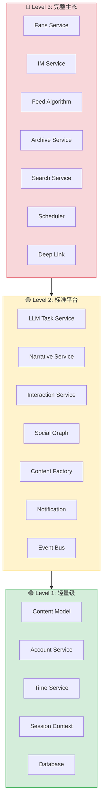
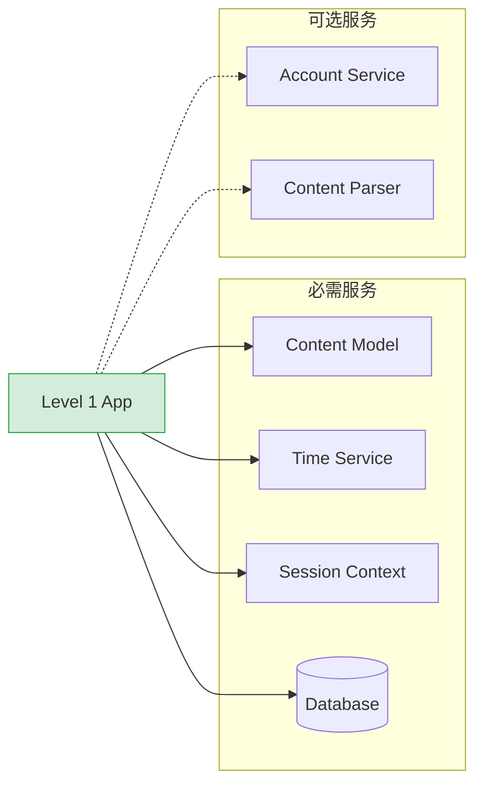
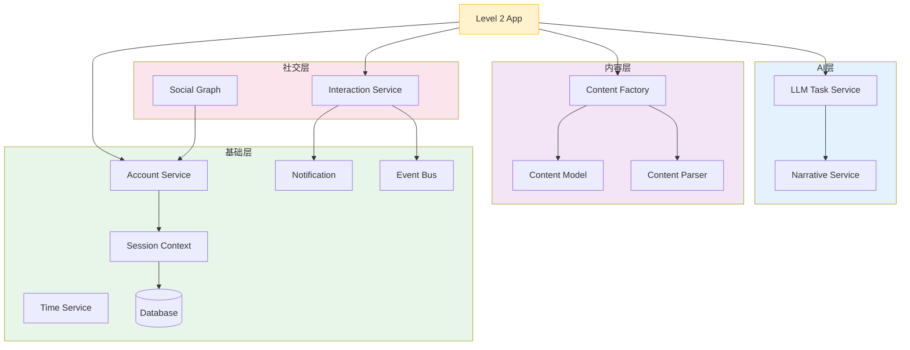
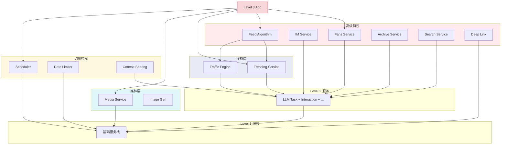
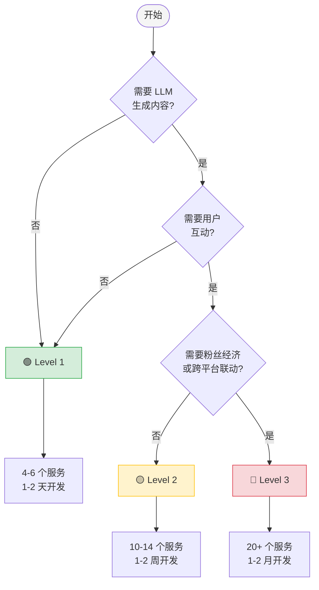
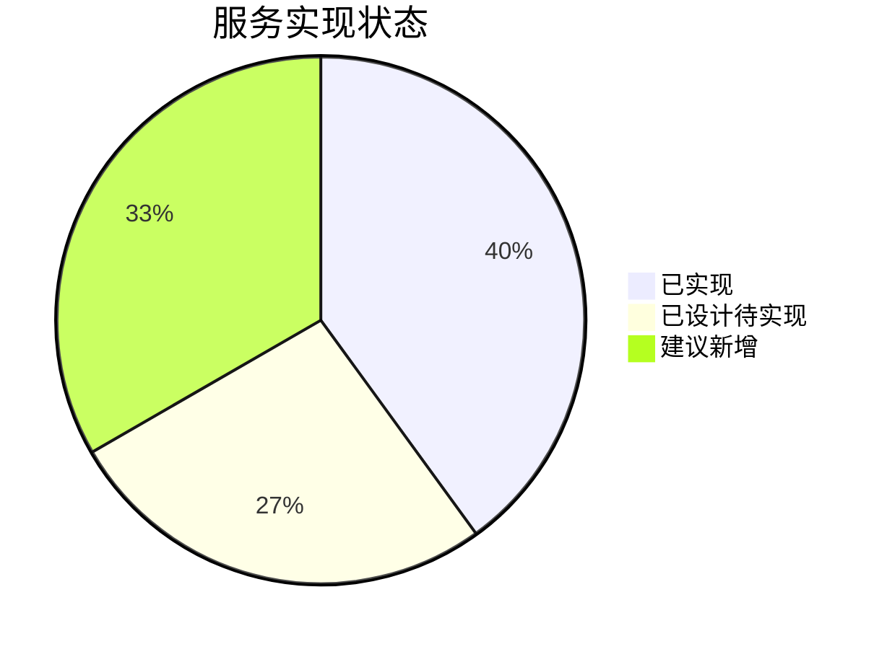
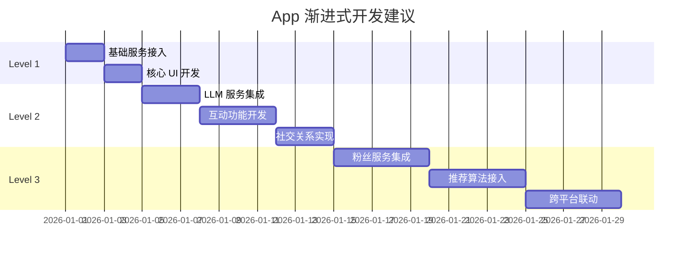

# 内容平台 App 复杂度分级指南

> **版本**: 1.0  
> **最后更新**: 2026-01-16  
> **目标**: 帮助开发者快速评估新 App 所需的系统服务

## 概述

本文档将内容平台 App 按复杂度分为三个等级，每个等级对应不同的系统服务需求。开发新 App 时，可根据功能需求选择对应等级，按需接入服务。

---

## 分级总览



---

## 🟢 Level 1: 轻量级内容 App

### 适用场景

- 纯浏览型应用
- 静态内容展示
- 单一功能工具

### 典型 App 示例

| App | 说明 | 核心服务 |
|-----|------|----------|
| 热搜榜单 | 只展示热搜列表 | Content Model + Time |
| 公告板 | 系统公告展示 | Content Model + Session |
| 图片浏览器 | 查看图库 | Media Service (基础) |
| 新闻阅读器 | 文章列表 | Content Model |

### 服务依赖图



### 服务清单

| 服务 | 必要性 | 说明 |
|------|--------|------|
| Content Model | ✅ 必需 | 统一内容结构 |
| Time Service | ✅ 必需 | 时间戳展示 |
| Session Context | ✅ 必需 | 会话隔离 |
| Database | ✅ 必需 | 数据持久化 |
| Account Service | ⚪ 可选 | 仅展示作者信息时需要 |
| Content Parser | ⚪ 可选 | 需要解析特定格式时 |

### 开发指标

```
📊 服务数量: 4-6 个
⏱️ 开发周期: 1-2 天
🧠 LLM 依赖: 无
👥 用户互动: 无
🔗 社交关系: 无
```

---

## 🟡 Level 2: 标准社交平台

### 适用场景

- 有 LLM 内容生成
- 有用户互动（点赞/收藏/评论）
- 有简单社交关系

### 典型 App 示例

| App | 说明 | 关键特性 |
|-----|------|----------|
| 基础微博 | 博文 + 评论 | LLM 生成 + 互动 |
| 简单论坛 | 帖子讨论 | 评论生成 + 回复 |
| 问答社区 | 问题回答 | 回答生成 + 采纳 |
| 评论区 | 嵌入式评论 | 评论生成 |

### 服务依赖图



### 服务清单

| 服务层 | 服务 | 必要性 | 说明 |
|--------|------|--------|------|
| **AI 层** | LLM Task Service | ✅ 必需 | 任务调度执行 |
| | Narrative Service | ✅ 必需 | 获取酒馆叙事上下文 |
| **社交层** | Interaction Service | ✅ 必需 | 点赞/收藏/评论 |
| | Social Graph | ⚪ 推荐 | 关注/粉丝关系 |
| **内容层** | Content Factory | ✅ 必需 | LLM 内容生成 |
| | Content Model | ✅ 必需 | 统一内容结构 |
| | Content Parser | ✅ 必需 | 平台格式解析 |
| **基础层** | Account Service | ✅ 必需 | 账号管理 |
| | Notification | ✅ 必需 | 消息通知 |
| | Event Bus | ✅ 必需 | 服务间通信 |
| | Profile Service | ⚪ 推荐 | 用户画像 |
| | Logger | ⚪ 推荐 | 调试追踪 |
| | (Level 1 全部) | ✅ 必需 | 基础服务 |

### 开发指标

```
📊 服务数量: 10-14 个
⏱️ 开发周期: 1-2 周
🧠 LLM 依赖: 有（内容生成）
👥 用户互动: 基础互动
🔗 社交关系: 简单关注
```

---

## 🔴 Level 3: 完整社交生态

### 适用场景

- 完整的社交模拟
- 复杂的粉丝经济
- 多平台联动
- 沉浸式角色扮演

### 典型 App 示例

| App | 说明 | 关键特性 |
|-----|------|----------|
| 完整微博 | 全功能社交 | 粉丝增长 + 热搜 + 推荐 |
| B站模拟 | 视频社区 | 一键三连 + 弹幕 |
| 知乎模拟 | 知识问答 | 问答 + 专栏 + 想法 |
| 多平台联动 | 角色跨平台 | 深度链接 + 上下文共享 |

### 服务依赖图



### 服务清单

| 服务层 | 服务 | 必要性 | 说明 |
|--------|------|--------|------|
| **高级特性** | Fans Service | ✅ 必需 | 粉丝增长模拟 |
| | IM Service | ⚪ 推荐 | 私信功能 |
| | Feed Algorithm | ✅ 必需 | 个性化推荐 |
| | Archive Service | ✅ 必需 | 长期记忆/知识库 |
| | Search Service | ⚪ 推荐 | 全文/语义搜索 |
| | Deep Link | ⚪ 推荐 | 跨 App 跳转 |
| **调度控制** | Scheduler | ✅ 必需 | 定时任务 |
| | Rate Limiter | ✅ 必需 | 频率控制 |
| | Context Sharing | ✅ 必需 | 跨 App 上下文 |
| **传播层** | Trending Service | ✅ 必需 | 热搜管理 |
| | Traffic Engine | ✅ 必需 | 热度计算 |
| **媒体层** | Media Service | ✅ 必需 | 媒体管理 |
| | Image Gen | ⚪ 可选 | AI 配图 |
| | Vector Store | ⚪ 可选 | 语义搜索 |
| | (Level 2 全部) | ✅ 必需 | 标准平台服务 |
| | (Level 1 全部) | ✅ 必需 | 基础服务 |

### 开发指标

```
📊 服务数量: 20+ 个
⏱️ 开发周期: 1-2 个月
🧠 LLM 依赖: 重度依赖
👥 用户互动: 完整互动
🔗 社交关系: 复杂图谱
```

---

## 快速决策流程



---

## 服务实现状态速查



| 状态 | 服务列表 |
|------|----------|
| ✅ 已实现 | Content Model, Content Factory, Account Service, Time Service, Notification, LLM Task, Narrative, Traffic Engine, Content Parser, Database, AI Service, Audio Service |
| 📋 已设计 | Session Context, Media Service, Fans Service, IM Service, Profile Service, Context Sharing, Archive Service, Trending Service |
| 🆕 建议新增 | Interaction Service, Social Graph, Feed Algorithm, Search Service, Scheduler, Rate Limiter, Event Bus, Vector Store, Deep Link, Logger |

---

## 渐进式开发路径



---

## 最佳实践

### 1. 从 Level 1 开始

```typescript
// ✅ 好的做法：先实现基础功能
const app = createApp({
  level: 1,
  services: ['contentModel', 'timeService', 'sessionContext'],
});

// 验证核心逻辑后再升级
app.upgrade(2, {
  additionalServices: ['llmTask', 'interaction'],
});
```

### 2. 按需加载服务

```typescript
// ✅ 好的做法：懒加载非必需服务
const fansService = await import('@/services/fans').then(
  m => m.default,
  () => null  // 降级处理
);

// ❌ 避免：一次性加载所有服务
import * as allServices from '@/services';
```

### 3. 复用现有实现

```typescript
// ✅ 好的做法：复用微博已验证的实现
import { useInteraction } from '@/apps/weibo/composables/useInteraction';
import { useContentFactory } from '@/services/social/contentFactory';

// 只需适配 UI 层
const MyApp = () => {
  const { like, favorite, comment } = useInteraction();
  // ...
};
```

---

## 参考文档

- [系统服务总览](./Service-for-social-media-platform.md)
- [服务开发指南](../service-development-guide.md)
- [微博 App 实现分析](./weibo-frontend-api-analysis.md)

---

## 版本历史

| 版本 | 日期 | 变更内容 |
|------|------|----------|
| 1.0 | 2026-01-16 | 初始版本 |
