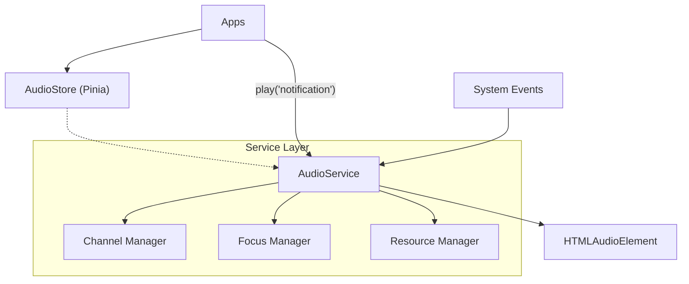
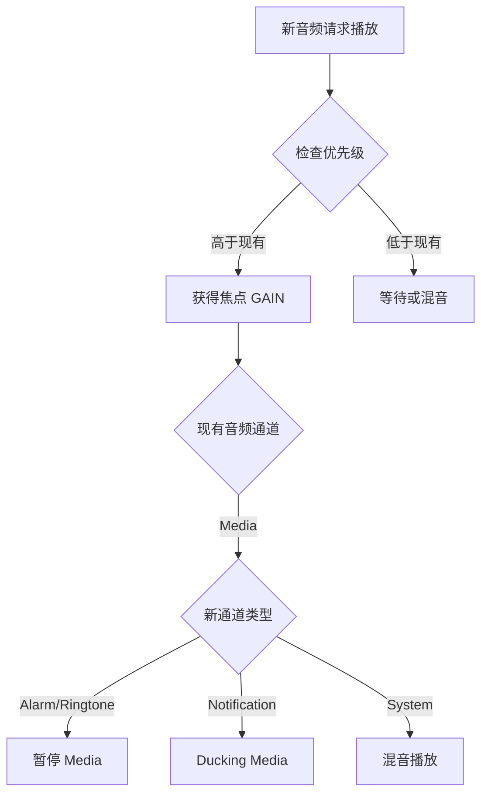
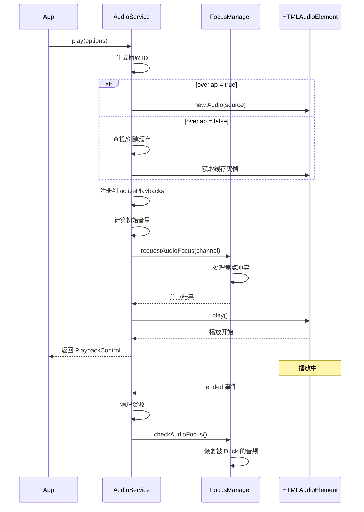
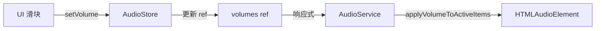

# 音频服务架构设计

> 本文档详细描述音频服务的内部架构、核心概念和实现原理。

## 1. 架构概览

音频服务位于 Service 层，向下封装浏览器的 `HTMLAudioElement`，向上通过 Pinia Store 提供响应式状态。



### 1.1 分层职责

| 层级 | 组件 | 职责 |
|------|------|------|
| **应用层** | Apps | 调用播放 API，响应音频事件 |
| **状态层** | AudioStore | 维护响应式状态，持久化音量设置 |
| **服务层** | AudioService | 音频播放核心逻辑，焦点管理 |
| **底层** | HTMLAudioElement | 浏览器原生音频 API |

## 2. 核心概念

### 2.1 音频通道 (Audio Channels)

系统将音频划分为不同的逻辑通道，每个通道有独立的音量设置和优先级。

```typescript
// 通道优先级定义
const CHANNEL_PRIORITY: Record<AudioChannelType, number> = {
  alarm: 50,       // 最高优先级
  ringtone: 40,
  notification: 30,
  system: 20,
  media: 10,       // 最低优先级
  master: 0        // 特殊通道，控制全局
}
```

#### 通道特性对比

| 通道 | 优先级 | 可被打断 | 打断其他 | 典型场景 |
|------|--------|----------|----------|----------|
| **Alarm** | 50 | ❌ | ✅ 暂停 Media | 闹钟、计时器 |
| **Ringtone** | 40 | ❌ | ✅ 暂停 Media | 来电铃声 |
| **Notification** | 30 | ✅ | ✅ Ducking | 消息通知 |
| **System** | 20 | ✅ | ❌ | 按键音、锁屏音 |
| **Media** | 10 | ✅ | ❌ | 音乐、视频 |

### 2.2 音频焦点 (Audio Focus)

当多个音频源尝试同时播放时，音频焦点机制决定如何处理冲突。

#### 焦点状态

```typescript
export type AudioFocusChange = 
  | 'GAIN'             // 获得完全焦点
  | 'LOSS'             // 永久失去焦点（应停止）
  | 'LOSS_TRANSIENT'   // 暂时失去焦点（应暂停）
  | 'LOSS_DUCK'        // 暂时失去焦点（应降低音量）
```

#### 焦点处理策略



### 2.3 Ducking 机制

**Ducking** 是一种音量压低技术：当高优先级音频播放时，低优先级音频不会完全暂停，而是将音量降低到 30%，播放完成后恢复。

```typescript
// Ducking 系数
const DUCKING_FACTOR = 0.3

// 音量计算
const finalVolume = masterVol * channelVol * baseVol * (ducked ? 0.3 : 1.0)
```

**典型场景**：
- 正在听音乐时收到通知
- 通知音播放期间，音乐音量降至 30%
- 通知结束后，音乐音量恢复至 100%

## 3. 核心组件

### 3.1 AudioService（单例）

核心服务类，采用单例模式，负责所有音频播放逻辑。

```typescript
export class AudioService {
  private static instance: AudioService
  
  // 状态（从 Store 注入）
  private _volumes: Ref<Record<AudioChannelType, number>>
  private _muted: Ref<Record<AudioChannelType, boolean>>
  
  // 活跃播放列表
  private activePlaybacks: Map<string, ActivePlaybackItem>
  
  // 音频缓存池
  private audioCache: Map<string, HTMLAudioElement>
  
  static getInstance(): AudioService
}
```

#### 内部数据结构

```typescript
interface ActivePlaybackItem {
  id: string                    // 播放实例唯一 ID
  audio: HTMLAudioElement       // 底层音频元素
  channel: AudioChannelType     // 所属通道
  baseVolume: number            // 基础音量（播放时设定）
  ducked: boolean               // 是否被 Ducking
}
```

### 3.2 AudioStore（Pinia）

响应式状态管理，负责 UI 绑定和持久化。

```typescript
export const useAudioStore = defineStore('audio', () => {
  // 各通道音量（持久化）
  const volumes = ref<Record<AudioChannelType, number>>({ ... })
  
  // 各通道静音状态（持久化）
  const muted = ref<Record<AudioChannelType, boolean>>({ ... })
  
  // Actions
  function setVolume(channel: AudioChannelType, value: number)
  function toggleMute(channel: AudioChannelType)
  function playSystemSound(key: SystemSoundKey)
  
  return { volumes, muted, setVolume, toggleMute, playSystemSound }
}, {
  persist: { paths: ['volumes', 'muted'] }  // 持久化配置
})
```

### 3.3 类型定义

```typescript
// 音频通道类型
export type AudioChannelType = 
  | 'master' 
  | 'alarm' 
  | 'ringtone' 
  | 'notification' 
  | 'system' 
  | 'media'

// 播放选项
export interface SoundOption {
  source: string              // 音频源 URL
  channel?: AudioChannelType  // 目标通道，默认 'media'
  volume?: number             // 相对音量 0.0-1.0，默认 1.0
  loop?: boolean              // 是否循环，默认 false
  overlap?: boolean           // 是否允许叠加播放，默认 false
  onEnded?: () => void        // 播放结束回调
}

// 播放控制器
export interface PlaybackControl {
  id: string
  stop: () => void
  pause: () => void
  resume: () => void
  setVolume: (vol: number) => void
  promise: Promise<void>
  readonly isPlaying: boolean
}
```

## 4. 播放流程

### 4.1 完整播放流程



### 4.2 焦点请求流程

```typescript
private requestAudioFocus(newChannel: AudioChannelType) {
  const newPriority = CHANNEL_PRIORITY[newChannel]
  
  this.activePlaybacks.forEach(item => {
    if (item.channel === newChannel) return
    
    const currentPriority = CHANNEL_PRIORITY[item.channel]
    
    if (newPriority > currentPriority) {
      // Alarm/Ringtone: 暂停 Media
      if (newChannel === 'alarm' || newChannel === 'ringtone') {
        if (item.channel === 'media') {
          item.audio.pause()
        }
      }
      // Notification: Ducking Media
      else if (newChannel === 'notification') {
        if (item.channel === 'media') {
          item.ducked = true
          this.updateItemVolume(item)
        }
      }
    }
  })
}
```

## 5. 资源管理

### 5.1 音频缓存

对于非 `overlap` 模式的音频，服务会缓存 `HTMLAudioElement` 实例以提高性能。

```typescript
// 缓存策略
if (overlap) {
  // 每次创建新实例
  audio = new Audio(source)
} else {
  // 复用缓存实例
  if (!this.audioCache.has(source)) {
    this.audioCache.set(source, new Audio(source))
  }
  audio = this.audioCache.get(source)!
  audio.currentTime = 0  // 重置进度
}
```

### 5.2 预加载

```typescript
preload(sources: string[]) {
  sources.forEach(src => {
    if (!this.audioCache.has(src)) {
      const audio = new Audio(src)
      audio.load()  // 触发预加载
      this.audioCache.set(src, audio)
    }
  })
}
```

### 5.3 资源释放

```typescript
const cleanup = () => {
  audio.removeEventListener('ended', handleEnded)
  audio.removeEventListener('error', handleError)
  this.activePlaybacks.delete(id)
  
  // 仅 overlap 模式需要手动释放
  if (overlap) {
    audio.src = ''
    audio.load()
  }
  
  // 检查焦点恢复
  this.checkAudioFocus()
}
```

## 6. 内置音效

### 6.1 预设音效表

```typescript
const BUILTIN_SOUNDS: Record<SystemSoundKey, string> = {
  CLICK: '',           // 点击（未配置）
  LOCK: '',            // 锁屏（未配置）
  UNLOCK: '',          // 解锁（未配置）
  KEYPRESS: '',        // 按键（未配置）
  NOTIFICATION: 'https://...', // 通知音（已配置）
  SUCCESS: '',         // 成功（未配置）
  ERROR: '',           // 错误（未配置）
  CAMERA_SHUTTER: 'https://...' // 快门（已配置）
}
```

### 6.2 播放系统音效

```typescript
playSystemSound(key: SystemSoundKey) {
  const url = BUILTIN_SOUNDS[key]
  if (url) {
    this.play({
      source: url,
      channel: 'system',
      volume: 1.0,
      overlap: true  // 系统音效通常允许重叠
    })
  } else {
    console.debug(`System sound not configured: ${key}`)
  }
}
```

## 7. 状态同步

### 7.1 Service 与 Store 的关系

AudioService 和 AudioStore 通过 **依赖注入** 方式连接：

```typescript
// Store 初始化时注入状态到 Service
audioService.init({
  volumes,  // ref
  muted     // ref
})
```

这种设计的优点：

1. **响应式绑定**：Store 状态变化自动反映到 Service
2. **持久化透明**：Store 负责持久化，Service 无需关心
3. **UI 解耦**：Service 专注业务逻辑，Store 专注状态管理

### 7.2 音量更新传播



## 8. 错误处理

### 8.1 播放错误

```typescript
const handleError = (e: Event) => {
  console.error('[AudioService] Playback error:', source, e)
  cleanup()
}

audio.addEventListener('error', handleError)
```

### 8.2 自动播放策略

浏览器可能阻止自动播放，服务会优雅处理：

```typescript
const playPromise = audio.play().catch(err => {
  // 忽略用户中断错误（切换音频时常见）
  if (err.name !== 'AbortError') {
    console.warn('[AudioService] Play failed:', err)
  }
  cleanup()
})
```

## 9. 扩展点

### 9.1 添加新的系统音效

```typescript
// 1. 在 types/audio.ts 中扩展类型
export type SystemSoundKey = 
  | 'CLICK' 
  | 'NOTIFICATION'
  | 'MY_NEW_SOUND'  // 新增

// 2. 在 audioService.ts 中配置 URL
const BUILTIN_SOUNDS: Record<SystemSoundKey, string> = {
  // ...
  MY_NEW_SOUND: '/assets/sounds/my-sound.mp3'
}
```

### 9.2 添加新的音频通道

```typescript
// 1. 扩展类型
export type AudioChannelType = 
  | 'master' 
  | 'media' 
  | 'voice_call'  // 新增：语音通话

// 2. 配置优先级
const CHANNEL_PRIORITY = {
  // ...
  voice_call: 45  // 介于 ringtone 和 alarm 之间
}

// 3. 配置默认音量
const volumes = ref({
  // ...
  voice_call: 1.0
})
```
