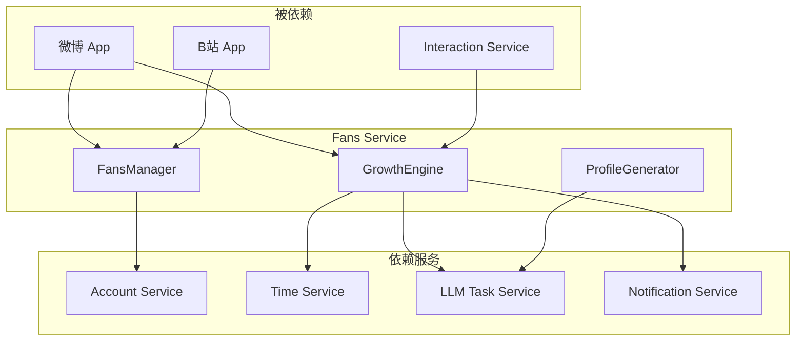

# 粉丝服务 (Fans Service)

> **版本**: 1.0  
> **状态**: 设计阶段  
> **最后更新**: 2026-01-16  
> **依赖**: Account Service, Social Graph Service, Time Service, LLM Task Service

## 1. 概述

粉丝服务是社交媒体模拟系统的核心服务之一，负责管理账号的粉丝关系、模拟粉丝增长、生成粉丝画像，并追踪粉丝互动行为。它采用「数值算法驱动 + LLM 辅助」的混合架构，既能通过数学模型保证增长的合理性，又能借助 LLM 生成丰富的粉丝画像和互动内容。

### 1.1 服务定位

```text
┌─────────────────────────────────────────────────────────────────────────┐
│                           应用层 (App Skins)                            │
│  ┌─────────┐  ┌─────────┐  ┌─────────┐  ┌─────────┐                    │
│  │  微博   │  │  B站    │  │  抖音   │  │  知乎   │  ...               │
│  └────┬────┘  └────┬────┘  └────┬────┘  └────┬────┘                    │
└───────┼────────────┼────────────┼────────────┼─────────────────────────┘
        │            │            │            │
        └────────────┴─────┬──────┴────────────┘
                           ▼
┌─────────────────────────────────────────────────────────────────────────┐
│                         系统服务层                                       │
│  ┌──────────────────┐                                                   │
│  │   Fans Service   │ ◀── 本文档                                        │
│  │   (粉丝服务)      │                                                   │
│  ├──────────────────┤                                                   │
│  │ • 粉丝管理        │                                                   │
│  │ • 增长算法        │                                                   │
│  │ • 画像生成        │                                                   │
│  │ • 互动追踪        │                                                   │
│  └──────────────────┘                                                   │
└─────────────────────────────────────────────────────────────────────────┘
```

### 1.2 设计原则

1. **真实感优先**: 粉丝增长曲线应符合真实社交媒体的规律（冷启动期、增长期、平台期）
2. **可解释性**: 每次涨粉都能追溯到具体原因（哪条博文、哪个互动）
3. **可控性**: 算法参数可调，支持不同类型账号的差异化增长
4. **LLM 增强**: 关键节点使用 LLM 生成内容，而非全程依赖 LLM
5. **平台无关**: 服务层与具体平台（微博/B站/抖音）解耦，通过配置适配

### 1.3 核心能力

| 能力模块 | 说明 | 文档 |
|----------|------|------|
| **粉丝管理** | 关注/取关、粉丝列表、互粉检测 | [fans-management.md](./fans-management.md) |
| **增长引擎** | 六大涨粉渠道、数值算法 | [growth-engine.md](./growth-engine.md) |
| **画像系统** | 粉丝特征、兴趣标签、活跃度 | [profile-system.md](./profile-system.md) |
| **互动追踪** | 粉丝评论、点赞、转发追踪 | [interaction-tracking.md](./interaction-tracking.md) |
| **数据统计** | 涨粉趋势、来源分析、里程碑 | [analytics.md](./analytics.md) |

---

## 2. 架构设计

### 2.1 服务架构图

```text
┌─────────────────────────────────────────────────────────────────────────┐
│                          Fans Service                                   │
├─────────────────────────────────────────────────────────────────────────┤
│                                                                         │
│  ┌─────────────────┐  ┌─────────────────┐  ┌─────────────────┐         │
│  │  FansManager    │  │  GrowthEngine   │  │  ProfileGenerator│         │
│  │  (粉丝管理器)    │  │  (增长引擎)      │  │  (画像生成器)    │         │
│  └────────┬────────┘  └────────┬────────┘  └────────┬────────┘         │
│           │                    │                    │                   │
│           └────────────────────┼────────────────────┘                   │
│                                ▼                                        │
│  ┌──────────────────────────────────────────────────────────────────┐  │
│  │                    FansDataStore (数据层)                         │  │
│  │  ┌──────────┐  ┌──────────┐  ┌──────────┐  ┌──────────┐          │  │
│  │  │ followers│  │ growth   │  │ profiles │  │ events   │          │  │
│  │  │ 粉丝关系  │  │ 增长记录  │  │ 粉丝画像  │  │ 涨粉事件  │          │  │
│  │  └──────────┘  └──────────┘  └──────────┘  └──────────┘          │  │
│  └──────────────────────────────────────────────────────────────────┘  │
│                                                                         │
└─────────────────────────────────────────────────────────────────────────┘
                                 │
                                 ▼
┌─────────────────────────────────────────────────────────────────────────┐
│                          依赖的系统服务                                  │
│  ┌──────────────┐  ┌──────────────┐  ┌──────────────┐                  │
│  │ Account      │  │ Time         │  │ LLM Task     │                  │
│  │ Service      │  │ Service      │  │ Service      │                  │
│  └──────────────┘  └──────────────┘  └──────────────┘                  │
└─────────────────────────────────────────────────────────────────────────┘
```

### 2.2 核心模块职责

| 模块 | 职责 | 对外接口 |
|------|------|----------|
| **FansManager** | 粉丝关系的增删查改 | `follow()`, `unfollow()`, `getFollowers()` |
| **GrowthEngine** | 涨粉算法计算与事件处理 | `processEvent()`, `calculateGain()` |
| **ProfileGenerator** | 生成/更新粉丝画像 | `generateProfile()`, `batchGenerate()` |
| **FansDataStore** | 数据持久化与查询 | `save()`, `query()`, `aggregate()` |

---

## 3. 与其他服务的关系

### 3.1 依赖关系



### 3.2 与 Social Graph Service 的关系

粉丝服务与社交图谱服务（Social Graph Service）有重叠但职责不同：

| 方面 | Fans Service | Social Graph Service |
|------|--------------|----------------------|
| **关注点** | 粉丝增长模拟、画像生成 | 通用社交关系管理 |
| **数据** | 粉丝特有数据（画像、来源） | 关系数据（关注、互粉） |
| **算法** | 涨粉算法、质量评估 | 图遍历、推荐算法 |
| **LLM** | 重度使用（画像生成） | 轻度使用 |

**集成方式**: Fans Service 可以调用 Social Graph Service 的基础关系管理能力，在其上扩展粉丝模拟特有的逻辑。

---

## 4. 数据模型概览

### 4.1 核心数据结构

```typescript
// 粉丝关系
interface FollowerRelation {
  id: string;
  followerId: string;      // 粉丝账号 ID
  followeeId: string;      // 被关注者账号 ID
  platformId: string;      // 平台 ID
  followedAt: number;      // 关注时间
  source: FollowerSource;  // 来源渠道
  isActive: boolean;       // 是否活跃粉丝
}

// 粉丝画像
interface FanProfile {
  accountId: string;
  nickname: string;
  avatar?: string;
  bio?: string;
  gender: 'male' | 'female' | 'unknown';
  ageRange: string;
  interests: string[];
  activityLevel: 'high' | 'medium' | 'low';
  followReason?: string;
  generatedAt: number;
}

// 涨粉事件
interface FollowerGainEvent {
  id: string;
  accountId: string;
  platformId: string;
  timestamp: number;
  source: FollowerSource;
  sourceDetail: Record<string, any>;
  followerGain: number;
  newFollowerIds: string[];
  story?: string;          // LLM 生成的涨粉故事
}

// 涨粉来源枚举
enum FollowerSource {
  CONTENT_EXPOSURE = 'content_exposure',   // 内容曝光
  HOT_TOPIC_FLOW = 'hot_topic_flow',       // 热搜流量
  INTERACTION_CONVERT = 'interaction_convert', // 互动转化
  REPOST_SPREAD = 'repost_spread',         // 转发扩散
  BIG_V_REFERRAL = 'big_v_referral',       // 大V导流
  PLATFORM_RECOMMEND = 'platform_recommend', // 平台推荐
  INITIAL_SEED = 'initial_seed',           // 初始种子粉丝
  MANUAL = 'manual'                        // 手动添加
}
```

### 4.2 数据库表设计

| 表名 | 说明 | 主键 |
|------|------|------|
| `fan_relations` | 粉丝关系表 | `id` |
| `fan_profiles` | 粉丝画像表 | `accountId` |
| `follower_gain_events` | 涨粉事件表 | `id` |
| `account_growth` | 账号成长统计 | `accountId` |

详见 [data-model.md](./data-model.md)

---

## 5. 文档结构

```text
docs/systems/fans-service/
├── README.md                    # 本文档 - 服务概述
├── fans-management.md           # 粉丝管理模块
├── growth-engine.md             # 增长引擎（核心算法）
├── profile-system.md            # 画像系统
├── interaction-tracking.md      # 互动追踪
├── analytics.md                 # 数据统计与分析
├── data-model.md                # 数据模型详解
├── api-reference.md             # API 参考
├── llm-tasks.md                 # LLM 任务定义
└── implementation-plan.md       # 实施计划
```

---

## 6. 快速开始

### 6.1 基本用法

```typescript
import { FansService } from '@/services/fans';

const fansService = FansService.getInstance();

// 获取账号的粉丝列表
const followers = await fansService.getFollowers('account_123', {
  limit: 20,
  sortBy: 'followedAt',
  order: 'desc'
});

// 处理博文发布事件，计算涨粉
const gainEvent = await fansService.processPostPublish(post);
if (gainEvent && gainEvent.followerGain > 0) {
  console.log(`新增 ${gainEvent.followerGain} 粉丝`);
}

// 生成新粉丝画像
const profiles = await fansService.generateFanProfiles('account_123', 5, {
  source: FollowerSource.CONTENT_EXPOSURE
});
```

### 6.2 配置示例

```typescript
const config: FansServiceConfig = {
  // 增长引擎配置
  growth: {
    baseConversionRate: 0.01,
    timeDecayHalfLife: 24,  // 小时
    enableLLMStories: true,
    minGainForStory: 50
  },
  
  // 画像生成配置
  profile: {
    batchSize: 10,
    defaultActivityLevel: 'medium'
  },
  
  // 平台特定配置
  platforms: {
    weibo: {
      bigVThreshold: 1000000,
      recommendPoolSize: 10000
    },
    bilibili: {
      bigVThreshold: 500000,
      recommendPoolSize: 5000
    }
  }
};
```

---

## 7. 实施状态

| 模块 | 状态 | 优先级 | 预估工作量 |
|------|------|--------|------------|
| 粉丝管理 (FansManager) | 📋 待实现 | 🔴 高 | 3-4h |
| 增长引擎 (GrowthEngine) | 📋 待实现 | 🔴 高 | 6-8h |
| 画像系统 (ProfileGenerator) | 📋 待实现 | 🟡 中 | 4-5h |
| 互动追踪 | 📋 待实现 | 🟡 中 | 3-4h |
| 数据统计 | 📋 待实现 | 🟢 低 | 2-3h |
| UI 集成 | 📋 待实现 | 🟢 低 | 4-5h |

**总预估**: 22-29 小时

---

## 8. 参考文档

- [社交内容平台系统服务架构](../architecture/Service-for-social-media-platform.md)
- [涨粉算法引擎（原始设计）](../follower-growth-engine.md)
- [账号服务](../account-service/README.md)
- [LLM 任务服务](../llm-task-service/README.md)
- [社交媒体引擎](../social-media-engine/README.md)
