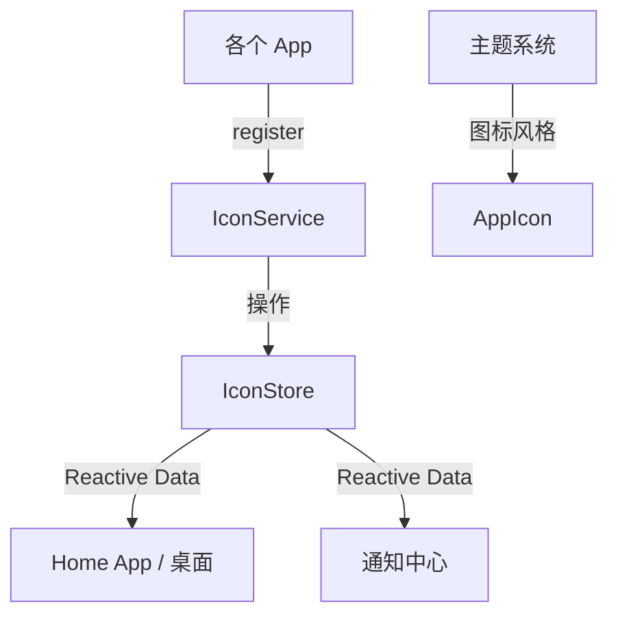

# 图标服务 (Icon Service)

> **版本**: 1.0  
> **状态**: ✅ 已实现  
> **最后更新**: 2026-01-10

## 1. 概述

图标服务负责统一管理所有 App（内置及第三方）的图标、名称、分类及快捷操作配置。它解决了桌面（Home App）需要硬编码所有 App 信息的痛点，实现了 **App 注册与展示的解耦**。

### 1.1 核心能力

| 能力 | 说明 |
| :--- | :--- |
| **图标注册** | App 启动时自动注册图标配置，支持多种图标类型 |
| **响应式状态** | 基于 Pinia Store，图标变化自动更新 UI |
| **分类管理** | 支持按分类筛选 App（社交、工具、娱乐等） |
| **动态徽章** | 支持未读消息数等动态徽章显示 |
| **快捷操作** | 支持长按菜单的快捷操作配置 |
| **主题适配** | 与主题系统集成，支持不同主题的图标风格 |

### 1.2 设计原则

1. **模式 B: 状态注入** - 遵循 [系统服务开发指南](../service-development-guide.md)，Store 持有响应式状态，Service 处理业务逻辑
2. **单例模式** - IconService 为全局单例，确保状态一致性
3. **向后兼容** - 保留 Legacy Facade 层，兼容旧代码
4. **类型安全** - 完整的 TypeScript 类型定义

---

## 2. 架构设计

```text
┌─────────────────────────────────────────────────────────────────┐
│                        应用层 (Apps)                              │
│  ┌─────────┐  ┌─────────┐  ┌─────────┐  ┌─────────┐            │
│  │  微博    │  │  微信    │  │  邮件    │  │  ...    │            │
│  └────┬────┘  └────┬────┘  └────┬────┘  └────┬────┘            │
└───────┼────────────┼────────────┼────────────┼──────────────────┘
        │            │            │            │
        └────────────┴─────┬──────┴────────────┘
                           │ register()
                           ▼
┌─────────────────────────────────────────────────────────────────┐
│                     图标服务层 (Icon Service)                      │
│                                                                   │
│  ┌─────────────────────┐      ┌─────────────────────┐           │
│  │   IconService       │◄────►│   IconStore         │           │
│  │   (业务逻辑)         │      │   (响应式状态)       │           │
│  └─────────────────────┘      └─────────────────────┘           │
│              ▲                          ▲                         │
│              │                          │                         │
│  ┌───────────┴─────────┐    ┌──────────┴──────────┐             │
│  │  RegistryService    │    │  AppRegistryService │             │
│  │  (图标注册 Facade)   │    │  (App 统一注册)      │             │
│  └─────────────────────┘    └─────────────────────┘             │
└─────────────────────────────────────────────────────────────────┘
                           │
                           ▼ Reactive Data
┌─────────────────────────────────────────────────────────────────┐
│                        UI 组件层                                   │
│  ┌─────────────────────┐      ┌─────────────────────┐           │
│  │   AppIcon.vue       │      │  DynamicAppIcon.vue │           │
│  │   (主题适配)         │      │  (动态来源)          │           │
│  └─────────────────────┘      └─────────────────────┘           │
└─────────────────────────────────────────────────────────────────┘
```

### 2.1 核心组件

| 组件 | 路径 | 职责 |
| :--- | :--- | :--- |
| **Types** | `src/types/icon.ts` | 核心类型定义 |
| **Service** | `src/services/icon/iconService.ts` | 业务逻辑层（单例） |
| **Store** | `src/stores/iconStore.ts` | Pinia 响应式状态 |
| **Facade** | `src/services/icon/registryService.ts` | 图标注册兼容层 |
| **AppRegistry** | `src/services/icon/appRegistryService.ts` | 统一 App 注册服务 |
| **AppIcon** | `src/components/common/AppIcon.vue` | 基础图标组件 |
| **DynamicAppIcon** | `src/components/common/DynamicAppIcon.vue` | 动态图标组件 |

---

## 3. 快速开始

### 3.1 注册图标

```typescript
import { iconService } from '@/services/icon'

iconService.register({
  id: 'my-app',
  name: '我的应用',
  route: '/my-app',
  icon: { type: 'emoji', value: '🚀', background: '#000' },
  category: 'tool',
  isBuiltin: true,
  getBadge: () => unreadCount.value, // 动态徽章
  quickActions: [
    { id: 'new', label: '新建', icon: 'fas fa-plus', route: '/my-app/new' }
  ]
})
```

### 3.2 获取图标数据

```vue
<script setup lang="ts">
import { useIconStore } from '@/stores/iconStore'
import { computed } from 'vue'

const iconStore = useIconStore()

// 获取所有已注册应用
const allApps = computed(() => iconStore.allIcons)

// 获取特定分类应用
const socialApps = computed(() => iconStore.getByCategory('social'))

// 获取单个应用配置
const myApp = iconStore.getIcon('my-app')
</script>
```

### 3.3 显示图标

```vue
<template>
  <!-- 基础图标组件 -->
  <AppIcon app-id="wechat" size="md" :badge="3" />
  
  <!-- 动态图标组件 -->
  <DynamicAppIcon app-id="wechat" size="sm" />
  <DynamicAppIcon 
    :icon="{ type: 'emoji', value: '📱' }" 
    size="md"
    :rounded="true"
  />
</template>
```

---

## 4. 文档目录

| 文档 | 说明 |
| :--- | :--- |
| [类型定义](./types.md) | 核心接口和类型说明 |
| [Service API](./service-api.md) | IconService 方法详解 |
| [Store API](./store-api.md) | IconStore 状态和方法 |
| [App 注册服务](./app-registry.md) | 统一 App 注册服务 |
| [组件使用](./components.md) | AppIcon 和 DynamicAppIcon 使用指南 |
| [集成示例](./integration.md) | 完整的集成示例 |

---

## 5. 与其他服务的关系



| 关联服务 | 关系说明 |
| :--- | :--- |
| **Home App** | 消费图标数据，展示桌面图标 |
| **通知系统** | 使用 DynamicAppIcon 显示应用图标 |
| **主题系统** | AppIcon 根据主题切换图标风格 |
| **App 注册服务** | 内置应用启动时批量注册图标 |

---

## 6. 版本历史

| 版本 | 日期 | 变更内容 |
| :--- | :--- | :--- |
| 1.0 | 2026-01-10 | 初始版本，完成 Service + Store 架构重构 |
