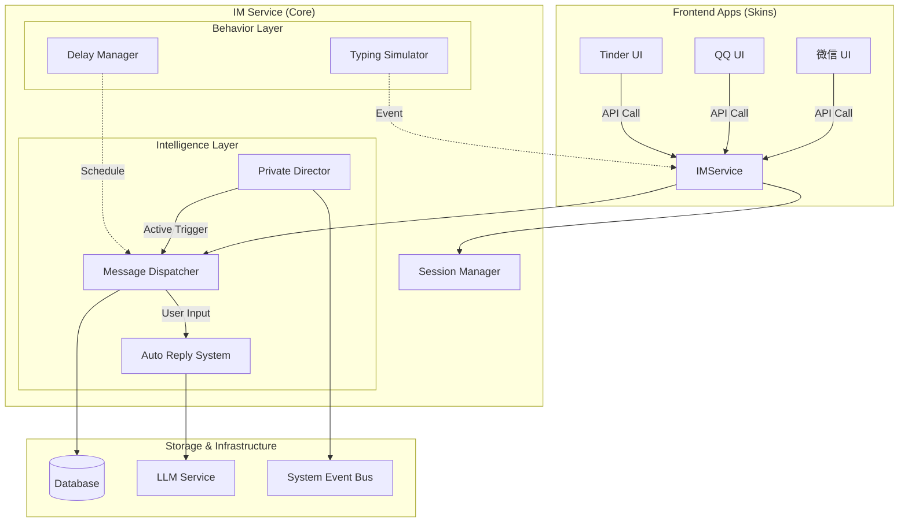

# 即时通讯与私信引擎 (IM & Direct Message Engine)

> **版本**: 1.0 (Draft)
> **状态**: 设计中
> **依赖**: DatabaseService, TimeService, LLMService, ContactStore

## 1. 概述

即时通讯引擎（以下简称 "IM 引擎"）是操作系统的核心通信组件。它通过标准化的接口向下屏蔽了 LLM 交互、消息持久化和自动化行为的复杂性，向上为微信、QQ、Tinder、短信等应用提供统一的消息收发能力。

与社交媒体引擎类似，IM 引擎采用 **"Core & Skin"** 架构，并引入了 **Private Director (私域导演)** 来驱动 NPC 的主动社交行为。

### 1.1 核心能力

1.  **统一会话管理**：集中管理所有应用的会话列表、未读计数和消息记录。
2.  **拟人化行为模拟**：模拟真实人类的"正在输入"状态、阅读延迟和回复延迟。
3.  **主动社交 (Private Director)**：基于时间、好感度和外部事件，驱动 NPC 主动发起私信。
4.  **多应用隔离**：支持同一 NPC 在不同 App (如微信和 Tinder) 拥有不同的聊天记录和人设微调。

---

## 2. 架构设计

### 2.1 整体架构图



### 2.2 核心模块职责

| 模块 | 职责 |
|Data Model| 定义统一的 `Conversation` 和 `Message` 结构 |
| **Session Manager** | 管理会话列表、置顶、免打扰、未读数计算 |
| **Message Dispatcher** | 消息路由核心，处理发送、接收、存储、状态更新 (Sent/Read) |
| **Private Director** | **(核心)** 负责生成 NPC 的主动发起行为 (Initiative Behavior) |
| **Behavior Engine** | 模拟人类特征：打字时长计算、阅读间隙、在线状态模拟 |

---

## 3. 数据模型 (Data Model)

为了支持多 App，我们需要在数据层通过 `appId` 进行逻辑隔离，同时保持底层存储的一致性。

### 3.1 会话 (Conversation)

```typescript
interface Conversation {
  id: string;              // UUID
  targetId: string;        // 聊天对象 ID (NPC ID)
  appId: string;           // 所属应用: 'com.wechat', 'com.qq'
  
  // 列表展示优化
  lastMessage: {
    content: string;
    type: MessageType;
    timestamp: number;
    senderId: string;
  };
  
  unreadCount: number;
  updatedAt: number;
  
  // 用户设置
  isPinned: boolean;       // 置顶
  isMuted: boolean;        // 免打扰
  backgroundImage?: string; // 聊天背景
}
```

### 3.2 消息 (Message)

扩展现有的 `MessageBase`，增加 App 特有的上下文。

```typescript
interface IMMessage {
  id: string;
  conversationId: string;
  appId: string;
  
  senderId: string;
  content: string;
  type: 'text' | 'image' | 'voice' | 'red_packet' | 'system';
  
  // 消息状态流转
  status: 'pending' | 'sent' | 'delivered' | 'read' | 'failed';
  timestamp: number;
  
  // 应用特定元数据 (JSON)
  // 微信红包: { amount: 100, status: 'unclaimed' }
  // 引用回复: { quoteId: "msg_123" }
  payload?: Record<string, any>;
}
```

---

## 4. 私域导演系统 (Private Director)

这是 IM 引擎的灵魂。它让手机不再是一个死板的问答机器，而是一个连接"活人"的窗口。

### 4.1 触发机制 (Triggers)

系统通过监听三类信号来决定是否发起私信：

1.  **时间信号 (Chronos Signal)**
    *   **日常问候**：早安 (8:00-9:00)，晚安 (22:00-24:00)。
    *   **饭点提醒**：午餐/晚餐时间。
    *   **长草期唤醒**：距离上次聊天超过 24h 且好感度 > 50。

2.  **事件信号 (Event Signal)**
    *   **来自 Social Engine**：检测到全服大事件（如"地震"、"明星塌房"）。
    *   **来自 System**：用户拍了一张照片、用户更换了头像。

3.  **空间信号 (Spatial Signal)**
    *   **位置重合**：用户移动到了 NPC 所在的地点（如"酒吧"）。

### 4.2 决策算法 (The Filter)

即使触发了信号，也不一定发送。需要通过算法过滤，避免骚扰用户。

```typescript
function shouldInitiate(npc: NPC, trigger: TriggerContext): boolean {
  // 1. 基础概率 (好感度决定基准)
  let p = npc.relationship.intimacy / 100; 
  
  // 2. 性格修正
  if (npc.traits.includes('shy')) p *= 0.5;
  if (npc.traits.includes('extrovert')) p *= 1.5;
  
  // 3. 疲劳度控制 (避免太频繁)
  if (Date.now() - npc.lastInitiatedTime < 4 * 3600 * 1000) return false;
  
  // 4. 当前状态检查
  if (npc.status === 'sleeping' || npc.status === 'busy') return false;
  
  return Math.random() < p;
}
```

### 4.3 生成与执行

一旦决定发起，Director 会构建特殊的 System Prompt 调用 LLM：

> **System**: "你现在不在用户身边，正拿着手机给他发微信。"
> **Context**: "刚才发生了一个大新闻：[事件摘要]。你的性格是[性格描述]。"
> **Task**: "发一条微信给用户，语气要自然、简短，可以用 Emoji。不要期待必回。"

---

## 5. 拟人化行为引擎 (Behavior Engine)

为了营造"对面是真人"的错觉，IM 引擎必须模拟人类的操作延迟。

### 5.1 "正在输入" (Typing Simulation)

当 LLM 开始生成回复时，系统不会立即展示结果，而是：

1.  **计算阅读时间**：`ReadTime = UserMessageLength * 0.1s`
2.  **计算思考时间**：`ThinkTime = Random(1s, 3s)`
3.  **计算打字时间**：`TypingTime = ReplyLength * 0.2s`
4.  **状态流转**：
    *   `Online` (ReadTime)
    *   `Typing...` (TypingTime)
    *   `Sent` (消息发出)

### 5.2 延迟回复队列 (Delayed Queue)

NPC 不应该总是秒回。我们可以维护一个**发送队列**：

*   **秒回模式**：(好感度极高 或 正在激烈争论) -> 延迟 < 5s
*   **正常模式**：-> 延迟 10s - 2min
*   **忙碌模式**：(NPC 设定为工作中) -> 延迟 30min - 4h

```typescript
// 伪代码
function scheduleReply(msg: Message, urgency: number) {
  const delay = calculateDelay(urgency);
  
  if (delay > 5000) {
    // 如果延迟超过 5秒，先推送到系统通知栏 (后台运行)
    NotificationService.push({ title: npc.name, body: msg.content, delay });
  } else {
    // 短延迟直接在 UI 显示正在输入
    ui.showTyping();
    setTimeout(() => ui.showMessage(msg), delay);
  }
}
```

---

## 6. 平台差异化与场景设计 (Platform & Scenarios)

不同的 App 拥有不同的社交语境。IM 引擎不仅要传递消息，还要传递“调性”和“人设面具”。

### 6.1 平台类型学 (Platform Typology)

| 平台类型 | 代表应用 | 社交关系 | 消息特征 | NPC 行为策略 |
| :--- | :--- | :--- | :--- | :--- |
| **私密熟人 (Private)** | 微信, QQ | 强关系 (Friend) | 高频、生活化、语音/表情包 | **本我模式**：暴露真实情绪，秒回率高，主动分享生活。 |
| **公共媒体 (Media)** | 微博, B站, 小红书 | 弱关系 (Fan/Follower) | 评论式、商务合作、投稿 | **超我模式**：维护公开人设 (Persona)，回复简短/官方，存在“已读不回”或“助理代回”。 |
| **功能导向 (Functional)** | Tinder, 闲鱼, 招聘 | 目的性关系 (Match/Deal) | 破冰、谈判、交易 | **目的模式**：直奔主题，根据达成率决定热情度。 |

### 6.2 典型场景设计

#### A. 微博/B站：粉丝与商单
*   **消息折叠**：对于大 V NPC，陌生人私信默认进入“未关注人消息”盒子，不触发强提醒。
*   **商单识别 (Intent Recognition)**：系统自动识别关键词（“合作”、“推广”、“报价”），将对话标记为 `Type: Business`。
    *   *响应*：NPC 切换到“商务语气”，或回复“请联系我的邮箱/经纪人”。
*   **粉丝互动**：对于普通粉丝的表白/催更，NPC 可能仅回复一个表情或点赞，甚至随机抽取回复（模拟“翻牌子”）。

#### B. Tinder/探探：破冰与暧昧
*   **限时聊天**：模拟某些 App 的机制，如果 24h 不回复则匹配失效。
*   **破冰助手**：双方匹配成功后，系统自动抛出破冰话题（基于双方 Profile）。

#### C. 微信/QQ：朋友圈与状态
*   **状态同步**：微信的状态（如“在忙”、“摸鱼中”）会直接影响回复延迟。
*   **朋友圈联动**：私信中会自然引用对方朋友圈的内容作为话题。

### 6.3 人设面具 (Persona Mask)

同一个 NPC 在不同平台拥有不同的 System Prompt 修正层。

```typescript
interface PlatformPersona {
  platformId: string;
  
  // 人设微调
  toneModifier: string;  // e.g. "Weibo: 高冷，使用网络流行语; WeChat: 软萌，喜欢发语音"
  
  // 隐私边界
  privacyLevel: 'high' | 'medium' | 'low'; // 微信 Low (啥都说), 微博 High (保护隐私)
  
  // 回复策略
  replyPolicy: {
    allowVoice: boolean;       // 微博不允许发语音
    minReplyLength: number;    // 微信短句为主，邮件长文为主
    emojiUsage: number;        // 0-1 频率
  };
}
```

---

## 7. 与 Social Engine 的联动

IM 引擎与 Social 引擎是互补关系。私信往往是公开社交的延伸。

### 6.1 "转私聊" 机制

当在朋友圈 (Social Engine) 的评论区互动超过一定轮次（例如 3 轮），或者话题涉及隐私时，系统可以触发**转私聊事件**。

*   **Social Engine**: 触发 `SwitchToDM` 事件。
*   **IM Engine**: 接收事件，由 NPC 发起一条新消息："这里人多，私聊说。"
*   **UI 跳转**: 用户点击通知直接跳转到 IM 界面。

### 6.2 共享记忆 (Shared Memory)

*   **Social -> IM**: NPC 在私信里会提到用户刚发的朋友圈 ("你刚才发的照片真好看")。
*   **IM -> Social**: NPC 在朋友圈评论里提到私信内容 ("就像我们在微信里说的...")。

这需要 LLM 在生成时同时注入两份上下文：`RecentChats` 和 `RecentPosts`。

---

## 8. API 设计预览

App (Skin) 调用 IM Service 的接口示例：

```typescript
class IMService {
  // 1. 发送消息 (用户侧)
  async sendMessage(appId: string, targetId: string, content: string, type: string = 'text') {
    // 持久化 -> 触发 LLM 回复 -> 模拟延迟 -> 写入对方回复
  }

  // 2. 获取会话列表
  async getConversations(appId: string): Promise<Conversation[]> {
    return db.conversations.where({ appId }).sortBy('updatedAt');
  }

  // 3. 监听事件 (UI 更新)
  onMessage(callback: (msg: IMMessage) => void);
  onTyping(callback: (targetId: string, status: boolean) => void);
}
```

---

## 9. 开发路线图

1.  **Phase 1: 核心服务**
    *   建立 `src/services/im/`
    *   实现数据库 Schema 和基础 CRUD。
    *   实现简单的“用户发 -> LLM 秒回”闭环。

2.  **Phase 2: 拟人化增强**
    *   实现 `TypingSimulator` (正在输入)。
    *   实现 `DelayManager` (延迟队列)。

3.  **Phase 3: 私域导演**
    *   接入 `TimeService` 实现定时问候。
    *   接入 `EventBus` 实现事件触发私信。

4.  **Phase 4: 多应用适配**
    *   实现微信 UI (ChatList, ChatRoom)。
    *   实现朋友圈与私信的跳转联动。
