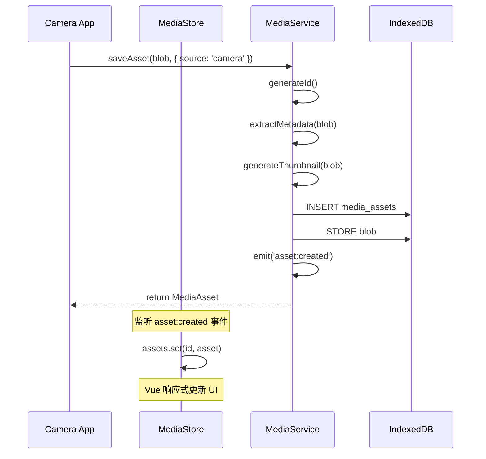
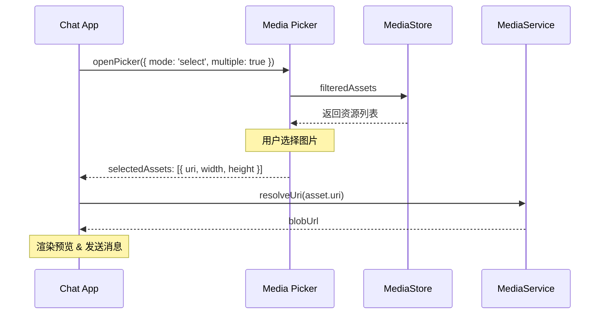
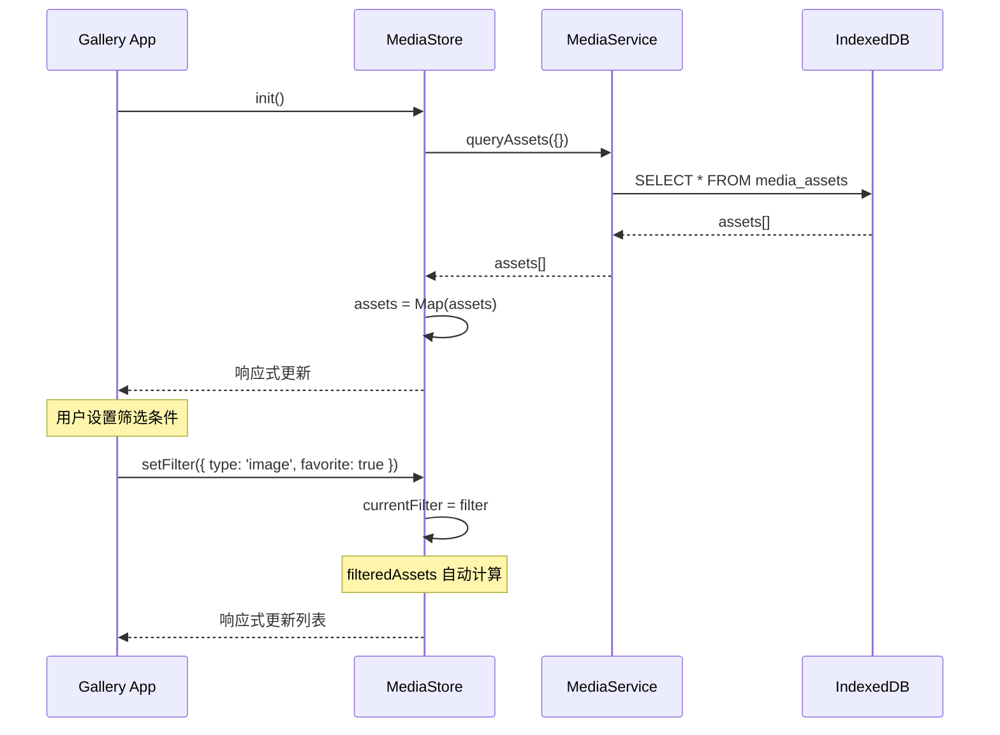

# 媒体服务架构设计

> 本文档详细描述媒体服务的分层架构、组件职责和交互流程。

## 1. 分层架构

媒体服务采用经典的三层架构，从上到下分别是：

```text
┌─────────────────────────────────────────────────────────────────────────┐
│                           应用层 (App Layer)                              │
│  ┌─────────┐  ┌─────────┐  ┌─────────┐  ┌─────────┐  ┌─────────┐        │
│  │  图库   │  │  相机   │  │  聊天   │  │  微博   │  │ 朋友圈  │ ...    │
│  │ Gallery │  │ Camera  │  │  Chat   │  │ Weibo   │  │ Moments │        │
│  └────┬────┘  └────┬────┘  └────┬────┘  └────┬────┘  └────┬────┘        │
└───────┼────────────┼────────────┼────────────┼────────────┼─────────────┘
        │            │            │            │            │
        └────────────┴─────┬──────┴────────────┴────────────┘
                           ▼
┌─────────────────────────────────────────────────────────────────────────┐
│                         状态层 (State Layer)                              │
│                                                                          │
│                    ┌──────────────────────────┐                          │
│                    │   MediaStore (Pinia)     │                          │
│                    │   统一状态管理            │                          │
│                    │   响应式数据绑定          │                          │
│                    └───────────┬──────────────┘                          │
└────────────────────────────────┼────────────────────────────────────────┘
                                 ▼
┌─────────────────────────────────────────────────────────────────────────┐
│                         服务层 (Service Layer)                           │
│                                                                          │
│  ┌──────────────────────────────────────────────────────────────────┐   │
│  │                        MediaService                               │   │
│  │  ┌──────────────┐  ┌──────────────┐  ┌──────────────┐            │   │
│  │  │ Asset Indexer│  │ Thumbnail   │  │ Album Manager│            │   │
│  │  │ 资产索引器   │  │ Generator   │  │ 相册管理器   │            │   │
│  │  │              │  │ 缩略图生成器 │  │              │            │   │
│  │  └──────────────┘  └──────────────┘  └──────────────┘            │   │
│  │                                                                   │   │
│  │  ┌──────────────┐  ┌──────────────┐  ┌──────────────┐            │   │
│  │  │ URI Resolver │  │ Event       │  │ Source       │            │   │
│  │  │ URI 解析器   │  │ Dispatcher  │  │ Adapter      │            │   │
│  │  │              │  │ 事件分发器  │  │ 来源适配器   │            │   │
│  │  └──────────────┘  └──────────────┘  └──────────────┘            │   │
│  └──────────────────────────────────────────────────────────────────┘   │
└────────────────────────────────┬────────────────────────────────────────┘
                                 ▼
┌─────────────────────────────────────────────────────────────────────────┐
│                         存储层 (Storage Layer)                           │
│                                                                          │
│  ┌──────────────────────────┐  ┌──────────────────────────┐             │
│  │      IndexedDB           │  │      Blob Storage        │             │
│  │  ┌────────────────────┐  │  │  ┌────────────────────┐  │             │
│  │  │ media_assets       │  │  │  │ Binary Data        │  │             │
│  │  │ media_albums       │  │  │  │ (图片/视频文件)    │  │             │
│  │  │ media_thumbnails   │  │  │  └────────────────────┘  │             │
│  │  └────────────────────┘  │  │                          │             │
│  └──────────────────────────┘  └──────────────────────────┘             │
└─────────────────────────────────────────────────────────────────────────┘
```

## 2. 组件职责

### 2.1 应用层 (App Layer)

各 App 作为「Skin」，只负责 UI 渲染和用户交互，不直接操作媒体数据。

| App | 职责 | 与媒体服务的交互 |
| ----- | ------ | ------------------ |
| **图库 (Gallery)** | 展示、管理所有媒体资源 | 全量读写 |
| **相机 (Camera)** | 拍照、录像 | 只写（保存新资源） |
| **聊天 (Chat)** | 选择图片发送 | 只读（通过选择器） |
| **微博 (Weibo)** | 配图发帖 | 只读 + 关联 |
| **朋友圈 (Moments)** | 图文动态 | 只读 + 关联 |

### 2.2 状态层 (State Layer)

**MediaStore (Pinia)** 是应用层与服务层的桥梁：

```typescript
// 核心状态
interface MediaStoreState {
  assets: Map<string, MediaAsset>;      // 所有媒体资源
  albums: Album[];                      // 相册列表
  loading: boolean;                     // 加载状态
  currentFilter: MediaFilter;           // 当前筛选条件
  currentSort: MediaSort;               // 当前排序
  selectedIds: string[];                // 选中的资源 ID
}

// 核心计算属性
interface MediaStoreGetters {
  assetList: MediaAsset[];              // 资源列表（数组）
  imageAssets: MediaAsset[];            // 仅图片
  videoAssets: MediaAsset[];            // 仅视频
  filteredAssets: MediaAsset[];         // 筛选后的资源
  stats: MediaStats;                    // 统计信息
}
```

**职责**：
* 缓存服务层返回的数据
* 提供响应式数据绑定
* 管理 UI 相关状态（筛选、排序、选中）
* 批量操作优化（减少服务层调用次数）

### 2.3 服务层 (Service Layer)

**MediaService** 是核心业务逻辑层，包含多个子组件：

#### 2.3.1 Asset Indexer（资产索引器）

负责媒体资源的索引和查询：

```typescript
interface AssetIndexer {
  // 索引操作
  index(asset: MediaAsset): Promise<void>;
  indexBatch(assets: MediaAsset[]): Promise<void>;
  remove(assetId: string): Promise<void>;
  
  // 查询操作
  query(filter: MediaFilter, sort: MediaSort): Promise<MediaAsset[]>;
  getById(id: string): Promise<MediaAsset | null>;
  getByIds(ids: string[]): Promise<MediaAsset[]>;
  
  // 统计
  count(filter?: MediaFilter): Promise<number>;
}
```

#### 2.3.2 Thumbnail Generator（缩略图生成器）

自动为大图生成缩略图，提升列表性能：

```typescript
interface ThumbnailGenerator {
  // 生成缩略图
  generate(source: Blob, options?: ThumbnailOptions): Promise<Blob>;
  
  // 批量生成
  generateBatch(sources: Array<{ id: string; blob: Blob }>): Promise<Map<string, Blob>>;
  
  // 获取缩略图
  getThumbnail(assetId: string): Promise<string | null>;
  
  // 清理缓存
  clearCache(assetIds?: string[]): Promise<void>;
}

interface ThumbnailOptions {
  maxWidth: number;   // 默认 256
  maxHeight: number;  // 默认 256
  quality: number;    // 0-1，默认 0.8
  format: 'jpeg' | 'webp' | 'png';  // 默认 'jpeg'
}
```

**实现方式**：
* 使用 Canvas API 进行图片缩放
* 支持 Web Worker 异步处理（可选）
* 缩略图存储在独立的 IndexedDB 表或 Blob 存储中

#### 2.3.3 Album Manager（相册管理器）

管理相册的 CRUD 和资源归属：

```typescript
interface AlbumManager {
  // 相册 CRUD
  createAlbum(name: string, type?: AlbumType): Promise<Album>;
  updateAlbum(id: string, updates: Partial<Album>): Promise<void>;
  deleteAlbum(id: string): Promise<void>;
  getAlbum(id: string): Promise<Album | null>;
  getAllAlbums(): Promise<Album[]>;
  
  // 资源归属
  addToAlbum(assetId: string, albumId: string): Promise<void>;
  removeFromAlbum(assetId: string, albumId: string): Promise<void>;
  getAlbumAssets(albumId: string): Promise<MediaAsset[]>;
  
  // 智能相册
  evaluateSmartAlbum(albumId: string): Promise<MediaAsset[]>;
}
```

#### 2.3.4 URI Resolver（URI 解析器）

将虚拟 URI 转换为可用于浏览器的实际 URL：

```typescript
interface URIResolver {
  // 解析 URI
  resolve(uri: string): Promise<string>;
  
  // 批量解析
  resolveBatch(uris: string[]): Promise<Map<string, string>>;
  
  // 验证 URI 格式
  validate(uri: string): boolean;
  
  // 生成 URI
  generate(type: MediaType, id: string): string;
}
```

**URI 格式**：
```text
internal://media/{type}/{id}
internal://media/images/abc-123
internal://media/videos/xyz-456
internal://media/thumbnails/abc-123
internal://assets/builtin/wallpapers/1.jpg
```

#### 2.3.5 Event Dispatcher（事件分发器）

广播媒体相关事件，供其他服务订阅：

```typescript
type MediaEventType = 
  | 'asset:created'
  | 'asset:updated'
  | 'asset:deleted'
  | 'album:created'
  | 'album:updated'
  | 'album:deleted'
  | 'thumbnail:generated';

interface EventDispatcher {
  emit(event: MediaEventType, payload: any): void;
  on(event: MediaEventType, handler: (payload: any) => void): () => void;
  once(event: MediaEventType, handler: (payload: any) => void): void;
  off(event: MediaEventType, handler?: Function): void;
}
```

#### 2.3.6 Source Adapter（来源适配器）

统一不同来源（相机、下载、导入）的资源入口：

```typescript
interface SourceAdapter {
  // 从 Blob 创建资源
  fromBlob(blob: Blob, metadata?: AssetMetadata): Promise<MediaAsset>;
  
  // 从 URL 创建资源（下载并保存）
  fromUrl(url: string, metadata?: AssetMetadata): Promise<MediaAsset>;
  
  // 从 Base64 创建资源
  fromBase64(data: string, metadata?: AssetMetadata): Promise<MediaAsset>;
  
  // 从文件系统导入（如果支持）
  fromFile(file: File, metadata?: AssetMetadata): Promise<MediaAsset>;
}

interface AssetMetadata {
  source: string;           // 来源 App ID
  description?: string;     // 描述
  tags?: string[];          // 标签
  albumIds?: string[];      // 初始相册
  metadata?: Record<string, any>;  // 扩展元数据
}
```

### 2.4 存储层 (Storage Layer)

#### 2.4.1 IndexedDB 表结构

**media_assets**：媒体资源元数据

| 字段 | 类型 | 索引 | 说明 |
| ------ | ------ | ------ | ------ |
| id | string | PK | UUID |
| type | string | Index | 'image' / 'video' / 'audio' |
| uri | string |  | 内部 URI |
| thumbnailUri | string |  | 缩略图 URI |
| width | number |  | 宽度 |
| height | number |  | 高度 |
| size | number |  | 文件大小 (bytes) |
| mimeType | string |  | MIME 类型 |
| createdAt | number | Index | 创建时间 |
| modifiedAt | number |  | 修改时间 |
| albumIds | string[] | MultiEntry | 所属相册 |
| tags | string[] | MultiEntry | 标签 |
| sourceAppId | string | Index | 来源 App |
| metadata | object |  | 扩展元数据 |

**media_albums**：相册

| 字段 | 类型 | 索引 | 说明 |
| ------ | ------ | ------ | ------ |
| id | string | PK | UUID |
| name | string |  | 相册名称 |
| description | string |  | 描述 |
| coverAssetId | string |  | 封面资源 ID |
| type | string | Index | 'user' / 'smart' / 'system' |
| rule | object |  | 智能相册规则 |
| createdAt | number |  | 创建时间 |
| updatedAt | number |  | 更新时间 |

**media_thumbnails**：缩略图缓存

| 字段 | 类型 | 索引 | 说明 |
| ------ | ------ | ------ | ------ |
| assetId | string | PK | 对应的资源 ID |
| blob | Blob |  | 缩略图二进制数据 |
| createdAt | number |  | 生成时间 |

#### 2.4.2 Blob Storage

原始媒体文件存储在 IndexedDB 的 Blob 字段中，或使用 File System Access API（如果可用）。

---

## 3. 交互流程

### 3.1 相机拍照保存



### 3.2 聊天选择图片



### 3.3 图库浏览与筛选



---

## 4. 与现有实现的对比

### 4.1 Gallery App 现有架构

```text
Gallery App (私有实现)
├── types.ts              # GalleryImage 类型
├── services/
│   └── galleryService.ts # 直接调用 AppDataService
└── stores/
    └── galleryStore.ts   # Pinia Store

数据存储：AppDataService (KV 结构)
├── gallery_images: AnyImage[]
├── local_configs: LocalResourceConfig[]
├── remote_hosts: RemoteHostConfig[]
└── albums: Album[]
```

**问题**：
1. 数据存储在 KV 结构中，查询效率低
2. 没有索引，全量加载后内存过滤
3. 无法被其他 App 访问
4. 缩略图没有自动生成机制

### 4.2 目标架构

```text
Media Service (系统服务)
├── MediaService          # 核心服务类
├── AssetIndexer          # 索引器
├── ThumbnailGenerator    # 缩略图生成
├── AlbumManager          # 相册管理
├── URIResolver           # URI 解析
└── EventDispatcher       # 事件分发

数据存储：独立 IndexedDB 表
├── media_assets (带索引)
├── media_albums
└── media_thumbnails

Gallery App → MediaStore → MediaService
```

**改进**：
1. 独立数据库表，支持高效索引查询
2. 系统级服务，所有 App 可共享
3. 自动缩略图生成
4. 事件驱动，实时同步

---

## 5. 扩展点

### 5.1 自定义来源适配器

```typescript
// 注册自定义来源
mediaService.registerSourceAdapter('ai-generated', {
  fromBlob: async (blob, metadata) => {
    // AI 生成图片的特殊处理
    return {
      ...baseAsset,
      metadata: {
        ...metadata,
        prompt: metadata.prompt,
        model: metadata.model,
        seed: metadata.seed,
      },
    };
  },
});
```

### 5.2 智能相册规则

```typescript
// 创建智能相册
const smartAlbum = await albumManager.createAlbum('最近一周', 'smart');
await albumManager.setSmartRule(smartAlbum.id, {
  filter: {
    createdAt: { $gte: Date.now() - 7 * 24 * 60 * 60 * 1000 },
  },
  sort: { createdAt: 'desc' },
});
```

### 5.3 存储后端扩展

```typescript
// 未来可支持多种存储后端
mediaService.setStorageBackend('file-system'); // File System Access API
mediaService.setStorageBackend('cloud');       // 云存储
mediaService.setStorageBackend('hybrid');      // 混合模式
```
