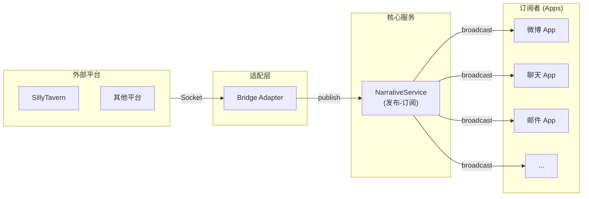
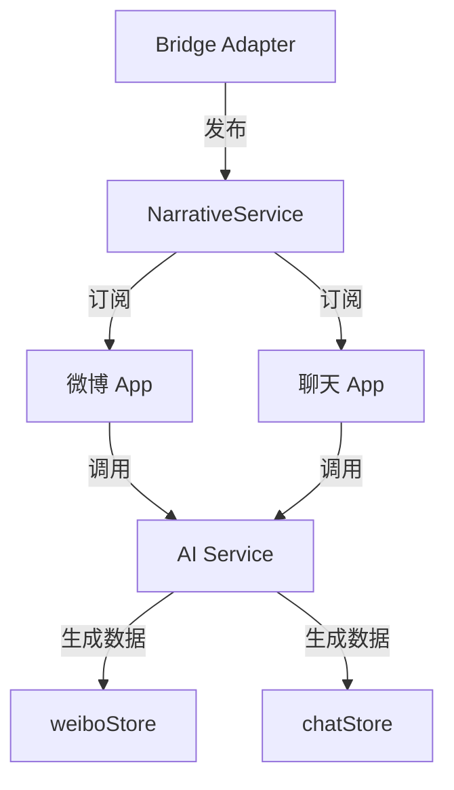

# 叙事内容分发服务 (Narrative Service)

> **版本**: 1.0  
> **状态**: ✅ 已实现  
> **源码位置**: `src/services/narrativeService.ts`

## 1. 概述

叙事内容分发服务是一个轻量级的发布-订阅（Pub/Sub）服务，负责将来自酒馆等平台的聊天叙事内容广播给各个 App。

### 核心原则

| 原则 | 说明 |
| ------ | ------ |
| **不解析** | 服务本身不解析内容，只负责分发 |
| **不存储** | 服务不保存历史内容，需要的话由订阅者自己存 |
| **不过滤** | 所有订阅者收到相同的内容，各自决定是否处理 |
| **解耦** | App 不需要知道内容来自哪个平台 |

### 什么是"叙事内容"？

叙事内容就是**纯文本的故事**，不是结构化数据。例如：

> *六月五日的阳光透过酒店厚重的遮光窗帘缝隙，在地毯上切出一道细长的亮斑。*
>
> *Artemis.Valkyrie的官方运营账号在十分钟前发布了这张照片。配文很简单："昨晚最锋利的矛，现在的起床困难户。早安，冠军们。"*

这段文字本身**不包含任何需要解析的数据**。但微博 App 拿到这段叙事后，可以用 LLM 去"阅读理解"：*"故事里提到发了微博"*，然后自行生成对应的微博帖子。

## 2. 架构设计



### 数据流

1. **Bridge Adapter** 接收来自平台的消息事件
2. **NarrativeService** 监听 Bridge 事件，转换为 `NarrativeEvent`
3. 所有订阅的 **App** 收到相同的叙事内容
4. 各 App 自行决定如何处理（通常借助 LLM）

## 3. 核心 API

### NarrativeEvent 接口

```typescript
interface NarrativeEvent {
  sessionId: string       // 会话ID
  messageId: number       // 楼层号
  swipeId: number         // 消息页ID
  content: string         // 纯文本故事内容
  isSwipeChange?: boolean // 是否是swipe切换触发的
  timestamp: number
}
```

### 主要方法

| 方法 | 说明 |
| ------ | ------ |
| `subscribe(callback)` | 订阅叙事内容，返回取消订阅函数 |
| `publish(event)` | 发布叙事内容（通常由 Bridge 调用） |
| `setupBridgeListener()` | 设置 Bridge 适配器监听 |
| `cleanup()` | 清理所有监听器 |

## 4. 文档目录

| 文档 | 说明 |
| ------ | ------ |
| [核心服务实现](./core-service.md) | NarrativeService 类的详细实现 |
| [变量与注入](./variables.md) | 标准变量定义与注入工具函数 |
| [内置提示词](./builtin-prompts.md) | 内置叙事理解系统提示词 |
| [使用指南](./usage.md) | App 如何订阅和处理叙事内容 |

## 5. 快速开始

### 5.1 初始化服务

```typescript
// src/main.ts 或 App.vue
import { narrativeService } from '@/services/narrativeService'

// 设置桥接监听（在应用启动时调用一次）
narrativeService.setupBridgeListener()
```

### 5.2 订阅叙事内容

```typescript
import { narrativeService } from '@/services/narrativeService'

// 在组件或 Store 中订阅
const unsubscribe = narrativeService.subscribe((event) => {
  console.log('收到叙事:', event.content)
  // 处理叙事内容...
})

// 组件卸载时取消订阅
onUnmounted(() => {
  unsubscribe()
})
```

### 5.3 配合 LLM 任务使用

```typescript
import { narrativeService, createNarrativeVariables } from '@/services/narrativeService'
import { AIGenerateService } from '@/services/aiGenerateService'

narrativeService.subscribe(async (event) => {
  // 将事件转换为标准变量
  const variables = createNarrativeVariables(event)
  
  // 传递给 LLM 进行分析
  const result = await AIGenerateService.generateWithPrompt(
    'social.weibo.analyze',
    { ...variables, characterName色名' },
    { appId: 'weibo', scene: 'social.weibo.analyze' }
  )
})
```

## 6. 与其他服务的关系



| 服务 | 关系 |
| ------ | ------ |
| **Bridge Adapter** | 数据来源，触发叙事发布 |
| **AI Service** | App 用它来"理解"叙事并生成结构化数据 |
| **LLM Task Service** | 可用于调度叙事分析任务 |
| **Time Service** | 叙事事件包含时间戳 |

## 7. 源码文件

| 文件 | 说明 |
| ------ | ------ |
| `src/services/narrativeService.ts` | 核心服务实现 |
| `src/services/builtinNarrativePrompts.ts` | 内置叙事理解提示词 |
