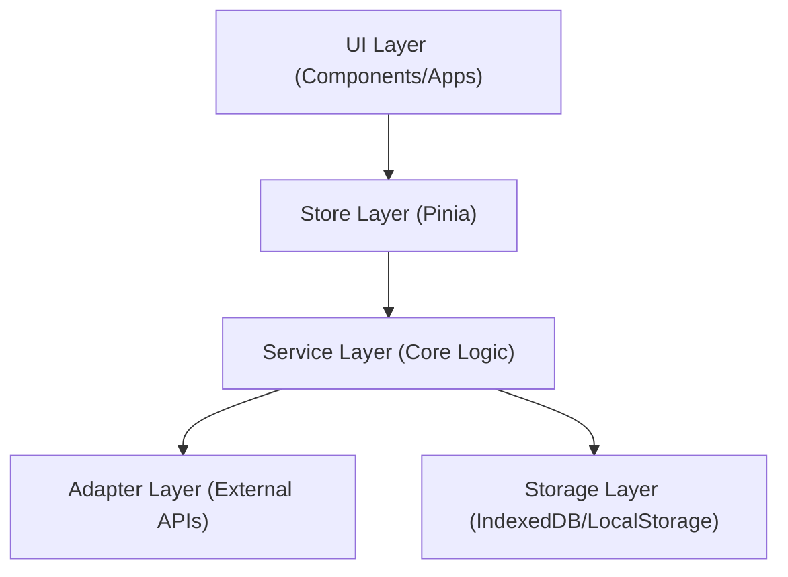

# 系统服务开发指南

> 本文档定义了系统中"系统级服务"的架构模式和开发规范。系统级服务是指独立于特定 UI 组件、负责核心业务逻辑和底层功能的模块。

## 目录

1. [架构概览](#架构概览)
2. [服务分层](#服务分层)
3. [核心原则](#核心原则)
4. [目录结构](#目录结构)
5. [开发流程](#开发流程)
6. [最佳实践](#最佳实践)

## 架构概览

在小手机模拟器架构中，系统服务位于 UI 层之下，数据层之上。它们连接了具体的 App (如设置、相册) 和底层数据/API。



### 为什么要分离服务层？

1.  **逻辑复用**：多个 App 可能需要访问相同的功能（如"发送通知"功能被聊天 App 和系统设置 App 同时使用）。
2.  **解耦**：UI 应该只关心"如何显示"，而由 Service 关心"如何工作"。
3.  **可测试性**：纯逻辑的服务层更容易进行单元测试。
4.  **状态一致性**：通过单例服务管理数据源，确保不同组件看到的数据是一致的。

## 服务分层

### 1. Service Layer (src/services)

这是核心逻辑层。Service 类通常是**单例**。

*   **职责**：
    *   业务规则执行（如：发送通知前检查勿扰模式）。
    *   数据转换和处理。
    *   调用 Adapter 与外部通信。
    *   管理数据的持久化。
*   **特点**：
    *   不直接依赖 Vue 组件。
    *   不直接操作 DOM。
    *   可以是纯 TypeScript 类。

### 2. Store Layer (src/stores)

这是响应式状态层，使用 Pinia。

*   **职责**：
    *   维护 UI 所需的**响应式状态**。
    *   作为 Service 的"缓存"或"视图"。
    *   暴露 Action 供 UI 调用，内部转发给 Service。
*   **特点**：
    *   与 Vue 紧密结合。
    *   负责 reactivity。

### 3. Adapter Layer (src/adapters)

这是适配层，用于处理外部 API 差异。

*   **职责**：
    *   与后端 API (如 Python Server) 通信。
    *   与浏览器 API (如 WebSocket) 通信。
    *   模拟数据 (Mock) 切换。

### 模式 B: 状态注入 (State Injection) - *适用于实时性强的服务*

对于像通知、WebSocket 这样由服务主动发起状态变更的场景，可以让 Store 将响应式状态 (`Ref`) 注入到 Service 中。

```typescript
// Service
class NotificationService {
  private _notifications: Ref<Notification[]> | null = null;

  init(refs: { notifications: Ref<Notification[]> }) {
    this._notifications = refs.notifications;
  }

  push(item) {
    // Service 直接修改 UI 状态
    this._notifications?.value.push(item);
  }
}

// Store
const store = defineStore('notification', () => {
  const notifications = ref([]);
  notificationService.init({ notifications });
  return { notifications };
});
```

## 目录结构

系统服务的标准目录结构如下：

```
src/
├── services/
│   ├── notification/           # 服务模块
│   │   ├── notificationService.ts  # 服务实现
│   │   ├── types.ts           # 类型定义
│   │   └── constants.ts       # 常量
│   └── index.ts               # 统一导出
├── stores/
│   ├── notificationStore.ts   # 对应的 Store
│   └── index.ts
└── types/
    └── notification.ts        # 全局共享类型
```

## 开发流程

### 步骤 1: 定义类型 (Types)

在 `src/types/` 中定义核心数据结构。

```typescript
// src/types/battery.ts
export interface BatteryStatus {
  level: number;
  isCharging: boolean;
}
```

### 步骤 2: 实现服务 (Service)

在 `src/services/` 中编写核心逻辑。

```typescript
// src/services/battery/batteryService.ts
class BatteryService {
  private static instance: BatteryService;
  
  // 单例模式
  static getInstance(): BatteryService {
    if (!this.instance) this.instance = new BatteryService();
    return this.instance;
  }

  async getLevel(): Promise<number> {
    // 调用底层 API
    return navigator.getBattery().then(b => b.level);
  }
}

export const batteryService = BatteryService.getInstance();
```

### 步骤 3: 实现状态管理 (Store)

在 `src/stores/` 中创建 Pinia Store，调用 Service。

```typescript
// src/stores/batteryStore.ts
export const useBatteryStore = defineStore('battery', () => {
  const level = ref(100);
  
  async function refresh() {
    level.value = await batteryService.getLevel();
  }
  
  return { level, refresh };
});
```

### 步骤 4: UI 集成

组件只与 Store 交互。

```vue
<script setup>
import { useBatteryStore } from '@/stores/batteryStore';
const store = useBatteryStore();
</script>
```

## 最佳实践

1.  **UI 不直接调用 Service**：尽量通过 Store 进行中转，除非该操作完全不涉及状态更新（如单纯的日志记录）。
2.  **Service 是单一事实来源**：如果数据需要持久化，由 Service 负责写入 Storage/API。
3.  **使用依赖注入**：虽然使用了单例，但在设计 Service 时考虑通过构造函数接收依赖（如 API Adapter），便于测试。
4.  **事件驱动**：对于跨服务的交互，考虑使用 EventBus 或观察者模式，避免强耦合。
