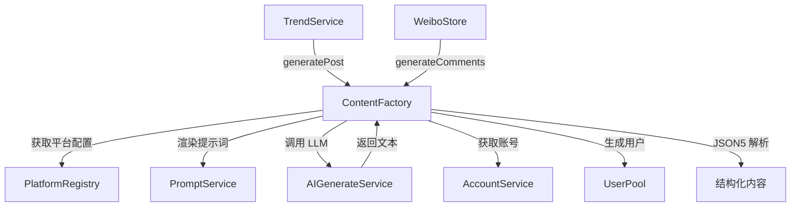
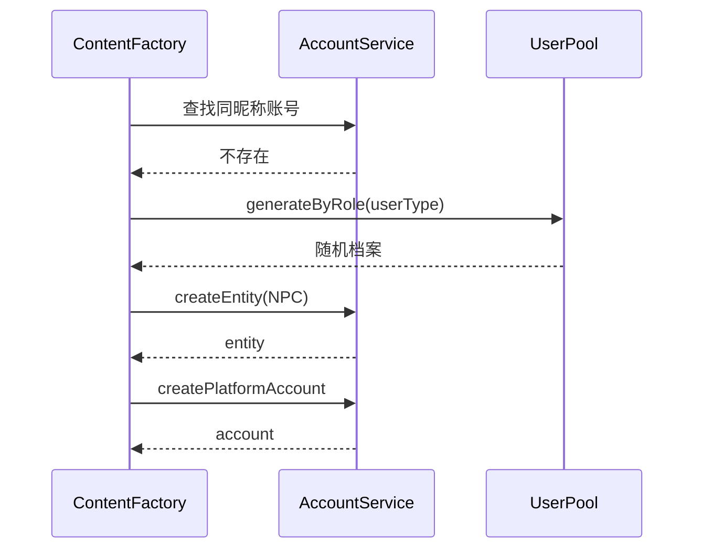

# ContentFactory 内容工厂

> **版本**: 1.0
> **状态**: ✅ 已实现
> **代码位置**: `src/services/social/contentFactory.ts`
> **依赖**: AIGenerateService, PromptService, PlatformRegistry, AccountService, UserPool

## 1. 概述

ContentFactory 是社交媒体模拟引擎的内容生成核心，负责与 LLM 交互，生成结构化的博文和评论内容。它封装了提示词渲染、LLM 调用、JSON 解析修复等复杂逻辑，为上层服务提供简洁的内容生成接口。

### 1.1 核心职责

1. **博文生成**: 基于话题和账号人设生成平台风格博文
2. **评论生成**: 批量生成多样化的评论内容
3. **账号关联**: 为生成的评论者创建 NPC 账号
4. **JSON 修复**: 鲁棒地解析 LLM 输出的 JSON

---

## 2. 架构设计

### 2.1 服务关系图



### 2.2 提示词优先级

```text
平台特定提示词 > 通用提示词 > 硬编码 Fallback

例如生成微博博文：
1. 优先查找: social.post.generate.weibo
2. 回退到:   social.post.generate
3. 最后使用: 代码内置的 fallback 模板
```

---

## 3. API 文档

### 3.1 获取实例

```typescript
import { ContentFactory } from '@/services/social/contentFactory';

const factory = ContentFactory.getInstance();
```

### 3.2 generatePost

生成一条博文。

```typescript
async generatePost(
  platformId: string,
  topic: TrendingTopic,
  account?: PlatformAccount
): Promise<PostPayload>
```

**参数**:

| 参数 | 类型 | 必填 | 说明 |
|------|------|------|------|
| `platformId` | `string` | ✅ | 平台 ID（如 `'weibo'`） |
| `topic` | `TrendingTopic` | ✅ | 话题对象 |
| `account` | `PlatformAccount` | ❌ | 发帖账号（可选） |

**返回值** (`PostPayload`):

```typescript
interface PostPayload {
  text: string;           // 博文内容
  title?: string;         // 标题（B站/知乎/小红书需要）
  images?: string[];      // 图片描述数组
}
```

**提示词变量**:

| 变量名 | 来源 | 说明 |
|--------|------|------|
| `platformName` | `platform.name` | 平台名称 |
| `platformCulture` | `platform.aiSetting` | 平台风格描述 |
| `topic` | 参数 | 话题关键词和背景 |
| `authorIdentity` | 账号实体 | 发帖者人设 |
| `length` | `platform.content.maxLength` | 字数限制 |

**示例**:

```typescript
const topic = {
  id: 'xxx',
  keyword: '#全息手机发布#',
  summary: '某科技公司发布全球首款消费级全息手机...',
  // ...
};

const payload = await factory.generatePost('weibo', topic);
// {
//   text: "刚看完发布会，这全息手机也太酷了吧！...",
//   images: ["发布会现场照片", "手机正面照"]
// }
```

---

### 3.3 generateComments

批量生成评论。

```typescript
async generateComments(
  platformId: string,
  postContent: string,
  count?: number
): Promise<Comment[]>
```

**参数**:

| 参数 | 类型 | 默认值 | 说明 |
|------|------|--------|------|
| `platformId` | `string` | - | 平台 ID |
| `postContent` | `string` | - | 原博文内容 |
| `count` | `number` | `5` | 生成数量 |

**返回值** (`Comment[]`):

```typescript
interface Comment {
  content: string;        // 评论内容
  userType: 'fan' | 'hater' | 'passerby' | 'ad';  // 用户类型
  nickname: string;       // 昵称
  likes: number;          // 点赞数
}
```

**用户类型说明**:

| 类型 | 说明 | 典型行为 |
|------|------|----------|
| `fan` | 粉丝 | 支持、赞美、追捧 |
| `hater` | 杠精 | 质疑、反驳、挑刺 |
| `passerby` | 路人 | 中立、好奇、吃瓜 |
| `ad` | 广告 | 带货、引流、水军 |

**LLM 参数**:

| 参数 | 值 | 说明 |
|------|-----|------|
| `temperature` | `1.0` | 高随机性，增加评论多样性 |

**副作用**:

生成评论后，会异步为每个评论者创建 NPC 账号（不阻塞返回）。

**示例**:

```typescript
const comments = await factory.generateComments(
  'weibo',
  '刚看完发布会，这全息手机也太酷了吧！',
  8
);
// [
//   { content: "同款期待！什么时候开售啊", userType: "fan", nickname: "科技小白", likes: 23 },
//   { content: "就这？上个月发布会都预热过了", userType: "hater", nickname: "理性分析师", likes: 5 },
//   ...
// ]
```

---

## 4. 内部机制

### 4.1 JSON 解析与修复

LLM 输出的 JSON 经常存在格式问题，`parseAndRepairJSON` 方法提供鲁棒的解析能力：

```mermaid
flowchart TD
    A[LLM 输出文本] --> B[移除 Markdown 标记]
    B --> C{JSON5 解析}
    C -->|成功| D[返回对象]
    C -->|失败| E[提取 JSON 边界]
    E --> F[查找首个 { 或 []
    F --> G[查找末尾 } 或 ]]
    G --> H{再次 JSON5 解析}
    H -->|成功| D
    H -->|失败| I[抛出异常]
```

**修复能力**:

| 问题 | 处理方式 |
|------|----------|
| `` ```json ... ``` `` 包裹 | 正则移除 |
| 前后有多余文本 | 提取 `{...}` 或 `[...]` 部分 |
| 尾逗号、单引号等 | JSON5 库容错解析 |

### 4.2 账号创建流程

评论生成后，为评论者创建账号：



**账号属性**:

| 属性 | 值 | 说明 |
|------|-----|------|
| `entity.type` | `'npc'` | 非玩家角色 |
| `entity.source` | `'social'` | 来源：社交引擎 |
| `account.scope` | `'session'` | 会话级作用域 |

---

## 5. 提示词配置

### 5.1 博文生成提示词

**场景 ID**: `social.post.generate` / `social.post.generate.{platformId}`

**模板示例**:

```handlebars
你是一个专业的社交媒体内容生成引擎。
当前平台: {{platformName}}
平台风格: {{platformCulture}}

话题: {{topic}}
发布者人设: {{authorIdentity}}
字数限制: {{length}}

请生成符合该平台风格的博文，输出 JSON 格式：
{
  "text": "博文内容",
  "title": "标题(可选)",
  "images": ["图片描述"]
}
```

### 5.2 评论生成提示词

**场景 ID**: `social.comment.batch` / `social.comment.batch.{platformId}`

**模板示例**:

```handlebars
你是一个社交媒体评论区模拟器。
当前平台: {{platformName}}

请为下方博文生成 {{count}} 条评论。
模拟真实用户生态：粉丝、杠精、路人、广告哥等。

博文内容: {{postContent}}

输出 JSON 数组：
[
  {
    "content": "评论内容",
    "userType": "fan|hater|passerby|ad",
    "nickname": "用户昵称",
    "likes": 0-100
  }
]
```

---

## 6. 使用示例

### 6.1 在 TrendService 中使用

```typescript
// src/services/social/trendService.ts

async ensureTopicContent(topicId: string) {
  const topic = await db.socialTopics.get(topicId);
  if (!topic) return;

  // 生成博文
  const factory = ContentFactory.getInstance();
  const payload = await factory.generatePost(topic.platformId!, topic);

  // 保存到数据库
  await db.socialPosts.add({
    id: uuidv4(),
    platformId: topic.platformId!,
    authorId: account.id,
    timestamp: Date.now(),
    topicTags: [topic.keyword],
    payload
  });
}
```

### 6.2 在微博 Store 中生成评论

```typescript
// src/stores/weiboStore.ts

async function loadComments(postId: string) {
  const post = await db.socialPosts.get(postId);
  if (!post) return;

  // 检查是否已有评论
  const existingCount = await db.socialComments
    .where('postId').equals(postId)
    .count();

  if (existingCount > 0) return;

  // 生成评论
  const factory = ContentFactory.getInstance();
  const comments = await factory.generateComments(
    'weibo',
    post.payload.text,
    10
  );

  // 保存评论...
}
```

---

## 7. 错误处理

### 7.1 常见错误

| 错误 | 原因 | 处理 |
|------|------|------|
| `Platform xxx not found` | 未注册的平台 ID | 检查 PlatformRegistry |
| `Failed to parse JSON content` | LLM 输出格式严重错误 | 重试或使用 fallback |
| `No JSON object or array found` | LLM 输出无 JSON 结构 | 检查提示词设计 |

### 7.2 容错机制

1. **提示词降级**: 平台特定 → 通用 → 硬编码
2. **JSON 修复**: JSON5 容错 + 边界提取
3. **账号创建异步**: 失败不阻塞评论返回

---

## 8. 相关服务

| 服务 | 文档 | 说明 |
|------|------|------|
| **TrendService** | [trend-service.md](./trend-service.md) | 调用生成博文 |
| **TrafficEngine** | [traffic-engine.md](./traffic-engine.md) | 计算互动数据 |
| **PlatformRegistry** | [platform-registry.md](./platform-registry.md) | 平台配置 |
| **PromptService** | [../prompt-service/](../prompt-service/) | 提示词管理 |
| **AccountService** | [../account-service.md](../account-service.md) | 账号管理 |

---

## 9. 版本历史

| 版本 | 日期 | 变更内容 |
|------|------|----------|
| 1.0 | 2026-01-16 | 初始文档，基于代码实现整理 |
| - | - | Phase 2: 迁移到新账号系统 |
