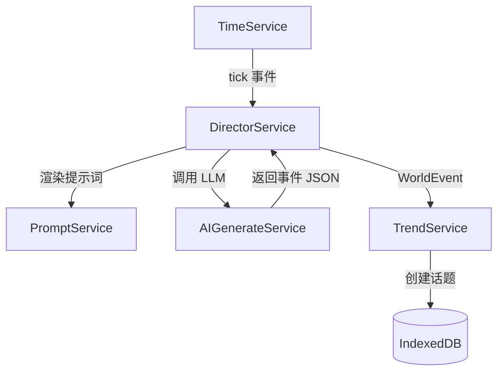
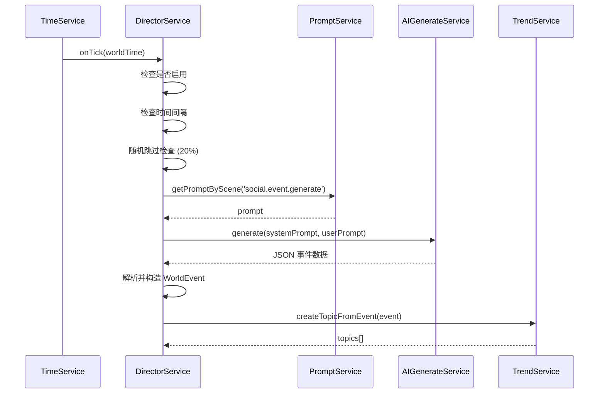
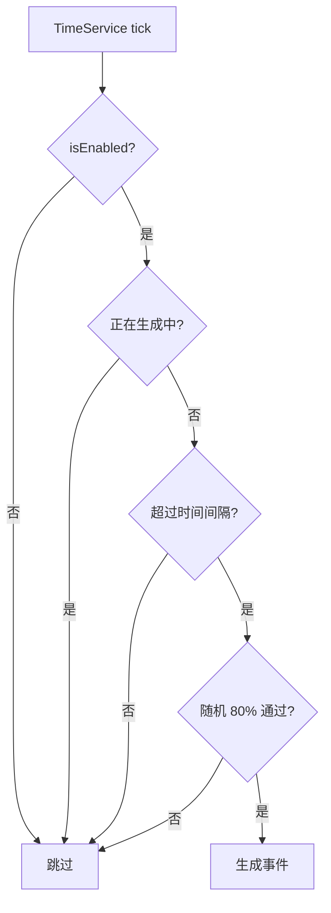

# DirectorService 世界导演服务

> **版本**: 1.0
> **状态**: ✅ 已实现
> **代码位置**: `src/services/social/directorService.ts`
> **依赖**: TimeService, AIGenerateService, PromptService, TrendService

## 1. 概述

DirectorService 是社交媒体模拟引擎的"幕后导演"，负责驱动虚拟世界的自主运转。它监听时间服务的 tick 事件，按配置的频率自动生成世界事件（突发新闻、娱乐八卦、科技突破等），并将事件推送给 TrendService 创建热搜话题。

### 1.1 核心理念

> **世界在"呼吸"**：即使玩家不操作，虚拟世界也在持续产生新闻和热点，营造真实的互联网氛围。

### 1.2 核心职责

1. **时间监听**: 订阅 TimeService 的 tick 事件
2. **事件生成**: 调用 LLM 生成随机世界事件
3. **热搜推送**: 将事件转化为各平台热搜话题
4. **频率控制**: 根据配置控制事件生成频率

---

## 2. 架构设计

### 2.1 服务关系图



### 2.2 事件生成流程



---

## 3. API 文档

### 3.1 获取实例

```typescript
import { DirectorService } from '@/services/social/directorService';

const director = DirectorService.getInstance();
```

### 3.2 setConfig

设置导演服务配置。

```typescript
setConfig(config: Partial<DirectorConfig>): void
```

**配置项** (`DirectorConfig`):

| 字段 | 类型 | 默认值 | 说明 |
|------|------|--------|------|
| `isEnabled` | `boolean` | `false` | 是否启用自动事件生成 |
| `frequency` | `'low' \| 'medium' \| 'high'` | `'medium'` | 事件生成频率 |
| `worldSetting` | `string` | 见下 | 世界观背景设定 |
| `costLimit` | `number` | `10000` | Token 预算（占位） |

**频率对应间隔**:

| 频率 | 世界时间间隔 | 说明 |
|------|-------------|------|
| `low` | 12 小时 | 每天 1-2 个事件 |
| `medium` | 6 小时 | 每天 3-4 个事件 |
| `high` | 2 小时 | 每天 10+ 个事件 |

**默认世界观**:

```
现代都市背景，科技与魔法轻微共存 (参考赛博朋克或现代奇幻)
```

**示例**:

```typescript
director.setConfig({
  isEnabled: true,
  frequency: 'high',
  worldSetting: '2077年的新东京，人工智能与人类共存的社会'
});
```

---

### 3.3 triggerManualEvent

手动触发一次事件生成（用于测试）。

```typescript
async triggerManualEvent(): Promise<void>
```

**示例**:

```typescript
// 在开发者工具中测试
await director.triggerManualEvent();
// [Director] Generating global event...
// [Director] Event generated: #某科技公司发布全息手机#
```

---

## 4. 数据模型

### 4.1 WorldEvent

导演生成的世界事件结构：

```typescript
interface WorldEvent {
  id: string;              // UUID
  source: 'director';      // 事件来源
  topic: string;           // 话题关键词
  summary: string;         // 事件描述
  priority: 'breaking' | 'normal' | 'minor';  // 优先级
  affectedPlatforms: string[];  // 影响的平台
  timestamp: number;       // 生成时间戳
}
```

### 4.2 LLM 输出格式

```typescript
interface EventData {
  title: string;           // 事件标题
  topic: string;           // 话题关键词 (如 "#某事爆发#")
  summary: string;   // 详细描述 (50-100字)
  category: string;        // 分类 (tech/entertainment/politics/...)
  magnitude: number;       // 影响力 (1-100)
  platforms: string[];     // 受影响平台
}
```

**优先级映射**:

| magnitude | priority | 说明 |
|-----------|----------|------|
| > 80 | `'breaking'` | 突发重大事件 |
| ≤ 80 | `'normal'` | 普通热点 |

---

## 5. 事件生成机制

### 5.1 触发条件



### 5.2 随机性控制

为避免事件过于规律，增加了 20% 的随机跳过概率：

```typescript
if (Math.random() > 0.8) return;
```

这意味着即使到达触发时间，仍有 20% 概率不生成事件。

### 5.3 防重入锁

使用 `isGenerating` 标志防止 LLM 调用期间重复触发：

```typescript
private isGenerating: boolean = false;

private async generateGlobalEvent(time: number) {
  this.isGenerating = true;
  try {
    // ... LLM 调用
  } finally {
    this.isGenerating = false;
  }
}
```

---

## 6. 提示词配置

### 6.1 事件生成提示词

**场景 ID**: `social.event.generate`

**变量**:

| 变量名 | 来源 | 说明 |
|--------|------|------|
| `timeContext` | 当前时间 | 格式化的日期时间字符串 |
| `eventType` | 固定 | `'随机'` |
| `intensity` | 固定 | `'中'` |

**Fallback 模板**:

```handlebars
基于当前世界观：{{worldSetting}}
编造一个刚刚发生的突发事件。
可以是科技突破、娱乐八卦、政治丑闻或自然灾害。
不要与主角直接相关，而是作为世界背景新闻。

输出 JSON:
{
  "title": "事件标题",
  "topic": "简短话题关键词 (如 #某事爆发#)",
  "summary": "事件详细描述 (50-100字)",
  "category": "tech|entertainment|politics|disaster|game|life",
  "magnitude": 1-100,
  "platforms": ["weibo", "bilibili", "zhihu"]
}
```

### 6.2 LLM 参数

| 参数 | 值 | 说明 |
|------|-----|------|
| `temperature` | `0.9` | 高随机性，增加事件多样性 |

---

## 7. 使用示例

### 7.1 在社交引擎配置 App 中启用

```typescript
// src/apps/social-engine/views/DirectorSettings.vue

const director = DirectorService.getInstance();

function toggleDirector(enabled: boolean) {
  director.setConfig({ isEnabled: enabled });
}

function setFrequency(freq: 'low' | 'medium' | 'high') {
  director.setConfig({ frequency: freq });
}

function updateWorldSetting(setting: string) {
  director.setConfig({ worldSetting: setting });
}
```

### 7.2 开发调试

```typescript
// 在浏览器控制台
const director = DirectorService.getInstance();

// 启用导演服务
director.setConfig({ isEnabled: true, frequency: 'high' });

// 手动触发一次事件
await director.triggerManualEvent();
```

---

## 8. 注意事项

### 8.1 默认关闭

⚠️ **导演服务默认关闭** (`isEnabled: false`)，需要用户手动开启。

**原因**:
- 避免无意中消耗大量 LLM API 调用
- 让用户可控地开启世界事件生成

### 8.2 API 成本控制

每次事件生成约消耗：
- 输入: ~200-500 tokens
- 输出: ~100-200 tokens

以 `medium` 频率（每6小时一次），一天约 4 次调用。

### 8.3 时间服务依赖

导演服务依赖 TimeService 的 tick 事件。如果使用模拟时间加速，事件生成也会相应加速。

---

## 9. 相关服务

| 服务 | 文档 | 说明 |
|------|------|------|
| **TrendService** | [trend-service.md](./trend-service.md) | 接收事件并创建热搜 |
| **TimeService** | [../time-service/](../time-service/) | 提供 tick 事件 |
| **PromptService** | [../prompt-service/](../prompt-service/) | 提示词管理 |
| **ContentFactory** | [content-factory.md](./content-factory.md) | 内容生成（热搜填充时调用） |

---

## 10. 版本历史

| 版本 | 日期 | 变更内容 |
|------|------|----------|
| 1.0 | 2026-01-16 | 初始文档，基于代码实现整理 |
