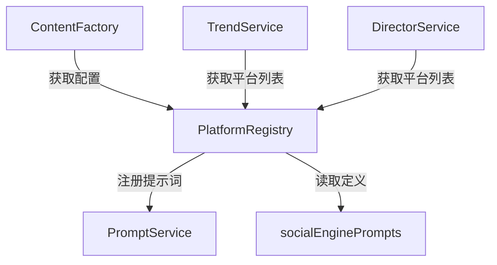
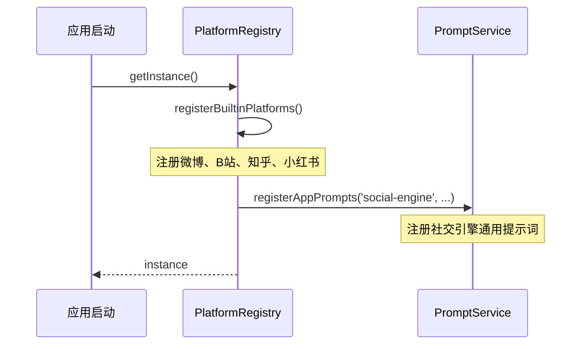

# PlatformRegistry 平台注册表

> **版本**: 1.0
> **状态**: ✅ 已实现
> **代码位置**: `src/services/social/registry.ts`
> **依赖**: PromptService

## 1. 概述

PlatformRegistry 是社交媒体模拟引擎的平台配置中心，管理所有支持的社交平台（微博、B站、知乎、小红书等）的配置信息。它采用**单例模式**，在初始化时自动注册内置平台和社交引擎提示词。

### 1.1 核心职责

1. **平台配置管理**: 存储和查询各平台的配置信息
2. **内置平台注册**: 预置微博、B站、知乎、小红书等平台
3. **提示词注册**: 初始化时自动注册社交引擎提示词
4. **扩展支持**: 允许动态注册新平台

---

## 2. 架构设计

### 2.1 服务关系图



### 2.2 初始化流程



---

## 3. API 文档

### 3.1 获取实例

```typescript
import { PlatformRegistry } from '@/services/social/registry';

const registry = PlatformRegistry.getInstance();
```

### 3.2 getPlatform

获取指定平台的配置。

```typescript
getPlatform(id: string): PlatformConfig | undefined
```

**参数**:

| 参数 | 类型 | 说明 |
| ------ | ------ | ------ |
| `id` | `string` | 平台 ID |

**示例**:

```typescript
const weibo = registry.getPlatform('weibo');
if (weibo) {
  console.log(weibo.name);  // "微博"
  console.log(weibo.aiSetting.slang);  // ['yyds', '绝绝子', ...]
}
```

### 3.3 getAllPlatforms

获取所有已注册平台的配置列表。

```typescript
getAllPlatforms(): PlatformConfig[]
```

**示例**:

```typescript
const platforms = registry.getAllPlatforms();
// [
//   { id: 'weibo', name: '微博', ... },
//   { id: 'bilibili', name: 'Bilibili', ... },
//   ...
// ]
```

### 3.4 registerPlatform

注册新平台（用于扩展）。

```typescript
registerPlatform(config: PlatformConfig): void
```

**示例**:

```typescript
registry.registerPlatform({
  id: 'douyin',
  name: '抖音',
  content: {
    hasTitle: false,
    mediaType: 'video',
    maxLength: 55,
  },
  aiSetting: {
    tone: 'Short, Catchy, Trendy',
    roles: ['Creator', 'Viewer'],
    slang: ['家人们', '绝了', '泰裤辣'],
    promptTemplate: 'social.post.generate.douyin',
  },
  interaction: {
    actions: ['like', 'favorite', 'repost'],
    commentStructure: 'nested',
  },
  dmStrategy: {
    allowStranger: true,
    foldUnknown: true,
  },
});
```

---

## 4. 数据模型

### 4.1 PlatformConfig

平台配置的完整结构：

```typescript
interface PlatformConfig {
  id: string;              // 平台唯一标识
  name: string;            // 平台显示名称
  content: ContentConfig;  // 内容配置
  aiSetting: AIConfig;     // AI 生成配置
  interaction: InteractionConfig;  // 互动配置
  dmStrategy: DMConfig;    // 私信策略
}
```

### 4.2 ContentConfig

内容相关配置：

```typescript
interface ContentConfig {
  hasTitle: boolean;       // 是否需要标题
  mediaType: 'text_image' | 'video' | 'qa';  // 媒体类型
  maxLength: number;       // 最大字数
}
```

### 4.3 AIConfig

AI 生成相关配置：

```typescript
interface AIConfig {
  tone: string;            // 语言风格描述
  roles: string[];         // 角色类型列表
  slang: string[];         // 平台黑话/流行语
  promptTemplate: string;  // 对应的提示词场景 ID
}
```

### 4.4 InteractionConfig

互动相关配置：

```typescript
interface InteractionConfig {
  actions: string[];       // 支持的互动类型
  commentStructure: 'nested' | 'flat' | 'bullet';  // 评论结构
}
```

### 4.5 DMConfig

私信策略配置：

```typescript
interface DMConfig {
  allowStranger: boolean;  // 是否允许陌生人私信
  foldUnknown: boolean;    // 是否折叠未知消息
}
```

---

## 5. 内置平台配置

### 5.1 微博 (weibo)

| 配置项 | 值 |
| -------- | ---- |
| **内容类型** | 图文 (`text_image`) |
| **标题** | 不需要 |
| **字数限制** | 140 字 |
| **语言风格** | Gossip, Emotional, Short sentences, Trendy slang |
| **角色类型** | Fan, Hater, Passerby, MarketingAccount |
| **流行语** | yyds, 绝绝子, 无语子, 笑死, 家人们 |
| **互动** | like, repost, favorite |
| **评论结构** | 嵌套 (nested) |

### 5.2 B站 (bilibili)

| 配置项 | 值 |
| -------- | ---- |
| **内容类型** | 视频 (`video`) |
| **标题** | 需要 |
| **字数限制** | 1000 字（简介） |
| **语言风格** | Meme-heavy, Otaku culture, Critical but humorous |
| **角色类型** | Otaku, TechGeek, Gamer, Uploader |
| **流行语** | 下次一定, 三连, 硬币, 好耶, 生草, 寄 |
| **互动** | like, dislike, coin, repost, favorite |
| **评论结构** | 弹幕式 (bullet) |

### 5.3 知乎 (zhihu)

| 配置项 | 值 |
| -------- | ---- |
| **内容类型** | 问答 (`qa`) |
| **标题** | 需要（问题标题） |
| **字数限制** | 5000 字 |
| **语言风格** | Professional, Rational, Pretensious, Storytelling |
| **角色类型** | Expert, Intellectual, Storyteller |
| **流行语** | 谢邀, 人在美国, 刚下飞机, 利益相关, 以上 |
| **互动** | like, dislike, favorite, repost |
| **评论结构** | 扁平 (flat) |

### 5.4 小红书 (redbook)

| 配置项 | 值 |
| -------- | ---- |
| **内容类型** | 图文 (`text_image`) |
| **标题** | 需要 |
| **字数限制** | 1000 字 |
| **语言风格** | Life-sharing, Aesthetic, Emoji-heavy, Helpful |
| **角色类型** | Influencer, Shopper, Student |
| **流行语** | 集美, 避雷, 种草, 天花板, 绝美 |
| **互动** | like, favorite, repost |
| **评论结构** | 嵌套 (nested) |

---

## 6. 提示词自动注册

### 6.1 注册机制

PlatformRegistry 在初始化时自动注册社交引擎通用提示词：

```typescript
private registerPrompts() {
  try {
    PromptService.registerAppPrompts('social-engine', socialEnginePrompts);
  } catch (error) {
    console.warn('[SocialEngine] Failed to register prompts:', error);
  }
}
```

### 6.2 注册的提示词

| 场景 ID | 说明 |
| --------- | ------ |
| `social.event.generate` | 生成世界事件 |
| `social.post.generate` | 生成通用博文 |
| `social.comment.batch` | 批量生成评论 |
| `social.user.generate` | 生成虚拟用户 |

提示词定义位于 `src/services/social/prompts.ts`。

---

## 7. 使用示例

### 7.1 在 ContentFactory 中获取平台配置

```typescript
// src/services/social/contentFactory.ts

public async generatePost(platformId: string, topic: TrendingTopic) {
  const platform = PlatformRegistry.getInstance().getPlatform(platformId);
  if (!platform) throw new Error(`Platform ${platformId} not found`);

  // 使用平台配置渲染提示词
  const rendered = PromptService.renderPrompt(prompt, {
    platformName: platform.name,
    platformCulture: `${platform.aiSetting.tone}. 常用语: ${platform.aiSetting.slang.join(', ')}`,
    length: platform.content.maxLength
  });
}
```

### 7.2 在 TrendService 中获取所有平台

```typescript
// src/services/social/trendService.ts

public async createTopicFromEvent(event: WorldEvent) {
  const platforms = event.affectedPlatforms.length > 0 
    ? event.affectedPlatforms 
    : PlatformRegistry.getInstance().getAllPlatforms().map(p => p.id);

  for (const platformId of platforms) {
    // 为每个平台创建话题...
  }
}
```

### 7.3 扩展新平台

```typescript
// src/apps/douyin/index.ts

import { PlatformRegistry } from '@/services/social/registry';

export function registerDouyinPlatform() {
  PlatformRegistry.getInstance().registerPlatform({
    id: 'douyin',
    name: '抖音',
    // ...完整配置
  });
}
```

---

## 8. 相关服务

| 服务 | 文档 | 说明 |
| ------ | ------ | ------ |
| **ContentFactory** | [content-factory.md](./content-factory.md) | 使用平台配置生成内容 |
| **TrendService** | [trend-service.md](./trend-service.md) | 获取平台列表创建话题 |
| **PromptService** | [../prompt-service/](../prompt-service/) | 提示词管理 |

---

## 9. 版本历史

| 版本 | 日期 | 变更内容 |
| ------ | ------ | ---------- |
| 1.0 | 2026-01-16 | 初始文档，基于代码实现整理 |
