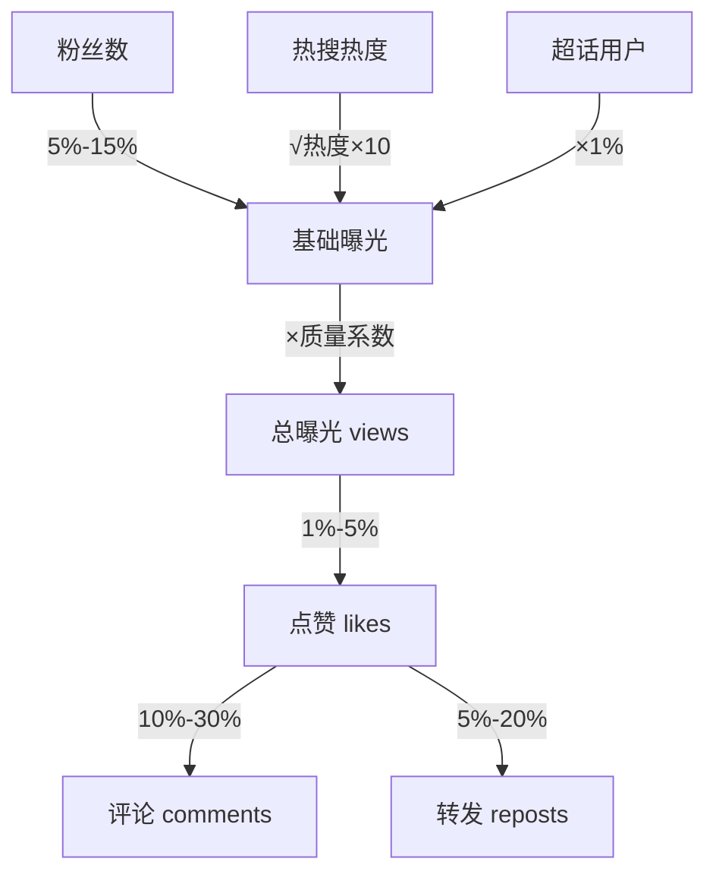

# TrafficEngine 流量算法引擎

> **版本**: 1.0
> **状态**: ✅ 已实现
> **代码位置**: `src/services/social/algorithm.ts`
> **依赖**: 无外部依赖（纯算法模块）

## 1. 概述

TrafficEngine 是社交媒体模拟引擎的核心算法模块，提供热度计算、互动概率计算等数值算法。它是一个**纯静态类**，不依赖任何外部服务，所有方法均为静态方法。

### 1.1 核心职责

1. **热度计算**: 基于时间曲线的话题热度实时计算
2. **热度格式化**: 将数值转换为人类可读格式（万/亿）
3. **等级判定**: 判断热度等级（沸/爆/热/新）
4. **互动预测**: 基于粉丝数和流量池计算互动数据

---

## 2. 算法原理

### 2.1 热度计算公式

```
Heat = (BaseScore³ × 0.1) × TimeFactor × Jitter
```

**公式组成**:

| 因子 | 公式 | 说明 |
| ------ | ------ | ------ |
| **BaseMagnitude** | `baseScore³ × 0.1` | 指数放大差异，100分=100万，50分=12.5万 |
| **TimeFactor** | 见下文 | 时间曲线（上升/衰退） |
| **Jitter** | `sin(t/20000) × 0.02 + 1` | ±2% 微波动，让数字"活"起来 |

### 2.2 时间曲线模型

```
热度
  │
  │         ╭──────╮ 峰值
  │       ╱│        ╲
  │      ╱ │         ╲
  │     ╱  │          ╲_____ 长尾(5%)
  │    ╱   │
  │───╱────┼────────────────── 时间
  │ 创建  峰值时间
  │
  └── 上升期 ──┴──── 衰退期 ────
```

**上升期** (创建 → 峰值):
```typescript
timeFactor = 0.2 + 0.8 × sin(progress × π/2)
// 正弦曲线前1/4周期，模拟发酵过程
```

**衰退期** (峰值后):
```typescript
timeFactor = max(0.05, exp(-timeSincePeak / 24h))
// 指数衰减，24小时半衰期，保留5%长尾
```

---

## 3. API 文档

### 3.1 calculateTopicHeat

计算话题的实时热度。

```typescript
static calculateTopicHeat(topic: TrendingTopic, currentTime: number): number
```

**参数**:

| 参数 | 类型 | 说明 |
| ------ | ------ | ------ |
| `topic` | `TrendingTopic` | 话题对象 |
| `currentTime` | `number` | 当前时间戳 |

**使用的话题字段**:

| 字段 | 说明 |
| ------ | ------ |
| `baseScore` | 基础分数 (1-100) |
| `createdAt` | 创建时间戳 |
| `peakTime` | 预计峰值时间戳 |

**示例**:

```typescript
const heat = TrafficEngine.calculateTopicHeat(topic, Date.now());
// 返回: 234567 (热度值)
```

---

### 3.2 calculateSimpleHeat

简化版热度计算，用于 LLM 生成的热搜。

```typescript
static calculateSimpleHeat(
  baseScore: number,
  createdAt: number,
  currentTime: number,
  peakHours?: number
): number
```

**参数**:

| 参数 | 类型 | 默认值 | 说明 |
| ------ | ------ | -------- | ------ |
| `baseScore` | `number` | - | 基础分数 (1-100) |
| `createdAt` | `number` | - | 创建时间戳 |
| `currentTime` | `number` | - | 当前时间戳 |
| `peakHours` | `number` | 随机 4-24 | 到达峰值的小时数 |

**示例**:

```typescript
// LLM 生成热搜时，只有 baseScore
const heat = TrafficEngine.calculateSimpleHeat(75, createdAt, Date.now());
```

---

### 3.3 formatHeat

格式化热度显示。

```typescript
static formatHeat(heat: number): string
```

**转换规则**:

| 热度范围 | 格式 | 示例 |
| ---------- | ------ | ------ |
| `< 10,000` | 原值 | `"8234"` |
| `10,000 ~ 10万` | X.X万 | `"2.5万"` |
| `10万 ~ 1亿` | XX万 | `"234万"` |
| `≥ 1亿` | X.X亿 | `"1.2亿"` |

**示例**:

```typescript
TrafficEngine.formatHeat(8234);      // "8234"
TrafficEngine.formatHeat(25000);     // "2.5万"
TrafficEngine.formatHeat(2345678);   // "234万"
TrafficEngine.formatHeat(120000000); // "1.2亿"
```

---

### 3.4 getHeatLevel

判断热度等级。

```typescript
static getHeatLevel(
  heat: number,
  rank: number,
  ageMinutes: number
): HeatLevel
```

**参数**:

| 参数 | 类型 | 说明 |
| ------ | ------ | ------ |
| `heat` | `number` | 热度值 |
| `rank` | `number` | 排名 (1-based) |
| `ageMinutes` | `number` | 话题年龄（分钟） |

**返回值** (`HeatLevel`):

| 等级 | 条件 | 说明 |
| ------ | ------ | ------ |
| `'boil'` | 排名 ≤ 3 且热度 ≥ 100万 | 沸 🔥 |
| `'explode'` | 热度 ≥ 50万 | 爆 💥 |
| `'new'` | 创建 < 1小时 | 新 🆕 |
| `'hot'` | 热度 ≥ 10万 | 热 🌡️ |
| `'normal'` | 其他 | 普通 |

**判断优先级**: boil > explode > new > hot > normal

---

### 3.5 getHeatDisplay

获取完整的热度显示信息（综合接口）。

```typescript
static getHeatDisplay(
  heat: number,
  rank: number,
  createdAt: number,
  currentTime?: number
): HeatDisplay
```

**返回值** (`HeatDisplay`):

```typescript
interface HeatDisplay {
  raw: number;        // 原始热度值
  formatted: string;  // 格式化文本 (如 "234.5万")
  level: HeatLevel;   // 热度等级
  tag: string;        // 标签文本 ("沸"/"爆"/"热"/"新"/"")
  isNew: boolean;     // 是否为新话题
  isHot: boolean;     // 是否为热门
}
```

**示例**:

```typescript
const display = TrafficEngine.getHeatDisplay(1500000, 1, createdAt);
// {
//   raw: 1500000,
//   formatted: "150万",
//   level: "boil",
//   tag: "沸",
//   isNew: false,
//   isHot: true
// }
```

---

### 3.6 generateInitialHeat

基于 baseScore 生成合理的初始热度。

```typescript
static generateInitialHeat(baseScore: number): number
```

**算法**:

```typescript
// 基础量级
baseMagnitude = baseScore³ × 0.1
// 随机波动 ±20%
randomFactor = 0.8 + random() × 0.4
// 初始为峰值的 20%-60%
initialFactor = 0.2 + random() × 0.4

return baseMagnitude × randomFactor × initialFactor
```

**典型值**:

| baseScore | 初始热度范围 |
| ----------- | ------------- |
| 100 | 16万 ~ 60万 |
| 75 | 6.7万 ~ 25万 |
| 50 | 2万 ~ 7.5万 |
| 25 | 2500 ~ 9400 |

---

### 3.7 calculateInteractions

计算博文的互动数据（交互概率漏斗）。

```typescript
static calculateInteractions(
  authorFollowers: number,
  topicHeat?: number,
  superTopicActiveUsers?: number,
  contentQualityScore?: number
): { likes: number; comments: number; reposts: number; views: number }
```

**参数**:

| 参数 | 类型 | 默认值 | 说明 |
| ------ | ------ | -------- | ------ |
| `authorFollowers` | `number` | - | 作者粉丝数 |
| `topicHeat` | `number` | `0` | 关联话题热度 |
| `superTopicActiveUsers` | `number` | `0` | 超话活跃用户数 |
| `contentQualityScore` | `number` | `0.5` | 内容质量 (0-1) |

**漏斗模型**:



**转化率**:

| 转化 | 基础率 | 质量加成 |
| ------ | -------- | ---------- |
| 曝光 → 点赞 | 1% ~ 5% | ×质量系数 |
| 点赞 → 评论 | 10% ~ 30% | - |
| 点赞 → 转发 | 5% ~ 20% | - |

**示例**:

```typescript
const stats = TrafficEngine.calculateInteractions(
  10000,     // 1万粉丝
  500000,    // 50万热度话题
  0,         // 无超话
  0.8        // 高质量内容
);
// {
//   views: 15000,
//   likes: 600,
//   comments: 120,
//   reposts: 60
// }
```

---

## 4. 类型定义

### 4.1 HeatLevel

```typescript
type HeatLevel = 'boil' | 'explode' | 'hot' | 'new' | 'normal';
```

### 4.2 HeatDisplay

```typescript
interface HeatDisplay {
  raw: number;        // 原始热度值
  formatted: string;  // 格式化后的显示文本
  level: HeatLevel;   // 热度等级
  tag: string;        // 热度标签文本
  isNew: boolean;     // 是否为新话题
  isHot: boolean;     // 是否为热门
}
```

---

## 5. 使用示例

### 5.1 在热搜列表中使用

```typescript
// 微博热搜列表组件
const trendingWithDisplay = trending.map((topic, index) => {
  const heat = TrafficEngine.calculateTopicHeat(topic, Date.now());
  const display = TrafficEngine.getHeatDisplay(
    heat,
    index + 1,
    topic.createdAt
  );
  
  return {
    ...topic,
    heat,
    display
  };
});
```

### 5.2 为新博文生成互动数据

```typescript
// 生成博文时计算初始互动
const author = await accountService.getAccount(authorId);
const topic = await db.socialTopics.get(topicId);

const stats = TrafficEngine.calculateInteractions(
  author.followerCount,
  topic?.currentHeat ?? 0,
  0,  // 暂不支持超话
  0.5 // 默认质量
);

const post = {
  ...postData,
  stats
};
```

---

## 6. 算法调优建议

### 6.1 热度曲线调整

| 参数 | 当前值 | 效果 |
| ------ | -------- | ------ |
| 上升期初始值 | 0.2 | 增大则起步热度更高 |
| 衰退半衰期 | 24h | 减小则衰退更快 |
| 长尾最低值 | 0.05 | 增大则话题存活更久 |
| 波动幅度 | ±2% | 增大则数字跳动更明显 |

### 6.2 互动率调整

| 参数 | 当前范围 | 说明 |
| ------ | ---------- | ------ |
| 粉丝曝光率 | 5%-15% | 微博实际约 10% |
| 点赞率 | 1%-5% | 可按内容类型细分 |
| 评论率 | 10%-30% | 争议话题可提高 |
| 转发率 | 5%-20% | 名人内容可提高 |

---

## 7. 相关服务

| 服务 | 文档 | 调用关系 |
| ------ | ------ | ---------- |
| **TrendService** | [trend-service.md](./trend-service.md) | 调用 `calculateTopicHeat` |
| **ContentFactory** | [content-factory.md](./content-factory.md) | 调用 `calculateInteractions` |
| **WeiboStore** | - | 调用 `getHeatDisplay` |

---

## 8. 版本历史

| 版本 | 日期 | 变更内容 |
| ------ | ------ | ---------- |
| 1.0 | 2026-01-16 | 初始文档，基于代码实现整理 |
