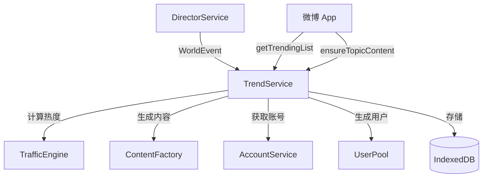
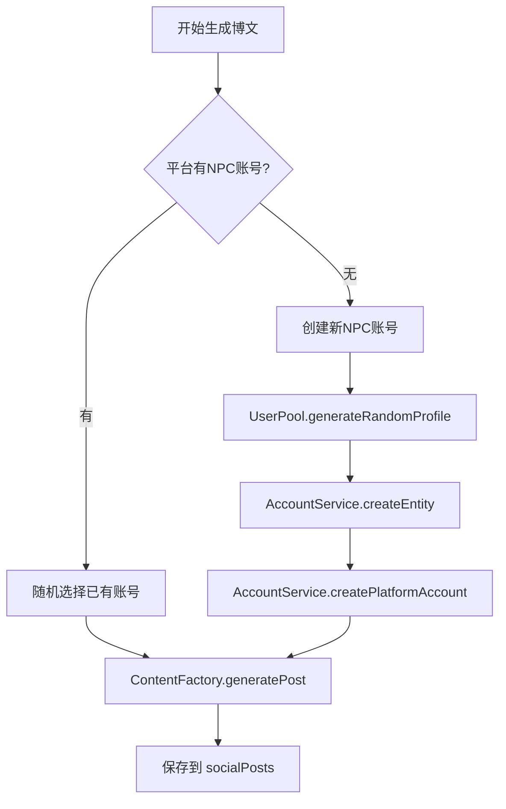

# TrendService 热搜服务

> **版本**: 1.0
> **状态**: ✅ 已实现
> **代码位置**: `src/services/social/trendService.ts`
> **依赖**: TrafficEngine, ContentFactory, AccountService, UserPool, IndexedDB

## 1. 概述

TrendService 是社交媒体模拟引擎的核心服务之一，负责管理热搜话题的创建、排名和内容填充。它采用**惰性内容填充**策略，只有当用户真正点击某个话题时才会触发内容生成，避免预生成大量无人查看的内容。

### 1.1 核心职责

1. **话题创建**: 将世界事件 (WorldEvent) 转化为平台热搜话题
2. **热度排名**: 实时计算话题热度，返回有序的热搜榜单
3. **惰性填充**: 按需生成话题下的博文内容

---

## 2. 架构设计

### 2.1 服务关系图



### 2.2 设计原则

| 原则 | 说明 |
| ------ | ------ |
| **单例模式** | 全局唯一实例，通过 `getInstance()` 获取 |
| **惰性填充** | 用户点击话题时才生成内容，节省 LLM 调用 |
| **实时热度** | 每次获取榜单时实时计算热度，而非定时更新 |
| **多平台支持** | 同一事件可在多个平台创建不同的热搜话题 |

---

## 3. API 文档

### 3.1 获取实例

```typescript
import { TrendService } from '@/services/social/trendService';

const trendService = TrendService.getInstance();
```

### 3.2 createTopicFromEvent

从世界事件创建热搜话题。

```typescript
async createTopicFromEvent(event: WorldEvent): Promise<TrendingTopic[]>
```

**参数**:

| 参数 | 类型 | 说明 |
| ------ | ------ | ------ |
| `event` | `WorldEvent` | 世界事件对象 |

**WorldEvent 结构**:

```typescript
interface WorldEvent {
  topic: string;              // 话题关键词
  summary: string;            // 事件描述（给 LLM 的背景）
  priority: 'breaking' | 'normal' | 'minor';  // 优先级
  affectedPlatforms: string[];  // 影响的平台列表
}
```

**返回值**: 创建的话题数组（每个平台一条）

**热度计算规则**:

| 优先级 | baseScore | 说明 |
| -------- | ----------- | ------ |
| `breaking` | 90 | 突发事件，立即置顶 |
| `normal` | 60 | 普通热点 |
| `minor` | 30 | 低热度话题 |

**示例**:

```typescript
const topics = await trendService.createTopicFromEvent({
  topic: '某科技公司发布全息手机',
  summary: '该公司今日召开发布会，推出全球首款消费级全息手机...',
  priority: 'breaking',
  affectedPlatforms: ['weibo', 'bilibili']
});
// 返回 2 条话题记录（微博和B站各一条）
```

---

### 3.3 getTrendingList

获取指定平台的实时热搜榜。

```typescript
async getTrendingList(platformId: string, limit?: number): Promise<TrendingTopic[]>
```

**参数**:

| 参数 | 类型 | 默认值 | 说明 |
| ------ | ------ | -------- | ------ |
| `platformId` | `string` | - | 平台 ID（如 `'weibo'`） |
| `limit` | `number` | `20` | 返回数量上限 |

**返回值**: 按热度排序的话题数组，包含以下运行时字段：

| 字段 | 类型 | 说明 |
| ------ | ------ | ------ |
| `currentHeat` | `number` | 实时计算的热度值 |
| `isHot` | `boolean` | 是否为热门（前 3 名且热度 > 10000） |
| `isNew` | `boolean` | 是否为新话题（1 小时内创建） |

**算法说明**:

1. 查询最近 3 天内创建的该平台话题
2. 调用 `TrafficEngine.calculateTopicHeat()` 计算每个话题的实时热度
3. 按热度降序排序
4. 标记 `isHot` 和 `isNew` 状态

**示例**:

```typescript
const trending = await trendService.getTrendingList('weibo', 50);
// [
//   { keyword: '#全息手机发布#', currentHeat: 89234, isHot: true, isNew: true },
//   { keyword: '#周末天气预报#', currentHeat: 45678, isHot: false, isNew: false },
//   ...
// ]
```

---

### 3.4 ensureTopicContent

确保话题下有内容（惰性填充）。

```typescript
async ensureTopicContent(topicId: string): Promise<void>
```

**参数**:

| 参数 | 类型 | 说明 |
| ------ | ------ | ------ |
| `topicId` | `string` | 话题 ID |

**行为**:

1. 检查话题是否存在
2. 查询该话题下是否已有博文
3. 如果无内容，生成 3-5 条博文
4. 为每条博文分配或创建发帖账号

**账号获取逻辑**:



**示例**:

```typescript
// 用户点击热搜话题时调用
await trendService.ensureTopicContent('topic-uuid-123');
// 如果话题下无内容，将自动生成 3-5 条博文
```

---

## 4. 数据模型

### 4.1 TrendingTopic

存储于 IndexedDB `socialTopics` 表。

```typescript
interface TrendingTopic {
  id: string;                 // UUID
  platformId: string;         // 平台 ID
  keyword: string;            // 话题关键词（如 "#某话题#"）
  summary: string;            // 背景描述（给 LLM）
  categories: string[];       // 分类标签
  
  // 热度参数
  baseScore: number;          // 基础分数 (1-100)
  velocity: number;           // 增长速度
  peakTime: number;           // 预计峰值时间戳
  createdAt: number;          // 创建时间戳
  
  // 运行时属性（不持久化）
  currentHeat?: number;       // 实时热度
  isNew?: boolean;            // 是否新话题
  isHot?: boolean;            // 是否热门
}
```

---

## 5. 使用示例

### 5.1 在微博 Store 中使用

```typescript
// src/stores/weiboStore.ts

import { TrendService } from '@/services/social/trendService';

export const useWeiboStore = defineStore('weibo', () => {
  const trendingList = ref<TrendingTopic[]>const trendService = TrendService.getInstance();

  // 刷新热搜榜
  async function refreshTrending() {
    trendingList.value = await trendService.getTrendingList('weibo', 50);
  }

  // 进入话题详情
  async function enterTopic(topicId: string) {
    // 确保有内容
    await trendService.ensureTopicContent(topicId);
    // 然后加载博文列表...
  }

  return { trendingList, refreshTrending, enterTopic };
});
```

### 5.2 与 DirectorService 配合

```typescript
// DirectorService 生成事件后自动创建话题
const event = await directorService.generateGlobalEvent(currentTime);
if (event) {
  await trendService.createTopicFromEvent(event);
}
```

---

## 6. 性能考量

### 6.1 查询优化

当前实现使用全表扫描后内存过滤：

```typescript
const allTopics = await db.socialTopics.toArray();
const topics = allTopics.filter(t => 
  t.platformId === platformId && t.createdAt > threeDaysAgo
);
```

**原因**: Dexie 复合索引在某些场景下不稳定。

**优化建议**（数据量大时）:
- 添加 `[platformId+createdAt]` 复合索引
- 定期清理过期话题

### 6.2 惰性填充控制

每次填充生成 3-5 条博文，避免一次性大量 LLM 调用：

```typescript
const generateCount = 3 + Math.floor(Math.random() * 3);
```

---

## 7. 相关服务

| 服务 | 文档 | 说明 |
| ------ | ------ | ------ |
| **TrafficEngine** | [algorithm.md](./traffic-engine.md) | 热度计算算法 |
| **ContentFactory** | [content-factory.md](./content-factory.md) | 内容生成工厂 |
| **DirectorService** | [director-service.md](./director-service.md) | 世界事件导演 |
| **AccountService** | [../account-service.md](../account-service.md) | 账号管理 |
| **UserPool** | [../account-service/user-pool.md](../account-service/user-pool.md) | 用户池 |

---

## 8. 版本历史

| 版本 | 日期 | 变更内容 |
| ------ | ------ | ---------- |
| 1.0 | 2026-01-16 | 初始文档，基于代码实现整理 |
