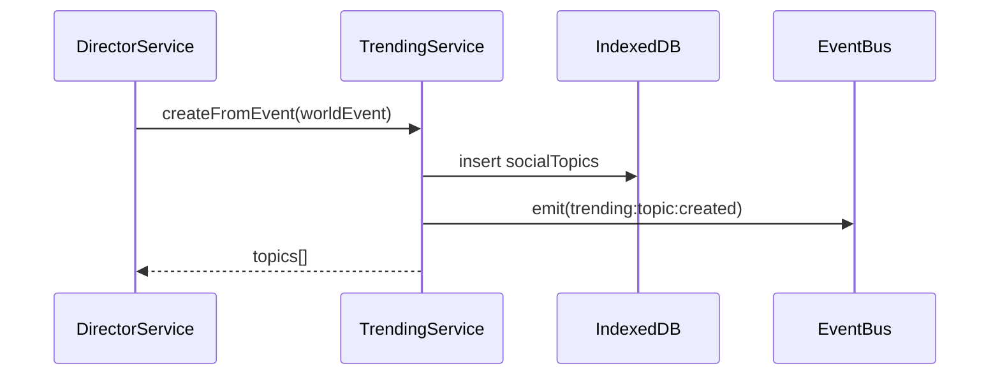
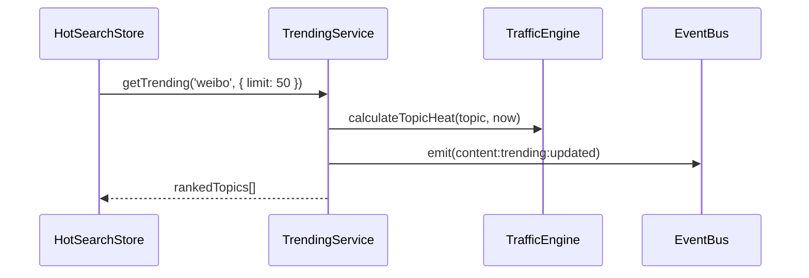
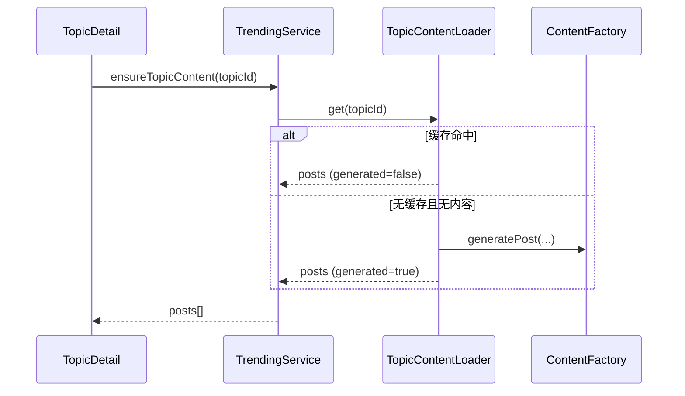

# Trending Service 系统集成

## 1. 依赖关系

| 服务 | 关系 | 作用 |
| ---- | ---- | ---- |
| `DirectorService` | 上游输入 | 生成世界事件并触发话题创建 |
| `TrafficEngine` | 核心依赖 | 计算话题实时热度 |
| `ContentFactory` | 核心依赖 | 话题无内容时生成帖子 |
| `Lazy Loader` | 核心依赖 | 话题内容惰性加载与缓存 |
| `EventBus` | 横向依赖 | 广播热搜更新事件 |
| `Logger Service` | 横向依赖 | 记录生成、排序、共享日志 |
| `Feed Service` | 下游消费者 | 获取热点内容作为候选源 |
| `Context Sharing` | 下游消费者 | 共享跨 App 热点上下文 |

## 2. 事件契约

| 事件名 | 发布方 | 订阅方 | 负载 |
| ---- | ---- | ---- | ---- |
| `trending:topic:created` | Trending Service | Feed/Notification | `topicIds`, `platformId` |
| `content:trending:updated` | Trending Service | App Stores | `platformId`, `timestamp` |
| `trending:policy:changed` | Trending Service | Context Sharing | `platformId`, `policy` |

## 3. 典型时序

### 3.1 世界事件 -> 热搜入榜

### 3.2 刷新榜单 -> UI 更新

### 3.3 点击话题 -> 惰性生成内容

## 4. 与现有模块的边界

- `Trending Service` 负责热点生命周期与排序，不负责 Feed 个性化排序
- `Feed Service` 负责多源聚合和个性化，热点仅作为一个内容来源
- `TrafficEngine` 保持算法实现，Trending 只负责编排调用

## 5. 集成建议

1. 先在微博侧接入 `trendingService` 新入口，保持 UI 无改动。
2. 热搜更新统一走 Event Bus，避免 Store 间直接调用。
3. 先开启单平台共享策略验证，再扩展为跨 App 聚合。
