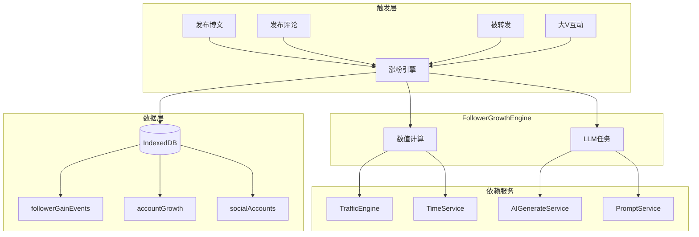

# 涨粉算法引擎 (Follower Growth Engine)

> **版本**: 1.0
> **状态**: 设计阶段
> **依赖**: TrafficEngine, UserPool, TimeService, LLMTaskStore

## 1. 概述

涨粉算法引擎是社交媒体模拟系统的核心组件，负责科学地模拟账号粉丝增长。它采用「数值算法驱动 + LLM 辅助」的混合架构，既能通过数学模型保证增长的合理性，又能借助 LLM 生成丰富的粉丝画像和互动内容。

### 1.1 设计原则

1. **真实感优先**: 粉丝增长曲线应符合真实社交媒体的规律（冷启动期、增长期、平台期）
2. **可解释性**: 每次涨粉都能追溯到具体原因（哪条博文、哪个互动）
3. **可控性**: 算法参数可调，支持不同类型账号的差异化增长
4. **LLM 增强**: 关键节点使用 LLM 生成内容，而非全程依赖 LLM

---

## 2. 涨粉来源模型

### 2.1 六大涨粉渠道

```typescript
enum FollowerSource {
  CONTENT_EXPOSURE = 'content_exposure',   // 内容曝光
  HOT_TOPIC_FLOW = 'hot_topic_flow',       // 热搜流量
  INTERACTION_CONVERT = 'interaction_convert', // 互动转化
  REPOST_SPREAD = 'repost_spread',         // 转发扩散
  BIG_V_REFERRAL = 'big_v_referral',       // 大V导流
  PLATFORM_RECOMMEND = 'platform_recommend' // 平台推荐
}
```

### 2.2 渠道详解

#### 📝 内容曝光 (Content Exposure)

最基础的涨粉方式，每发布一条博文都有机会获得新粉丝。

**触发条件**: 发布博文

**计算公式**:
```typescript
// 基础曝光量
baseExposure = followerCount * 0.1 + 100 // 粉丝基数 + 冷启动流量

// 内容质量评分 (由 LLM 评估或规则计算)
qualityScore = evaluateContentQuality(post) // 0.1 - 3.0

// 转化率 (新账号更高，老账号趋于稳定)
conversionRate = 0.01 * (1 + 1 / Math.log10(followerCount + 10))

// 涨粉数
followerGain = floor(baseExposure * qualityScore * conversionRate * random(0.5, 1.5))
```

**质量评分因素**:
| 因素 | 权重 | 说明 |
| ------ | ------ | ------ |
| 文字长度 | 0.2 | 100-500字最佳 |
| 话题相关性 | 0.3 | 是否蹭热点 |
| 情感强度 | 0.2 | 情绪饱满更易传播 |
| 原创性 | 0.2 | 转发内容权重低 |
| 时间段 | 0.1 | 黄金时段加成 |

---

#### 🔥 热搜流量 (Hot Topic Flow)

参与热搜话题可获得额外曝光。

**触发条件**: 博文包含热搜话题标签

**计算公式**:
```typescript
// 话题热度系数 (1-100 映射到 1-10)
topicHeatMultiplier = topicScore / 10

// 参与时机系数 (越早参与收益越高)
participationTiming = 1 / (1 + hoursSinceTopicStart * 0.1)

// 基础流量池
basePool = topicHeatMultiplier * 1000

// 竞争系数 (参与者越多，单人分得越少)
competitionFactor = 1 / Math.sqrt(topicParticipants + 1)

// 涨粉数
followerGain = floor(basePool * participationTiming * competitionFactor * qualityScore * 0.005)
```

**示例**:
- 热度 80 的话题，1小时内参与，100人竞争
- `basePool = 8000`, `timing = 0.91`, `competition = 0.1`, `quality = 1.5`
- `gain = 8000 * 0.91 * 0.1 * 1.5 * 0.005 ≈ 5` 粉丝

---

#### 💬 互动转化 (Interaction Convert)

主动评论/回复他人博文，有概率转化对方粉丝。

**触发条件**: 发布评论

**计算公式**:
```typescript
// 目标博主的粉丝基数影响
targetInfluence = Math.log10(targetFollowerCount + 100)

// 评论质量 (点赞数反映)
commentQuality = Math.min(commentLikes / 10, 3)

// 转化概率
conversionProb = 0.001 * targetInfluence * commentQuality

// 单次最大转化
maxConvert = Math.min(targetFollowerCount * 0.001, 100)

// 涨粉数
followerGain = floor(maxConvert * conversionProb * random(0.5, 1.5))
```

---

#### 🔄 转发扩散 (Repost Spread)

被他人转发时，获得二次曝光。

**触发条件**: 博文被转发

**计算公式**:
```typescript
// 转发者粉丝基数
reposterReach = reposterFollowerCount

// 转发深度衰减 (转发的转发收益递减)
depthDecay = 1 / Math.pow(2, repostDepth - 1)

// 基础曝光
baseExposure = reposterReach * 0.05 * depthDecay

// 转化率
conversionRate = 0.01

// 涨粉数
followerGain = floor(baseExposure * conversionRate * random(0.5, 1.5))
```

---

#### ⭐ 大V导流 (Big V Referral)

被大V（粉丝数 > 100万）点赞/评论/转发，获得显著流量。

**触发条件**: 收到大V互动

**计算公式**:
```typescript
// 大V影响力等级
bigVTier = getBigVTier(bigVFollowerCount)
// Tier 1: 100万+  → 系数 5
// Tier 2: 50-100万 → 系数 3
// Tier 3: 10-50万  → 系数 2

// 互动类型权重
interactionWeight = {
  'like': 0.5,
  'comment': 1.5,
  'repost': 3.0,
  'mention': 2.0
}[interactionType]

// 基础导流
baseReferral = bigVTier * 100 * interactionWeight

// 涨粉数
followerGain = floor(baseReferral * random(0.7, 1.3))
```

**特殊机制**: 大V导流事件会触发 LLM 生成「涨粉故事」，记录在账号动态中。

---

#### 📊 平台推荐 (Platform Recommend)

内容进入平台推荐池（发现页/推荐流）。

**触发条件**: 随机触发（基于内容质量）

**计算公式**:
```typescript
// 推荐概率 (质量越高越容易被推)
recommendProb = qualityScore * 0.05

// 是否被推荐
isRecommended = random() < recommendProb

if (isRecommended) {
  // 推荐池大小 (模拟平台DAU的一部分)
  recommendPool = 10000 * random(0.5, 2.0)
  
  // 转化率
  conversionRate = 0.001 * qualityScore
  
  // 涨粉数
  followerGain = floor(recommendPool * conversionRate)
}
```

---

## 3. 时间维度模型

### 3.1 增长曲线阶段

```
粉丝数 ↑
       │                                    ╭────── 平台期
       │                              ╭─────╯
       │                        ╭─────╯
       │                  ╭─────╯ 增长期
       │            ╭─────╯
       │      ╭─────╯
       │ ╭────╯ 冷启动期
       │─╯
       └──────────────────────────────────────────▶ 时间
```

### 3.2 阶段特征

| 阶段 | 粉丝数范围 | 日均涨粉 | 特征 |
| ------ | ------------ | ---------- | ------ |
| 冷启动期 | 0 - 100 | 5-20 | 依赖主动互动，转化率高 |
| 萌芽期 | 100 - 1000 | 20-50 | 内容曝光开始产生效果 |
| 增长期 | 1000 - 10000 | 50-200 | 进入正循环，可能爆发 |
| 稳定期 | 10000 - 100000 | 100-500 | 增速放缓，质量更重要 |
| 平台期 | 100000+ | 波动 | 依赖爆款和事件驱动 |

### 3.3 时间衰减函数

博文的涨粉效应随时间衰减：

```typescript
// 指数衰减
timeDecay = Math.exp(-hoursSincePost / 24) // 24小时半衰期

// 长尾效应 (优质内容持续产生价值)
longTailBonus = qualityScore > 2 ? 0.1 : 0

effectiveDecay = Math.max(timeDecay, longTailBonus)
```

---

## 4. LLM 任务集成

### 4.1 LLM 参与的场景

| 场景 | 触发条件 | LLM 任务 | 输出 |
| ------ | ---------- | ---------- | ------ |
| 涨粉故事 | 单次涨粉 > 50 | 生成涨粉事件描述 | 动态文案 |
| 新粉丝画像 | 涨粉事件 | 生成粉丝用户画像 | SocialAccount |
| 粉丝互动 | 定期触发 | 模拟粉丝评论/点赞 | 互动数据 |
| 内容评估 | 发布博文 | 评估内容质量分 | 0.1-3.0 |

### 4.2 涨粉故事生成

```typescript
const FOLLOWER_STORY_PROMPT = {
  id: 'social.follower.story',
  scene: 'social.follower.story',
  template: `
你是一个社交媒体数据分析师。根据以下涨粉事件，生成一条简短的涨粉动态描述。

## 事件信息
- 博主昵称: {{authorName}}
- 涨粉数量: {{followerGain}}
- 涨粉来源: {{source}}
- 相关内容: {{relatedContent}}
- 时间: {{time}}

## 输出要求
生成一条 50 字以内的涨粉动态，模拟微博后台的涨粉提醒风格。
示例：
- "恭喜！你的微博「关于xxx的想法」被@某某大V 转发，为你带来了 156 位新粉丝 🎉"
- "你参与 #热搜话题# 的讨论获得广泛关注，新增 89 位粉丝"

## 输出
`
};
```

### 4.3 新粉丝画像生成

```typescript
const NEW_FOLLOWER_PROFILE_PROMPT = {
  id: 'social.follower.profile',
  scene: 'social.follower.profile',
  template: `
你是一个社交媒体用户画像生成器。根据博主特征，生成合理的新粉丝画像。

## 博主信息
- 昵称: {{authorName}}
- 领域: {{authorDomain}}
- 风格: {{authorStyle}}
- 粉丝画像特征: {{existingFansProfile}}

## 涨粉来源
{{source}}: {{sourceDetail}}

## 输出格式 (JSON)
{
  "followers": [
    {
      "nickname": "用户昵称",
      "bio": "简介 (20字以内)",
      "gender": "male|female|unknown",
      "ageRange": "18-24|25-34|35-44|45+",
      "interest": ["兴趣标签"],
      "activityLevel": "high|medium|low",
      "followReason": "关注原因 (10字以内)"
    }
  ]
}

生成 {{count}} 个新粉丝画像。
`
};
```

---

## 5. 数据结构

### 5.1 涨粉事件 (FollowerGainEvent)

```typescript
interface FollowerGainEvent {
  id: string;
  accountId: string;         // 账号 ID
  platformId: string;        // 平台 ID
  timestamp: number;         // 事件时间
  
  // 涨粉来源
  source: FollowerSource;
  sourceDetail: {
    postId?: string;         // 相关博文
    topicId?: string;        // 相关话题
    interactionId?: string;  // 相关互动
    referrerId?: string;     // 导流账号
  };
  
  // 计算过程
  calculation: {
    baseGain: number;
    qualityMultiplier: number;
    timeDecay: number;
    randomFactor: number;
  };
  
  // 结果
  followerGain: number;      // 净增粉丝数
  newFollowers: string[];    // 新粉丝账号 ID 列表
  
  // LLM 生成内容
  story?: string;            // 涨粉故事
}
```

### 5.2 账号成长数据 (AccountGrowth)

```typescript
interface AccountGrowth {
  accountId: string;
  
  // 粉丝统计
  currentFollowers: number;
  followerHistory: {
    date: string;            // YYYY-MM-DD
    followers: number;
    dailyGain: number;
    dailyLoss: number;
  }[];
  
  // 涨粉来源分布
  sourceDistribution: Record<FollowerSource, number>;
  
  // 增长指标
  metrics: {
    avgDailyGain: number;    // 日均涨粉
    growthRate: number;      // 增长率
    engagementRate: number;  // 互动率
    conversionRate: number;  // 转化率
  };
  
  // 里程碑
  milestones: {
    followerCount: number;
    achievedAt: number;
    celebrationStory?: string; // LLM 生成的庆祝文案
  }[];
}
```

---

## 6. 服务接口设计

### 6.1 FollowerGrowthEngine

```typescript
// src/services/social/followerGrowthEngine.ts

export class FollowerGrowthEngine {
  private static instance: FollowerGrowthEngine;
  
  // 单例获取
  static getInstance(): FollowerGrowthEngine;
  
  // ===== 核心方法 =====
  
  /**
   * 处理博文发布事件
   * 计算内容曝光带来的涨粉
   */
  async processPostPublish(post: UniversalPost): Promise<FollowerGainEvent | null>;
  
  /**
   * 处理热搜参与事件
   */
  async processHotTopicParticipation(
    post: UniversalPost, 
    topic: TrendingTopic
  ): Promise<FollowerGainEvent | null>;
  
  /**
   * 处理互动事件 (评论/回复)
   */
  async processInteraction(
    interaction: SocialInteraction,
    targetPost: UniversalPost
  ): Promise<FollowerGainEvent | null>;
  
  /**
   * 处理被转发事件
   */
  async processRepost(
    originalPost: UniversalPost,
    reposter: SocialAccount
  ): Promise<FollowerGainEvent | null>;
  
  /**
   * 处理大V互动事件
   */
  async processBigVInteraction(
    targetAccount: SocialAccount,
    bigV: SocialAccount,
    interactionType: 'like' | 'comment' | 'repost' | 'mention'
  ): Promise<FollowerGainEvent>;
  
  /**
   * 检查并触发平台推荐
   */
  async checkPlatformRecommend(post: UniversalPost): Promise<FollowerGainEvent | null>;
  
  // ===== 查询方法 =====
  
  /**
   * 获取账号成长数据
   */
  async getAccountGrowth(accountId: string): Promise<AccountGrowth>;
  
  /**
   * 获取涨粉历史
   */
  async getFollowerGainHistory(
    accountId: string,
    options?: { limit?: number; source?: FollowerSource }
  ): Promise<FollowerGainEvent[]>;
  
  // ===== LLM 任务 =====
  
  /**
   * 生成涨粉故事
   */
  async generateFollowerStory(event: FollowerGainEvent): Promise<string>;
  
  /**
   * 生成新粉丝画像
   */
  async generateNewFollowerProfiles(
    account: SocialAccount,
    count: number,
    source: FollowerSource
  ): Promise<SocialAccount[]>;
  
  /**
   * 评估内容质量
   */
  async evaluateContentQuality(post: UniversalPost): Promise<number>;
}
```

### 6.2 与现有服务的集成点



---

## 7. 内置 LLM 任务

### 7.1 任务定义

```typescript
// 添加到 weibo/stores/llm/builtinTasks.ts

export const FOLLOWER_GROWTH_TASKS: BuiltinTaskDefinition[] = [
  {
    id: 'weibo-simulate-growth',
    name: '📈 模拟粉丝增长',
    description: '基于当前账号状态，模拟一段时间的粉丝增长',
    type: 'manual',
    category: 'growth',
    variables: [
      { key: 'accountId', label: '账号ID', type: 'text', required: false },
      { key: 'days', label: '模拟天数', type: 'number', defaultValue: '7' },
      { key: 'activity', label: '活跃度', type: 'select', 
        options: ['low', 'medium', 'high'], defaultValue: 'medium' }
    ],
    outputHandler: 'followerGrowth'
  },
  {
    id: 'weibo-generate-milestone',
    name: '🎉 生成里程碑庆祝',
    description: '为粉丝数突破生成庆祝动态',
    type: 'prompt',
    promptId: 'social.follower.milestone',
    category: 'growth',
    variables: [
      { key: 'accountName', label: '账号昵称', type: 'text' },
      { key: 'milestone', label: '里程碑', type: 'select',
        options: ['100', '1000', '10000', '100000', '1000000'] },
      { key: 'accountStyle', label: '账号风格', type: 'text', 
        defaultValue: '普通用户' }
    ],
    outputHandler: 'notification'
  },
  {
    id: 'weibo-analyze-growth',
    name: '📊 分析涨粉数据',
    description: '分析账号的涨粉数据并给出建议',
    type: 'prompt',
    promptId: 'social.follower.analyze',
    category: 'growth',
    variables: [
      { key: 'accountId', label: '账号ID', type: 'text', required: false }
    ],
    outputHandler: 'console'
  }
];
```

### 7.2 自动执行配置

```typescript
interface FollowerGrowthAutoConfig {
  enabled: boolean;
  
  // 执行频率
  checkInterval: number;     // 检查间隔 (毫秒)
  
  // 触发条件
  triggers: {
    onPostPublish: boolean;  // 发布博文时计算
    onInteraction: boolean;  // 互动时计算
    onTimeElapse: boolean;   // 时间流逝时计算
  };
  
  // LLM 调用控制
  llmUsage: {
    generateStories: boolean;       // 生成涨粉故事
    generateFollowerProfiles: boolean; // 生成粉丝画像
    evaluateQuality: boolean;       // AI 评估内容质量
  };
  
  // 通知设置
  notifications: {
    onMilestone: boolean;    // 里程碑通知
    onBigVInteraction: boolean; // 大V互动通知
    onViralPost: boolean;    // 爆款博文通知
  };
}
```

---

## 8. UI 集成

### 8.1 粉丝数据面板

在「我的」页面添加粉丝数据展示：

```vue
<!-- components/FollowerGrowthPanel.vue -->
<template>
  <div class="follower-panel">
    <!-- 粉丝数概览 -->
    <div class="follower-count">
      <span class="number">{{ formatNumber(followers) }}</span>
      <span class="label">粉丝</span>
      <span class="trend" :class="trend > 0 ? 'up' : 'down'">
        {{ trend > 0 ? '+' : '' }}{{ trend }} 今日
      </span>
    </div>
    
    <!-- 增长曲线 -->
    <div class="growth-chart">
      <GrowthChart :data="growthHistory" />
    </div>
    
    <!-- 涨粉来源 -->
    <div class="source-breakdown">
      <div v-for="(count, source) in sourceDistribution" :key="source">
        <span class="icon">{{ getSourceIcon(source) }}</span>
        <span class="label">{{ getSourceLabel(source) }}</span>
        <span class="value">{{ count }}</span>
      </div>
    </div>
    
    <!-- 最近涨粉事件 -->
    <div class="recent-events">
      <div v-for="event in recentEvents" :key="event.id" class="event-item">
        <span class="story">{{ event.story }}</span>
        <span class="gain">+{{ event.followerGain }}</span>
      </div>
    </div>
  </div>
</template>
```

### 8.2 涨粉动态通知

```typescript
// 涨粉事件触发通知
function notifyFollowerGain(event: FollowerGainEvent) {
  if (event.followerGain >= 10) {
    notificationStore.push({
      type: 'follower_gain',
      title: `+${event.followerGain} 新粉丝`,
      body: event.story || `来自${getSourceLabel(event.source)}`,
      icon: '👥',
      timestamp: event.timestamp
    });
  }
}
```

---

## 9. 配置参数

### 9.1 全局配置

```typescript
interface FollowerGrowthConfig {
  // 基础系数
  baseConversionRate: number;     // 基础转化率 (默认 0.01)
  qualityMultiplierRange: [number, number]; // 质量系数范围 [0.1, 3.0]
  randomFactorRange: [number, number];      // 随机系数范围 [0.5, 1.5]
  
  // 衰减参数
  timeDecayHalfLife: number;      // 半衰期 (小时, 默认 24)
  
  // 大V定义
  bigVThresholds: {
    tier1: number;  // 100万
    tier2: number;  // 50万
    tier3: number;  // 10万
  };
  
  // 平台推荐
  recommendProbBase: number;      // 基础推荐概率 (默认 0.05)
  recommendPoolSize: number;      // 推荐池大小 (默认 10000)
  
  // LLM 使用限制
  llmCallsPerHour: number;        // 每小时 LLM 调用上限
  minGainForStory: number;        // 触发故事生成的最小涨粉数
}
```

### 9.2 默认配置

```typescript
export const DEFAULT_FOLLOWER_GROWTH_CONFIG: FollowerGrowthConfig = {
  baseConversionRate: 0.01,
  qualityMultiplierRange: [0.1, 3.0],
  randomFactorRange: [0.5, 1.5],
  
  timeDecayHalfLife: 24,
  
  bigVThresholds: {
    tier1: 1000000,
    tier2: 500000,
    tier3: 100000
  },
  
  recommendProbBase: 0.05,
  recommendPoolSize: 10000,
  
  llmCallsPerHour: 20,
  minGainForStory: 50
};
```

---

## 10. 开发计划

### Phase 1: 基础算法 (MVP)

- [ ] 实现 `FollowerGrowthEngine` 核心类
- [ ] 实现内容曝光涨粉计算
- [ ] 实现热搜流量涨粉计算
- [ ] 数据库表设计 (`followerGainEvents`, `accountGrowth`)
- [ ] 与 `feedStore.publishPost` 集成

### Phase 2: 互动与扩散

- [ ] 实现互动转化涨粉
- [ ] 实现转发扩散涨粉
- [ ] 实现大V导流涨粉
- [ ] 平台推荐随机触发

### Phase 3: LLM 增强

- [ ] 涨粉故事生成
- [ ] 新粉丝画像生成
- [ ] 内容质量 AI 评估
- [ ] 内置 LLM 任务注册

### Phase 4: UI 集成

- [ ] 粉丝数据面板
- [ ] 涨粉动态通知
- [ ] 增长曲线图表
- [ ] 设置页面配置

---

## 11. 附录

### A. 真实数据参考

根据公开的社交媒体研究数据：

| 账号类型 | 日均涨粉 | 互动转化率 | 内容曝光率 |
| ---------- | ---------- | ------------ | ------------ |
| 素人 (0-1k) | 5-20 | 0.5% | 10% |
| 小V (1k-10k) | 20-100 | 0.3% | 15% |
| 中V (10k-100k) | 50-300 | 0.2% | 20% |
| 大V (100k+) | 100-1000 | 0.1% | 25% |

### B. 常见问题

**Q: 如何防止粉丝数无限增长？**

A: 通过以下机制控制：
1. 转化率随粉丝数对数衰减
2. 内容质量需要持续产出
3. 掉粉机制（长期不活跃）
4. 上限设置（可配置）

**Q: LLM 调用成本如何控制？**

A: 
1. 只在关键节点调用（大涨粉、里程碑）
2. 可配置调用频率上限
3. 简单场景使用规则算法替代
4. 批量生成而非单条生成
