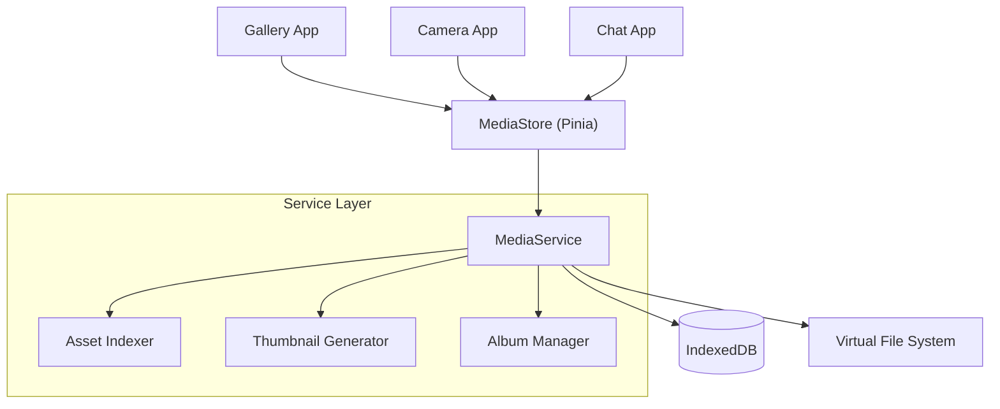

# 媒体服务架构 (Media Service)

> 媒体服务 (Media Service) 是系统级的多媒体资源管理中心，负责图片、视频、音频等资产的索引、存储、元数据管理及跨应用共享。

## 1. 系统概览

目前，各 App (如图库、聊天) 可能各自维护自己的媒体数据，形成了数据孤岛。媒体服务旨在打破这种隔离，提供一个统一的“媒体库 (Media Store)”，使得：
*   **相机** 拍摄的照片能立即出现在 **图库** 中。
*   **聊天** 应用可以调用统一的选择器发送 **图库** 中的照片。
*   **浏览器** 下载的图片可以被所有 App 访问。

### 核心职责

- **资产管理 (Asset Management)**: 统一存储和索引媒体文件元数据（路径、尺寸、创建时间、来源）。
- **相册管理 (Album Management)**: 支持逻辑上的分组（相册），支持智能相册（基于时间、位置、标签）。
- **缩略图生成 (Thumbnail Generation)**: 自动为大图生成和缓存缩略图，优化列表加载性能。
- **跨应用共享 (Content Provider)**: 提供标准的媒体选择器接口。

## 2. 架构设计

MediaService 位于 Service 层，直接操作底层的 IndexedDB (`media_assets` 表)，并向上层 App 提供 API。



## 3. 核心概念

### 3.1 媒体资产 (Media Asset)

系统中的基本单元，对应一张图片或一个视频。

```typescript
type MediaType = 'image' | 'video' | 'audio';

interface MediaAsset {
  id: string;              // UUID
  type: MediaType;
  uri: string;             // 资源的访问路径 (internal://...)
  thumbnailUri?: string;   // 缩略图路径
  
  // 元数据
  width: number;
  height: number;
  duration?: number;       // 视频/音频时长
  size: number;            // 文件大小 (bytes)
  mimeType: string;        // e.g. "image/jpeg"
  
  // 组织信息
  createdAt: number;       // 创建时间
  modifiedAt: number;      // 修改时间
  albumIds: string[];      // 所属相册 ID 列表
  tags: string[];          // 标签 (用于 AI 分类或搜索)
  
  // 来源追踪
  sourceAppId?: string;    // 来源 App (e.g. "com.camera")
  metadata?: Record<string, any>; // Exif 或 AI 生成参数
}
```

### 3.2 虚拟路径 (Virtual URI)

为了屏蔽底层存储差异（可能是 Base64 存 DB，也可能是 Blob 存 IndexedDB 文件句柄），系统使用统一的 URI 协议：

*   `internal://media/images/{id}`
*   `internal://assets/builtin/wallpapers/1.jpg`

Service 层负责将这些 URI 解析为实际可被 `` 标签加载的 URL (如 `blob:http://...` 或 `data:image/...`)。

## 4. 数据库设计

原有的 `AppDataService` (KV 存储) 不适合存储海量图片索引。需要迁移到专门的 IndexedDB 表。

### Table: `media_assets`

| 字段 | 类型 | 索引 | 说明 |
| ------ | ------ | ------ | ------ |
| id | string | PK | UUID |
| type | string |  | image/video |
| createdAt | number | Index | 用于按时间排序 |
| albumIds | string[] | MultiEntry | 用于查询相册内容 |
| tags | string[] | MultiEntry | 用于搜索 |

### Table: `media_albums`

| 字段 | 类型 | 索引 | 说明 |
| ------ | ------ | ------ | ------ |
| id | string | PK | UUID |
| name | string |  | 相册名称 |
| coverAssetId | string |  | 封面图 ID |
| type | string |  | 'user' (用户创建) / 'smart' (智能) / 'system' (系统) |
| rule | object |  | 智能相册规则 (JSON) |

## 5. 交互流程

### 场景：相机拍照保存

1.  **Camera App** 捕获画面，获得 Blob 数据。
2.  **Camera App** 调用 `MediaService.createAsset({ blob, type: 'image' })`。
3.  **MediaService**:
    *   计算图片宽高。
    *   生成缩略图。
    *   将原图 Blob 存入 Blob 存储（或 DB）。
    *   在 `media_assets` 表插入记录。
    *   **广播事件**: `media:asset-created`。
4.  **Gallery App** (后台监听或前台刷新):
    *   收到事件/Store更新。
    *   列表自动出现新照片。

### 场景：聊天发送图片

1.  **Chat App** 点击“发送图片”。
2.  **App** 调用系统选择器: `router.push({ path: '/gallery/picker', query: { mode: 'select' } })`。
3.  **Gallery App (Picker Mode)**:
    *   展示精简版界面。
    *   用户选择图片 -> 点击确认。
4.  **Gallery App**:
    *   返回结果（通过 EventBus 或回调）。
    *   返回数据: `[{ uri: 'internal://...', width: 100, height: 100 }]`。
5.  **Chat App**:
    *   接收 URI。
    *   调用 `MediaService.resolveUrl(uri)` 获取可显示 URL 渲染预览。
    *   发送消息。

## 6. 与现有 Gallery App 的重构关系

现有的 `src/apps/gallery` 实现了完整的 UI 和逻辑，但数据层是私有的。

**重构计划**:
1.  **Phase 1 (Service)**: 实现 `MediaService` 和 `media_assets` 数据库表。
2.  **Phase 2 (Migration)**: 编写脚本，将 `AppDataService` 中的 `gallery_images` 数据迁移到新数据库表。
3.  **Phase 3 (Store)**: 修改 `galleryStore`，不再调用 `galleryService` (旧)，而是调用 `mediaService` (新)。
4.  **Phase 4 (UI)**: 保持 UI 组件不变，仅适配新的数据字段名称。

## 7. API 参考

```typescript
// 查询资源
const assets = await mediaService.queryAssets({
  sortBy: 'createdAt',
  order: 'desc',
  limit: 20,
  offset: 0,
  albumId: 'favorites'
});

// 保存新资源
const newAsset = await mediaService.saveAsset(fileBlob, {
  source: 'camera',
  albumIds: ['camera_roll']
});

// 解析 URI
const blobUrl = await mediaService.resolveUri(asset.uri);
// 

// 创建相册
const album = await mediaService.createAlbum('My Trip');

// 添加到相册
await mediaService.addToAlbum(asset.id, album.id);
```
