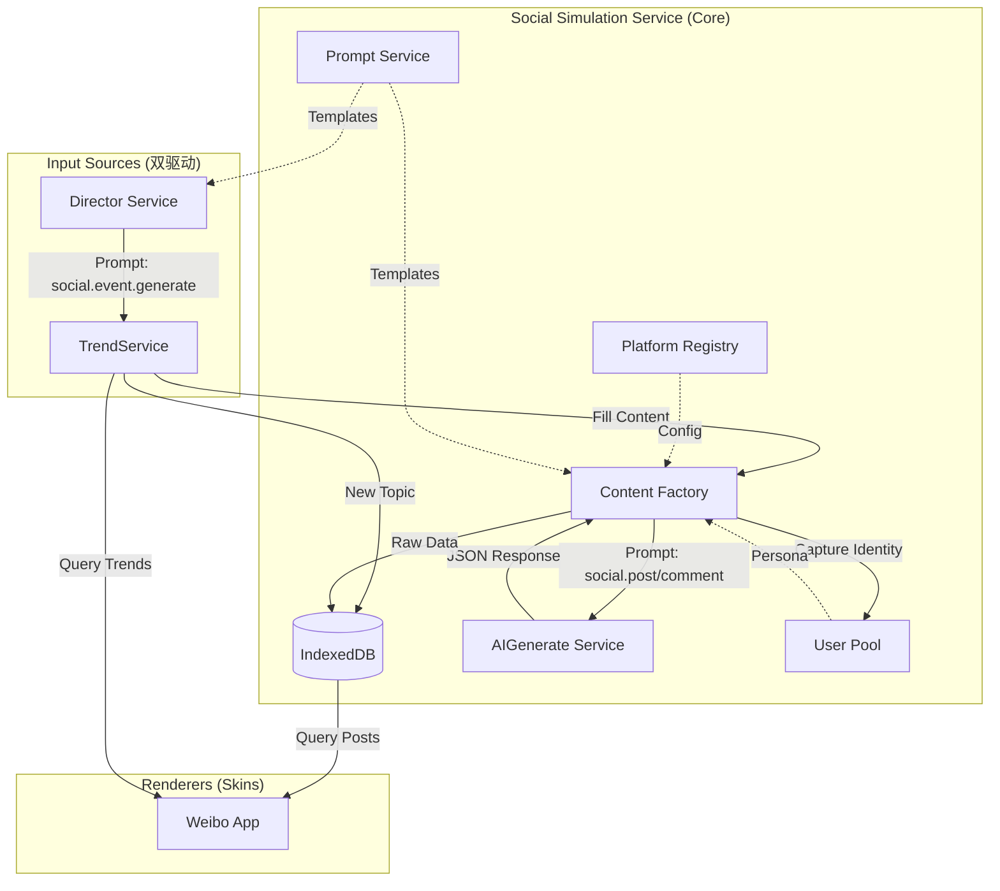

# 社交媒体模拟引擎 (Social Media Simulation Engine)

> **版本**: 1.5
> **状态**: Phase 1-3 已实现，Phase 4 部分完成
> **依赖**: TimeService, AIGenerateService, IndexedDB (Dexie), PromptService, PromptChainService

## 1. 概述

社交媒体模拟引擎（Social Media Engine, SME）是一个与具体 App 解耦的通用内容生成与模拟框架。它的核心目标是构建一个"自律运行"的虚拟互联网环境，不仅能响应用户的聊天互动（反应式），还能自主产生热点事件与社会舆论（自发式）。

### 1.1 核心理念

1. **引擎与皮肤分离**：微博、B站、知乎等 App 仅作为"渲染器"（Skin），共享底层的流量算法、用户池与内容生成逻辑（Core）
2. **双驱动架构**：内容源既来自用户的角色扮演聊天（Chat Bridge），也来自后台自主运行的世界导演（Director Service）
3. **真实感量化**：通过数值算法而非纯 LLM 生成来控制热度、排名与交互概率，模拟真实的互联网"沉默"与"爆发"
4. **多账号矩阵**：支持名人/官方号的跨平台矩阵运营，同时允许普通用户（玩家）的多重身份扮演

---

## 2. 架构实现

### 2.1 整体架构图



### 2.2 核心服务模块

代码组织在 `src/services/social/`：

| 模块 | 类名 | 职责 | 状态 |
| :--- | :--- | :--- | :--- |
| **Trend** | `TrendService` | 热搜管理、话题生成、惰性内容填充 | ✅ 已实现 |
| **Director** | `DirectorService` | 后台静默线程，基于 TimeService 生成世界事件 | ✅ 已实现 |
| **Factory** | `ContentFactory` | LLM 交互封装、博文/评论生成、JSON 修复 | ✅ 已实现 |
| **User Pool** | `UserPool` | 影子账号捕获、随机路人生成、实体管理 | ✅ 已实现 |
| **Registry** | `PlatformRegistry` | 平台配置管理、提示词自动注册 | ✅ 已实现 |
| **Algorithm** | `TrafficEngine` | 热度计算、交互概率计算 | ✅ 已实现 |
| **Prompts** | `socialEnginePrompts` | 社交引擎专用的提示词定义 | ✅ 已实现 |

---

## 3. 详细 API 文档

### 3.1 Platform Registry (`src/services/social/registry.ts`)

管理所有支持的社交平台配置。

- `getInstance()`: 获取单例，**初始化时会自动注册 `social-engine` 的提示词**
- `registerPlatform(config: PlatformConfig)`: 注册新平台
- `getPlatform(id: string)`: 获取特定平台配置

### 3.2 User Pool

> **代码位置**: `src/services/account/userPool.ts`
> **详细文档**: [账号服务文档](account-service.md)

UserPool 是账号系统的一部分，负责生成虚拟用户身份。社交媒体引擎通过 `ContentFactory` 调用它来生成评论者、路人等 NPC。

**核心能力**：

- 生成随机用户档案（昵称、头像、简介、性别）
- 生成完整角色画像（年龄、职业、兴趣、性格等）
- 批量生成用户
- 基于上下文的智能生成

**类型定义**：完整的 `CharacterProfile` 接口定义在 `src/types/account.ts`

### 3.3 Content Factory (`src/services/social/contentFactory.ts`)

负责与 LLM 交互，生成结构化内容。**现已全面接入 `PromptService`**。

- `generatePost(platformId, topic, account?)`: 生成一条博文
  - 调用 Prompt: `social.post.generate`
- `generateComments(platformId, postContent, count)`: 生成评论列表
  - 调用 Prompt: `social.comment.batch`
- `parseAndRepairJSON(text)`: 鲁棒的 JSON 解析器，能处理 Markdown 代码块和简单的语法错误

### 3.4 Director Service (`src/services/social/directorService.ts`)

后台导演，驱动世界运转。

> ⚠️ **默认关闭**：`isEnabled: false`。用户需要在「社交引擎配置」App 的「导演服务」页面手动开启，才会自动生成世界事件。这避免了无意中消耗大量 API 调用。

- `generateGlobalEvent(time)`: 调用 LLM 生成突发事件
  - 调用 Prompt: `social.event.generate`
  - 生成后自动调用 `TrendService.createTopicFromEvent`

---

## 4. 提示词管理 (Prompt System)

社交引擎采用**分层提示词架构**：

1. **引擎级提示词** (`appId: social-engine`)：
   由 `PlatformRegistry` 注册，负责通用的世界事件生成、通用博文/评论生成结构
2. **应用级提示词** (`appId: weibo` 等)：
   由具体 App (如 WeiboApp) 在启动时注册，负责该平台特有的文风、排版和用户画像生成

### 4.1 核心通用提示词

以下提示词注册在 `social-engine` 下：

| 场景 ID (`scene`) | 名称 | 描述 | 变量 |
| :--- | :--- | :--- | :--- |
| `social.event.generate` | 生成世界事件 | 生成突发新闻或社会热点 | `timeContext`, `eventType`, `intensity` |
| `social.post.generate` | 生成社交博文(通用) | 根据话题生成指定平台的博文 | `platformName`, `platformCulture`, `topic` |
| `social.comment.batch` | 批量生成评论(通用) | 生成多条不同立场的评论 | `platformName`, `postContent`, `count` |
| `social.user.generate` | 生成虚拟用户(通用) | 生成用户画像（昵称/简介等） | `platformName`, `context` |

> **扩展开发**：若要为新 App (如 Bilibili) 定制生成逻辑，请在该 App 内部定义并注册对应的专用提示词（如 `social.post.generate.bilibili`），引擎在调用时会自动优先使用平台专用的提示词模板。

### 4.2 自定义与调试

用户可以在「提示词管理」应用中查看和修改上述提示词。

- **修改影响**: 修改后的提示词会立即生效，影响后续生成的内容风格
- **回退机制**: 如果删除了 Prompt，代码中有硬编码的 Fallback 逻辑保证服务可用性

---

## 5. 数据模型

### 5.1 统一博文 (UniversalPost)

存储于 IndexedDB `socialPosts` 表。

```typescript
interface UniversalPost {
  id: string;
  platformId: string;    // 'weibo', 'bilibili'
  authorId: string;      // 关联 socialAccounts
  timestamp: number;
  topicTags: string[];   // 关联话题
  
  // 统计数据 (由算法计算，不一定实时更新)
  stats: {
    views: number;
    likes: number;
    comments: number;
    reposts: number;
  };
  
  // 动态载荷 (不同平台结构不同)
  payload: {
    text?: string;
    title?: string;
    images?: string[];
    videoDuration?: number;
    // ...
  };
}
```

### 5.2 角色画像 (CharacterProfile)

> **类型定义位置**: `src/types/account.ts`

完整的用户画像数据结构，用于 LLM 生成和涨粉引擎。

**主要字段**：

| 分类 | 字段 | 类型 | 说明 |
| --- | --- | --- | --- |
| 人口统计 | `ageRange` | `AgeRange` | 年龄段 (teen/young/adult/middle/mature/senior) |
| 人口统计 | `occupation` | `string` | 职业 |
| 人口统计 | `location` | `string` | 所在地 |
| 兴趣风格 | `interests` | `InterestDomain[]` | 兴趣领域 (最多5个) |
| 兴趣风格 | `contentStyle` | `ContentStyle` | 内容风格 |
| 兴趣风格 | `personality` | `PersonalityType` | 性格类型 |
| 社交特征 | `activityLevel` | `ActivityLevel` | 活跃度 |
| 社交特征 | `influenceLevel` | `InfluenceLevel` | 影响力等级 |
| 标签系统 | `tags` | `string[]` | 自定义标签 |
| 行为倾向 | `behaviorTendencies` | `BehaviorTendencies` | 点赞/评论/转发频率等 |

**兴趣领域** (`InterestDomain`)：tech, entertainment, gaming, anime, food, travel, fashion, fitness, finance, education, news, life, art, pet, parenting, car, other

### 5.3 热搜话题 (TrendingTopic)

存储于 IndexedDB `socialTopics` 表。

```typescript
interface TrendingTopic {
  id: string;
  platformId?: string;
  keyword: string;         // "#某话题#"
  summary: string;         // 给 LLM 的背景描述
  
  // 热度参数
  baseScore: number;       // 1-100
  peakTime: number;        // 预计峰值时间
  createdAt: number;
  
  // 运行时属性 (不入库或非持久化)
  currentHeat?: number;
  isNew?: boolean;
  isHot?: boolean;
}
```

---

## 6. 工作流示例

### 6.1 从"无"到"有"：世界事件的诞生

1. **Director 触发**: `TimeService` 通知时间流逝，`DirectorService` 决定生成一个事件
2. **Prompt 调用**: Director 请求 `social.event.generate`，LLM 生成事件 "某科技公司发布全息手机"
3. **话题创建**: `TrendService` 为微博创建话题 `#全息手机发布#`，设定 BaseScore=85
4. **榜单更新**: 用户打开微博，`WeiboStore` 调用 `TrendService.getTrendingList`，话题上榜，显示 "爆"
5. **内容填充**: 用户点击话题，发现列表为空。`TrendService` 立即调用 `ContentFactory` (进而调用 `social.post.generate`) 生成 3 条相关博文
6. **展示**: UI 渲染这 3 条博文

### 6.2 评论区的涌现

1. **进入详情**: 用户点击某条博文进入详情页
2. **检查评论**: `WeiboStore` 检查 `socialComments` 表，发现该博文无评论
3. **惰性生成**: Store 调用 `ContentFactory.generateComments`
4. **Prompt 调用**: Factory 请求 `social.comment.batch`，生成 5 条评论
5. **持久化**: 评论存入 DB，评论者的昵称被注册为影子账号
6. **展示**: UI 渲染评论列表

---

## 7. 提示词链 (Prompt Chain) ✅ 已集成

> **状态**: ✅ Phase 1-3 已完成（类型定义、执行引擎、基础 UI、App 链注册）

### 7.1 概述

提示词链是一种**声明式的多步骤 LLM 编排机制**，用于替代当前硬编码在服务中的调用逻辑。

| 对比项 | 当前硬编码 | 提示词链 |
| -------- | ----------- | ---------- |
| **可视化** | ❌ 需要读代码 | ✅ 表单编辑 + 实时监控 |
| **变量传递** | 手动拼接 | 声明式映射 |
| **调试** | console.log | 可查看每步中间结果 |
| **复用** | 复制代码 | 引用已有链 |
| **用户定制** | 不可能 | 可导出/导入/修改 |

### 7.2 数据结构 ✅

```typescript
// src/types/promptChain.ts

interface PromptChain {
  id: string;
  name: string;
  description: string;
  inputs: ChainVariableDefinition[];
  steps: ChainStep[];
  outputs: Record<string, string>;
  executionMode: 'multi-step' | 'single-shot';
  enabled: boolean;
  tags?: string[];
  createdAt: string;
  updatedAt: string;
}

interface ChainStep {
  id: string;
  name: string;
  type: 'prompt' | 'transform' | 'condition' | 'loop';
  promptId?: string;
  inlineTemplate?: string;
  inputMapping: Record<string, string>;
  outputKey: string;
  condition?: string;
  
  // 🔮 规划中：步骤级 Provider 配置
  provider?: {
    presetId?: string;
    overrides?: {
      model?: string;
      temperature?: number;
      maxTokens?: number;
    };
  };
}
```

### 7.3 多 Provider 策略（规划中）

提示词链支持**灵活的 Provider 配置**，与 [API Manager](../apps/api-manager.md) 深度集成：

#### 配置层级（优先级从高到低）

| 层级 | 配置位置 | 说明 |
| ------ | ---------- | ------ |
| **步骤级** | `step.provider.presetId` | 该步骤使用指定预设 |
| **链级** | `chain.defaultPresetId` | 链内所有步骤的默认预设 |
| **全局** | API Manager 激活的预设 | 系统全局默认 |
| **回退** | 酒馆 API | 无自定义配置时使用 |

#### 典型场景：成本优化

```typescript
// 微博热点生成链 - 多 Provider 配置示例
const weiboHotTopicPipeline: PromptChain = {
  id: 'weibo-hot-topic-pipeline',
  name: '微博热点内容生成',
  defaultPresetId: 'deepseek-chat',  // 默认用便宜的模型
  
  steps: [
    {
      id: 'step1',
      name: '生成世界事件',
      promptId: 'social.event.generate',
      // 使用默认 (DeepSeek) - 简单任务，便宜够用
    },
    {
      id: 'step3',
      name: '生成高质量博文',
      promptId: 'social.post.generate.weibo',
      provider: {
        presetId: 'gpt-4-turbo',  // 核心内容用强模型
      },
    },
    {
      id: 'step4',
      name: '批量生成评论',
      promptId: 'social.comment.batch',
      provider: {
        presetId: 'groq-llama',   // 评论用高速低成本模型
        overrides: {
          temperature: 0.9,       // 评论更随机
        }
      },
    },
  ]
};
```

#### 推荐配置

| 任务类型 | 推荐模型 | 理由 |
| ---------- | ---------- | ------ |
| 事件生成 | DeepSeek / GPT-3.5 | 结构化输出，简单任务 |
| 博文创作 | GPT-4 / Claude 3 | 需要创意和文风把控 |
| 评论批量 | Groq (Llama) / Gemini Flash | 高并发，低延迟 |
| 用户画像 | 任意 | 格式化输出，要求不高 |
| JSON 提取 | GPT-3.5 / DeepSeek | 纯格式转换 |

### 7.4 示例：微博热点生成链

```
┌─────────┐     ┌─────────┐     ┌─────────┐
│ 🌍 输入  │────▶│ Step 1  │────▶│ Step 2  │
│timeContext    │ 生成事件 │     │ 提取标签 │
└─────────┘     └─────────┘     └────┬────┘
                                     │
                                     ▼
                            ┌─────────────────┐
                            │    Step 3       │
                            │   生成博文 ×3   │
                            │  [prompt+loop]  │
                            └────────┬────────┘
                                     │
                  ┌──────────────────┼──────────────────┐
                  ▼                  ▼                  ▼
            ┌──────────┐      ┌──────────┐      ┌──────────┐
            │ Step 4.1 │      │ Step 4.2 │      │ Step 4.3 │
            │ 评论×5   │      │ 评论×5   │      │ 评论×5   │
            └──────────┘      └──────────┘      └──────────┘
                  │                  │                  │
                  └──────────────────┴──────────────────┘
                                     │
                                     ▼
                            ┌─────────────────┐
                            │   📤 输出       │
                            │ event, posts,   │
                            │ users           │
                            └─────────────────┘
```

### 7.5 执行模式

提示词链支持两种执行模式：

#### 模式 A: 多步模式 (Multi-Step Mode) ✅ 已实现

**默认模式**，每个步骤独立调用 LLM，支持：
- 步骤间可查看中间结果
- 单步失败可重试
- 不同步骤使用不同 Provider（规划中）

```
Step 1 → LLM Call → Result 1
                        ↓
Step 2 → LLM Call → Result 2
                        ↓
Step 3 → LLM Call → Result 3
```

#### 模式 B: 单次模式 (Single-Shot Mode) 📋 规划中

将整个链**组装成一个复合提示词**，一次性请求 LLM 返回所有结果。

**优势对比**：

| 对比项 | 多步模式 | 单次模式 |
| -------- | ---------- | ---------- |
| API 调用次数 | N 次 | 1 次 |
| 延迟 | 累加 | 单次 |
| 成本 | 较高（多次请求开销） | 较低 |
| 中间结果查看 | ✅ 实时 | ❌ 仅最终结果 |
| 错误恢复 | ✅ 单步重试 | ❌ 需全部重来 |

### 7.6 实现进度

#### ✅ 已完成

- [x] **类型定义**: `src/types/promptChain.ts`（含 `appId` 字段）
- [x] **数据存储**: IndexedDB `promptChains` 表
- [x] **管理服务**: `PromptChainService` (CRUD 操作 + App 链注册)
  - `registerAppChains(appId, chains)` - App 注册链
  - `getAllAppChains()` - 获取所有 App 链
  - `getAppChains(appId)` - 获取指定 App 的链
- [x] **执行引擎**: `PromptChainExecutor`
  - 顺序执行（多步模式）
  - 变量映射与表达式求值
  - JSON 解析
  - 循环执行 (`loop.over` / `loop.times`)
- [x] **链列表页**: `ChainsList.vue`（支持 App 链筛选）
- [x] **链编辑器**: `ChainEditor.vue`（App 链只读模式）
- [x] **执行监控**: `ChainRunner.vue`
- [x] **首页集成**: PromptsHome 添加创建入口和帮助说明
- [x] **微博链集成**: `src/apps/weibo/chains.ts`
  - 微博热点内容生成链
  - 评论区深度对话链
  - 批量用户画像生成链

#### 📋 待实现

- [ ] **多 Provider 支持**: 与 API Manager 集成
- [ ] **可视化编辑器**: 拖拽式流程图
- [ ] **条件分支**: `condition` 表达式求值
- [ ] **单次模式**: PromptComposer 组装器

---

## 8. 开发计划

### Phase 4: 提示词链与可视化 ✅ 部分完成

- [x] **提示词链数据模型**: 在 `src/types/promptChain.ts` 定义 `PromptChain` 和 `ChainStep` 类型
- [x] **链执行引擎**: 实现 `PromptChainExecutor`
- [x] **Prompts App 集成**: 在提示词管理中添加"链编辑器"视图
- [x] **执行监控面板**: 实时显示链执行进度、每步中间结果
- [ ] **多 Provider 支持**: 与 API Manager 集成
- [ ] **预置链模板**: 提供 "微博热点生成链" 等开箱即用的模板

### Phase 5: 平行世界深化

- [ ] **图片生成对接**: 集成 SD/DALL-E 为博文生成配图
- [ ] **用户交互闭环**: 玩家的点赞/评论应真实影响 `TrafficEngine` 的热度计算
- [ ] **跨平台联动**: 同一个事件在不同平台应有不同的表现形式（如微博是图文，B站是视频）

### Phase 6: 档案系统集成

- [ ] **账号档案绑定**: 社交账号可绑定角色/世界设定档案
- [ ] **生成时注入**: ContentFactory 自动注入账号绑定的档案
- [ ] **核心知识**: 支持 `always` 级别档案的全局注入
- [ ] **去重机制**: 防止同一档案重复注入

详见 [档案 App 文档](../apps/archives.md)

### Phase 7: 更多皮肤

- [ ] **知乎**: 问答结构的适配
- [ ] **朋友圈**: 基于通讯录关密社交圈
